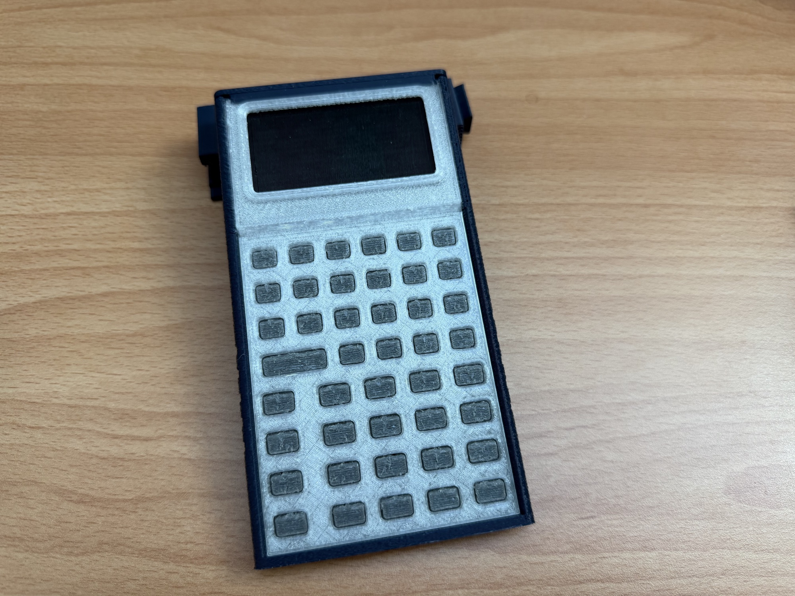
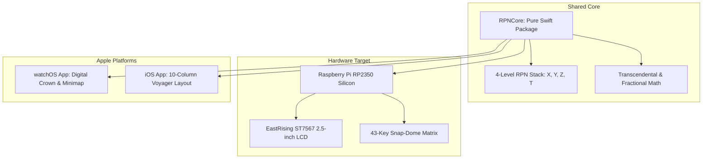

# Welcome to the StackCalc Engineering Blog

!!! note "Current prototype status"
    The current physical StackCalc prototype is a tool-free, 3D-printed mechanical assembly. The planned electronics platform is RP2350-based, but the PCB has not yet been fabricated. We are staging the initial build log series on [Hackaday](https://hackaday.io/project/206743-stackcalc32-a-tactile-rpn-calculator) before its public launch.



*The current unpowered, 3D-printed mechanical prototype. Its calculator PCB has not yet been fabricated.*


*Current mechanical CAD view. It is not a powered product photograph.*

Look at the desk of almost any experienced software engineer or scientist, and right beside the mechanical keyboard and dual monitors, you'll often find a vintage Hewlett-Packard calculator—usually an HP-32SII or an HP-15C held together with stubborn affection. Those classic machines weren't disposable consumer gadgets; they were precision instruments built with crisp tactile keycaps, instant boot times, and Reverse Polish Notation (RPN) that let you calculate complex equations at the speed of thought without ever touching a parenthesis or an `=` key.

As a software and AI expert, my daily world is high-level code, system architectures, and machine learning models. But I've also spent years as an amateur 3D-printing enthusiast, with a desktop 3D printer quietly whirring in the corner of my workspace. I don't have an electrical engineering background or a fancy electronics lab; I just love these calculators and think it is an absolute injustice that more people do not use them. When I looked at the state of modern calculators—glassy, laggy smartphone apps that drop keystrokes, sprout banner ads, or distort into awkward oval buttons when turned sideways—and saw vintage HP hardware fetching upwards of \$200 on eBay, I decided it was time to build something new.

I wanted to create an accessible, modern, open-source, low-cost physical RPN calculator for the next generation of engineers, students, and makers, inspiring them to discover the elegance of RPN just as I did. Coming from software, tackling custom 4-layer PCB layout and bare-metal microcontroller firmware felt like stepping onto an alien planet. But by pairing software expertise with modern AI coding agents to navigate unfamiliar hardware intricacies, and using desktop 3D printing to iterate physical enclosures and tactile button plungers, StackCalc32 was born: a unified ecosystem spanning physical hardware, bare-metal Embedded Swift, and native Apple Watch and iPhone apps.

<!-- more -->

## The Vision: Hardware Silicon Meets Wearable Software

StackCalc32 is not a software simulator wrapped around an old ROM dump, nor is it a quick weekend Arduino toy. It is a full-stack engineering project that spans custom 4-layer PCBs, bare-metal Embedded Swift firmware, and pixel-precise SwiftUI interfaces for the Apple Watch and iPhone:



To guarantee that a calculation on your wrist produces the exact bit-for-bit result as our physical desk prototype, the entire ecosystem shares `RPNCore`—a zero-dependency Swift engine maintaining strict decimal invariants, HP stack-lift mechanics, and IEEE-754 edge-case parity:

```swift
// RPNCore/Sources/RPNCore/RPNEngine.swift
public struct RPNEngine {
    public private(set) var stack: [Double] = [0.0, 0.0, 0.0, 0.0]
    public private(set) var lastX: Double = 0.0
    public var stackLiftEnabled: Bool = true

    public mutating func push(_ value: Double) {
        stack[3] = stack[2]
        stack[2] = stack[1]
        stack[1] = stack[0]
        stack[0] = value
    }
}
```

## What We're Engineering Across the Stack

The project attacks the problem across multiple physical and digital surfaces simultaneously:

| Surface Target | Compute Engine | Display Subsystem | Tactile Input Surface |
|---|---|---|---|
| **Physical Hardware** | Raspberry Pi RP2350 (Dual Cortex-M33) | EastRising ST7567 2.5" Transflective LCD | 43 snap-dome metal switches with 3D plungers |
| **Apple Watch** | watchOS 10+ via RPNCore | OLED Retina Display with 29x15 Annunciator | CoreHaptics Taptic Engine + Digital Crown |
| **iPhone (Voyager)** | iOS 17+ via RPNCore | 12-char 7-segment emulation with auto-scale | 10-column landscape layout with Haptic feedback |

## What You'll Find in These Logs

This blog is our open bench notebook. We won't bore you with sanitized corporate press releases or generic framework tutorials. Instead, you'll find raw engineering logs documenting the real struggles:

- **Hardware & PCB Routing**: Navigating 28-pin 0.5mm-pitch ZIF connectors through 4-layer KiCad boards with Python scripts and AI-assisted DRC clearance debugging.
- **Embedded Firmware**: Compiling bare-metal Embedded Swift directly for the RP2350 and debouncing noisy switch contacts with zero dynamic memory allocation.
- **Wearable UX**: Hacking watchOS Digital Crown optical encoders to prevent loose jacket cuffs from scrolling your stack into oblivion.
- **Cross-Surface Tooling**: Building differential fuzzers that hammer millions of pseudorandom mathematical operations across ARM silicon and Xcode simulators to hunt down floating-point divergences.

## Conclusion: Why We Build From Scratch

Building a dedicated mathematical instrument in an era of disposable digital gadgets is a labor of love, algorithmic discipline, and maker persistence. When you 3D-print button plungers with 0.1 millimeter clearances on your own desktop printer, use AI coding agents to bridge the gap into 4-layer PCB design and bare-metal Embedded Swift, and write deterministic stack logic shared across watches, phones, and silicon, you achieve something off-the-shelf software can never deliver: total ownership of the physical and digital experience. Our goal is to make physical RPN computing accessible and thrilling for a whole new generation of engineers and students. We hope these technical dispatches inspire you to fire up your 3D printer, lean into AI-assisted hardware engineering, and build tools that endure.
