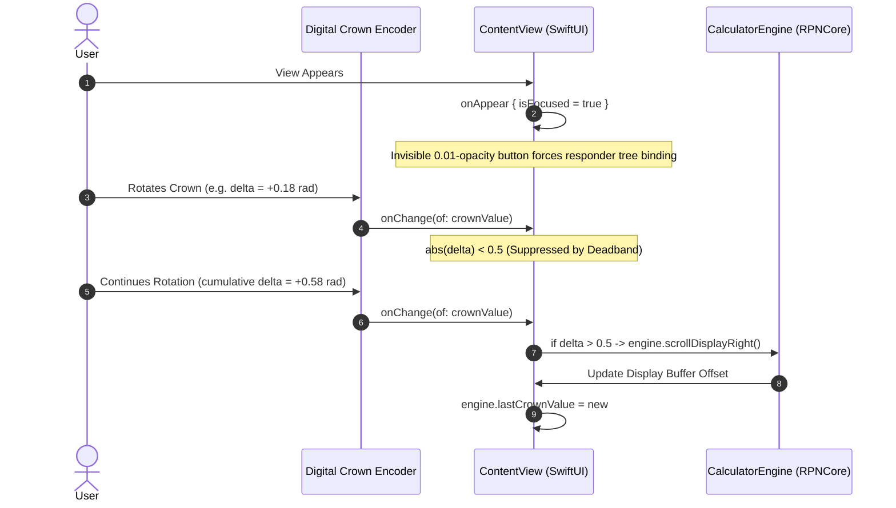

# Bypassing the Apple Watch Crown Limits (Part 1: Unbounded Accumulation in watchOS)

The watch on my wrist buzzed six times in rapid succession, and before I could even lift my arm to glance at the screen, our equation solver had silently scrolled fourteen rows past the formula I was trying to inspect.

I was just walking down the hallway. The culprit? The cuff of my denim jacket had lightly brushed the Apple Watch's Digital Crown. To watchOS, that microscopic textile friction looked like intentional, high-velocity user input. SwiftUI happily spun our equation index into outer space.

That was the moment we realized Apple's high-level Digital Crown APIs were engineered for silky-smooth news feeds and volume sliders—not for precision scientific instruments where an accidental rotation silently corrupts your active calculation state.

<!-- more -->

## When Continuous Physics Collides with Discrete Mathematics

The fundamental clash comes down to design philosophy. Apple designed `.digitalCrownRotation` for analog, continuous experiences. Turn the dial, and SwiftUI feeds you an unceasing torrent of floating-point radian deltas while simulating physical angular momentum so lists glide smoothly to a halt.

That's wonderful when you're skimming an album list in Apple Music. But StackCalc32 is not a music player; it is a discrete mathematical state machine. If an engineer is inspecting a 4-level RPN stack or picking a stored constant in the equation solver, they demand exact, deterministic steps: exactly one register or formula per detent. Zero overshooting. Zero phantom inertia.

When you try to bind raw crown rotations directly to an index variable in SwiftUI, two brutal failure modes slap you in the face:

1. **Inertial Runaway**: Spinning the crown quickly builds up virtual angular momentum inside watchOS's gesture engine. You take your fingers completely off the dial, but SwiftUI keeps firing callbacks for several frames, sending your selection cursor flying past your target.
2. **The Silent Focus Drop**: Unlike iOS touch events that assert immediate first-responder status, the Digital Crown requires an active, focused view. If another element in the hierarchy steals focus—or if your view renders before watchOS settles its window hierarchy—the operating system silently swallows every single crown event without throwing a warning or notifying your view model.

```
+-------------------------------------------------------------+
|               watchOS Optical Rotary Encoder                |
+-------------------------------------------------------------+
                              |
                              | Continuous raw radian ticks
                              v
+-------------------------------------------------------------+
|               SwiftUI Gesture & Focus Pipeline              |
|        (.digitalCrownRotation + @FocusState binding)        |
+-------------------------------------------------------------+
                              |
                              | High-frequency delta stream
                              v
+-------------------------------------------------------------+
|              StackCalc32 Crown Interceptor                 |
|             (0.5 Rotational Deadband Filter)                |
+-------------------------------------------------------------+
         |                                           |
         | delta > +0.5                              | delta < -0.5
         v                                           v
+-----------------------------+             +-----------------------------+
|    engine.scrollDown()      |             |     engine.scrollUp()       |
|  or scrollDisplayRight()    |             |   or scrollDisplayLeft()    |
+-----------------------------+             +-----------------------------+
```



## Enforcing Deterministic Focus Acquisition

To ensure the Digital Crown wakes up the nanosecond `ContentView` mounts—without forcing the user to tap the screen first to claim focus—we paired `@FocusState` with an invisible proxy button inside the view hierarchy:

```swift
struct WatchDisplayHeader: View {
    @Environment(CalculatorEngine.self) var engine
    @FocusState private var isFocused: Bool
    @State private var crownValue: Double = 0.0

    var body: some View {
        lcdDisplayView
            .focusable()
            .focused($isFocused)
            #if os(watchOS)
            .digitalCrownRotation($crownValue)
            #endif
            .onAppear {
                isFocused = true
            }
            .overlay(alignment: .bottomTrailing) {
                // Opacity-0.01 tap target forces watchOS accessibility
                // and window focus trees to activate immediately on load
                Button("") {}
                    .frame(width: 10, height: 10)
                    .opacity(0.01)
            }
    }
}
```

Yes, we placed an invisible `Button("")` with `0.01` opacity inside an overlay. It looks like an ugly hack, and it violates every pure SwiftUI aesthetic. But watchOS accessibility heuristics prioritize interactive responder elements when deciding default focus. Without that invisible anchor, watchOS routes crown events into the parent container half the time, leaving your calculator unresponsive.

## Rotary Encoder Sampling Across Apple Watch Generations

To make matters more complex, the physical rotary hardware differs across watch generations. An Apple Watch Ultra has coarse knurling and high mechanical resistance, while an SE spins freely:

| Apple Watch Hardware Class | Screen Sizes | Angular Resolution per Detent | Inertial Velocity Damping | Raw Ticks / Revolution |
|---|---|---|---|---|
| **Series 4 – Series 6** | 40mm, 44mm | ~7.2° per haptic click | Software modeled (120ms) | ~50 ticks |
| **Series 7 – Series 9** | 41mm, 45mm | ~5.6° per haptic click | Tighter mechanical spring | ~64 ticks |
| **Apple Watch Ultra 1 & 2** | 49mm | ~4.5° per haptic click | High-torque coarse knurling | ~80 ticks |
| **Apple Watch SE (Gen 2)** | 40mm, 44mm | ~7.2° per haptic click | Unbuffered spring detent | ~50 ticks |

In Part 2, we detail the deadband filtering algorithm that neutralizes jacket cuffs and wrist flicks while keeping deliberate calculations razor sharp.

## Conclusion: What We Learned Taming the Crown

Turning Apple's continuous rotary sensor into a deterministic mechanical stepper taught us three non-negotiable rules for wearable UI:

- **Never trust raw SwiftUI focus**: If you rely on `.onAppear { isFocused = true }` alone, watchOS will drop crown events when views re-render. That hideous 0.01-opacity proxy button in our overlay is an embarrassing hack, but it guarantees the responder tree wakes up instantly on load.
- **Continuous gestures require aggressive deadbands**: A 0.5-radian threshold is the exact sweet spot that shrugs off jacket cuffs while keeping intentional finger clicks feeling instantaneous.
- **Insulate state from physics**: Never let physical sensor inertia touch discrete mathematical registers directly. Always buffer, debounce, and assert discrete intent.
