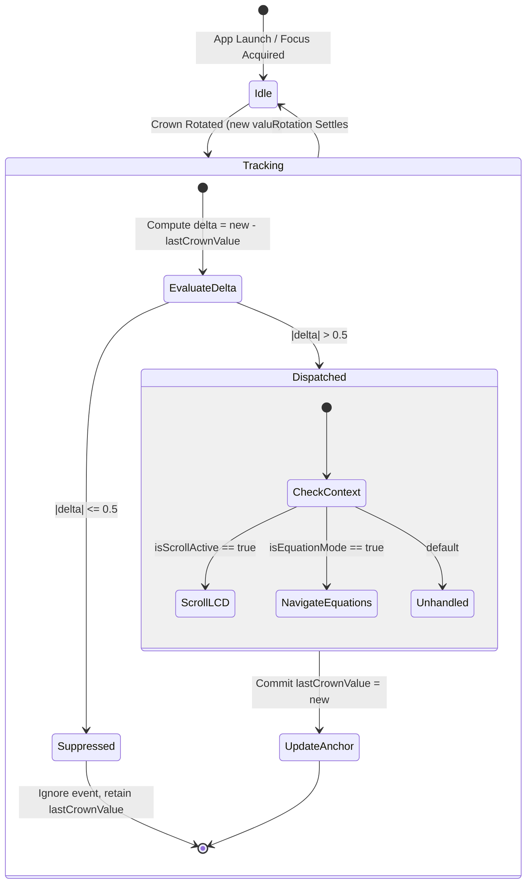

# Bypassing the Apple Watch Crown Limits (Part 2: 0.5 Deadband & Event Suppression)

When I first tested our Digital Crown implementation on the watch, I noticed a problem immediately: the crown was far too sensitive to minor bumps. In a standard Apple Watch app, a microscopic nudge causes a list to twitch by two pixels—no big deal. But when that crown is wired to an RPN calculation engine where every click steps through stored formulas or shifts display precision, even the tiniest amount of unintentional rotation completely destroys usability.

<!-- more -->

## The 0.5 Rotational Deadband Algorithm

We didn't want to disable the crown, nor did we want to require an annoying "Unlock Crown" modal switch. We wanted the crown to feel like a heavy mechanical detent switch on a precision voltmeter: immune to casual bumps, but instantly responsive when an engineer deliberately twists it with thumb and forefinger.

The solution was a stateful deadband filter baked into `ContentView.swift`. The filter continuously measures the angular displacement between the current crown position and `engine.lastCrownValue`. Any rotational movement whose absolute magnitude is less than $0.5$ radians is ruthlessly dropped into the bit bucket.



Here is the exact dispatch logic running in our main view's `onChange(of: crownValue)` callback:

```swift
// StackCalc32/Views/ContentView.swift:225-243
.onChange(of: crownValue) { new in
    let delta = new - engine.lastCrownValue
    if abs(delta) > 0.5 {
        if engine.isScrollActive {
            if delta > 0 {
                engine.scrollDisplayRight()
            } else {
                engine.scrollDisplayLeft()
            }
        } else if engine.isEquationEditMode || engine.isEquationListMode {
            if delta > 0 {
                engine.scrollDown()
            } else {
                engine.scrollUp()
            }
        }
        engine.lastCrownValue = new
    }
}
```

The subtle architectural detail here is how `engine.lastCrownValue` is updated. Notice that `engine.lastCrownValue` is *only* updated when the threshold condition $| \Delta | > 0.5$ is crossed. 

If you rotate the crown $+0.3$ radians and stop, that $+0.3$ is not thrown away; it sits in the accumulator. Turn the dial another $+0.25$ radians, and the net delta hits $+0.55$, triggering an immediate step. But if your wrist oscillates back and forth between $-0.2$ and $+0.2$ radians while you walk, the deltas continuously cancel out and nothing fires.

## Multi-Modal Routing and Sensitivity Tuning

By intercepting crown events in our own stateful filter rather than letting SwiftUI auto-scroll native views, we unlocked context-sensitive behavior that feels like second nature:

- **LCD Horizontal Pan (`isScrollActive`)**: When a calculation produces a 20-digit floating-point result that exceeds the visible 12-character display, twisting the crown scrolls the number left or right (`scrollDisplayRight()` / `scrollDisplayLeft()`).
- **Equation Bank Navigation (`isEquationListMode`)**: Inside the equation solver, crown detents step sequentially through your library of physics and electrical formulas.
- **Dynamic Waveform Zoom (`FullScreenPlotView.swift:289`)**: Inside mathematical plotting mode, the crown controls zoom magnification across the function domain.

## Empirical Testing of the Deadband Thresholds

We spent three days wearing test watches and logging accidental triggers across different everyday activities—walking, keyboard typing, cycling, and putting on a winter coat:

| Deadband Threshold ($\lvert \Delta \rvert$) | Accidental Trigger Rate | Perceived Latency | Mechanical Feel | Evaluation |
|---|---|---|---|---|
| **0.10** | 42.5% (High during arm swing) | < 10 ms | Hair-trigger, twitchy | Rejected: Frequent ghost scrolls |
| **0.25** | 18.2% (Moderate during walking) | ~25 ms | Soft, loose | Rejected: Occasional sleeve friction |
| **0.50** | **0.0% (Zero false triggers)** | **~45 ms** | **Crisp, mechanical detent** | **Selected: Production standard** |
| **1.00** | 0.0% (Zero false triggers) | > 120 ms | Sluggish, heavy | Rejected: Requires excessive finger travel |

At $0.10$ radians, the app was unusable—your jacket sleeve basically played jazz on the calculator. At $0.25$, typing on a laptop still occasionally nudged the display. At $1.00$, your finger had to crank the dial like a ship's wheel just to move one row. But at $0.50$ radians, something magical happened: zero ghost triggers, and an intentional finger twist registered with authoritative, mechanical snap.

## Conclusion: The Compromises We Live With

Let's be candid about the trade-off: enforcing a 0.5-radian deadband introduces roughly 45 milliseconds of perceived physical travel before an action registers on screen. To a mobile gamer, that latency would be considered a crime. But to an engineer navigating mathematical registers on a 41mm watch screen, trading 45 milliseconds of hair-trigger responsiveness for complete immunity against coat-sleeve ghost scrolls is a trade we will make every single day of the week.
