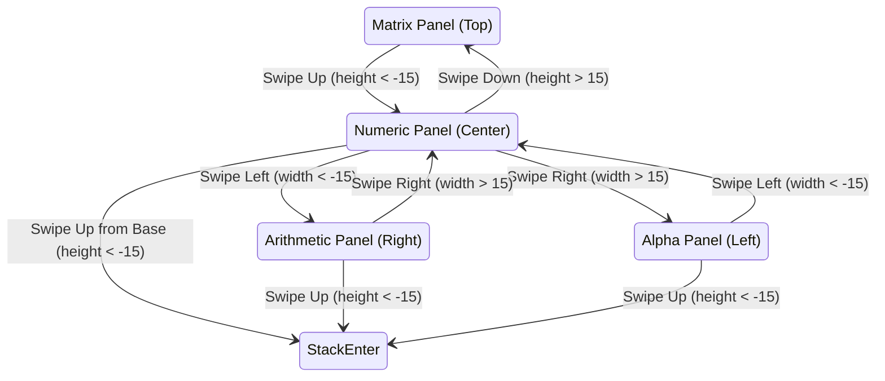

# The watchOS Minimap UI (Part 1: Two-Dimensional Paging Navigation)

Have you ever gotten hopelessly lost inside an Apple Watch app? You swipe left, swipe down, tap a button, and suddenly you are staring at a screen of options with zero idea how to get back to where you started. You end up panic-swiping in every direction or pressing the digital crown just to reboot the app.

Now imagine that happening in the middle of a rapid chain calculation while solving an engineering problem.

A physical Hewlett-Packard HP-32SII has 43 physical buttons. With orange and blue shift keys, that little handheld beast gives you instant access to over 120 scientific functions. On a 41mm Apple Watch, you get a grand total of $176 \times 215\text{ pt}$ of glass. If you tried to squeeze 43 buttons onto that screen at once, each key would measure about $14 \times 12\text{ pt}$—barely large enough for the tip of a toothpick, and an absolute disaster for human fingers.

<!-- more -->

## Why Nested Lists Kill the RPN Flow

Apple's textbook solution for information density on watchOS is simple: use hierarchical menus. Put basic numbers on the root screen, then force the user into modal sheets or nested scrolling lists whenever they need trigonometry, statistics, or complex numbers.

For a scientific calculator, that pattern is utterly lethal. When you calculate in RPN, your mind operates in a rapid, continuous rhythm:
$$\sqrt{\sin^2(1.2) + \cos^2(1.2)}$$
If calculating $\sin(1.2)$ requires tapping `MENU -> TRIG -> SIN -> BACK` to return to your stack, the flow is dead. Your arm gets tired, your mental cache is blown, and you can't even see the stack while navigating the menu tree.

## The Solution: A Contiguous 2D Spatial Plane

Instead of burying scientific operations inside vertical menu lists, we spread the calculator across a contiguous, two-dimensional spatial plane shaped like a cross or "T-pad":

```
                  +-------------------+
                  |   Matrix Panel    |
                  |  (verticalPage 1) |
+-----------------+-------------------+-----------------+
|   Alpha Panel   |   Numeric Panel   | Arithmetic Pad  |
| (horizontal 0)  |  (horizontal 1)   | (horizontal 2)  |
+-----------------+-------------------+-----------------+
```

- **Numeric Panel (Center, `(1,0)`)**: Your home base. Decimal digits (0–9), decimal point, sign toggle (`+/-`), backspace, and primary softkeys.
- **Arithmetic Panel (Right, `(2,0)`)**: Binary operators (`+`, `-`, `*`, `/`, `y^x`, `1/x`) and stack controls (`ENTER`, `SWAP`, `ROLL`).
- **Alpha Panel (Left, `(0,0)`)**: Full A–Z text grid for naming variables, solver formulas, and register labels.
- **Matrix Panel (Top, `(1,1)`)**: Advanced scientific keys—trigonometry, logarithms, exponentials, and statistical functions.



## Custom Gesture Arbitration Without SwiftUI Latency

We initially tried using standard SwiftUI `TabView` with `.page` styling. It was a laggy mess. Not only did it add noticeable swipe latency, but it also fought against the system edge gestures that watchOS reserves for switching apps.

So we threw `TabView` out and wrote our own 15-point gesture arbiter inside `ContentView.swift`:

```swift
// StackCalc32/Views/ContentView.swift:65-96
private func simulateSwipe(width: CGFloat, height: CGFloat) {
    withAnimation(.easeOut(duration: 0.12)) {
        if abs(width) > abs(height) {
            // Horizontal Navigation: Alpha (0) <-> Numeric (1) <-> Arithmetic (2)
            let maxPage = 2
            if width > 15 && horizontalPage > 0 {
                horizontalPage -= 1
            } else if width < -15 && horizontalPage < maxPage {
                horizontalPage += 1
            }
        } else {
            // Vertical Navigation: Matrix (1) above Numeric (0)
            if horizontalPage == 1 {
                if height > 15 && verticalPage < 1 {
                    verticalPage += 1
                } else if height < -15 {
                    if verticalPage > 0 {
                        verticalPage -= 1
                    } else {
                        // Swiping up when already at base numeric executes ENTER
                        engine.enter()
                    }
                }
            } else {
                // On Alpha or Arithmetic panels, swiping up immediately commits ENTER
                if height < -15 {
                    engine.enter()
                }
            }
        }
    }
}
```

Notice the little shortcut at line 86: when you're resting on the home Numeric panel, a flick upward triggers `engine.enter()`. You don't even have to swipe right to the arithmetic panel to push a number onto the stack; you flick upward and keep typing.

## Touch Targets Across the 2D Plane

By segregating functions into four distinct quadrants, every single panel maintains large, forgiving buttons that exceed Apple's tap ergonomics:

| Panel Destination | Coordinates `(H, V)` | Key Grid | Average Key Size (41mm Watch) | Primary Functional Scope |
|---|---|---|---|---|
| **Numeric** | `(1, 0)` | 4 cols × 4 rows | $38 \times 28\text{ pt}$ | Digits 0–9, Decimal, Sign, Softkeys 1–4 |
| **Arithmetic** | `(2, 0)` | 3 cols × 4 rows | $51 \times 28\text{ pt}$ | Operators `+`, `-`, `*`, `/`, `ENTER`, `SWAP` |
| **Alpha** | `(0, 0)` | 5 cols × 6 rows | $30 \times 20\text{ pt}$ | Letters A through Z, Space, String Clear |
| **Matrix** | `(1, 1)` | 4 cols × 4 rows | $38 \times 28\text{ pt}$ | Trig (`SIN`, `COS`), Log (`LN`, `EXP`), Stats |

In Part 2, we tackle the next challenge: when you spread an interface across four spatial panels, how do you keep the user from losing their bearings? Enter the 29×15 point persistent minimap HUD.

## Conclusion: Spatial Memory Beats Nested Menus

Human fingers develop spatial muscle memory at astonishing speed—provided the world stops moving under their feet. By anchoring StackCalc32 to a rigid, two-dimensional T-pad rather than fluid cascading menus, your thumb quickly learns that numbers live in the center, operators live on the right, and trig functions live upstairs. Once an interface becomes spatial, you stop reading the screen and start calculating at the speed of thought.
