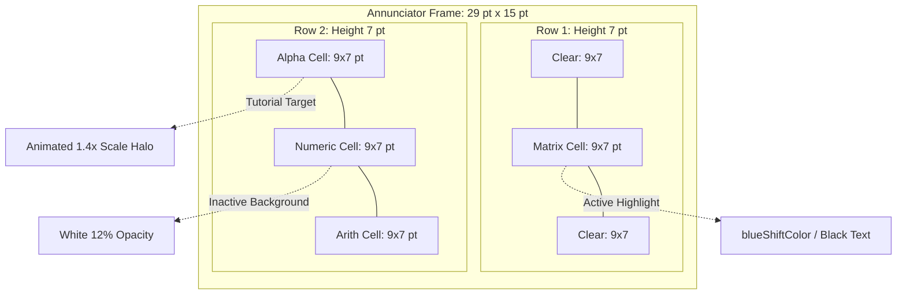

# The watchOS Minimap UI (Part 2: 29x15 pt Spatial Annunciator Matrix)

In early test builds of StackCalc32, our two-dimensional T-pad layout had an embarrassing side effect: testers would swipe upward into the Matrix panel to grab a square root, get distracted, and then wonder why tapping `7` wouldn't put a number onto the stack.

Without visual feedback, a four-quadrant canvas is a blind maze.

On iOS, you can slap a row of little `UIPageControl` dots at the bottom of the screen. But page dots are completely useless here: they only understand linear, one-dimensional lists. They cannot tell you that there is an Alpha keyboard to your left, an Arithmetic pad to your right, and an advanced Matrix panel directly above your head. Worse, on an Apple Watch, adding a dedicated pagination bar burns 15 to 20 vertical points that we desperately need for key strike targets.

<!-- more -->

## The 29×15 pt Hardware Annunciator Philosophy

When you look at an original HP-32SII or HP-48GX, you notice something brilliant: the liquid crystal display doesn't waste precious character cells telling you what mode you're in. Instead, HP etched microscopic hardware annunciators directly into the glass: tiny static glyphs for `RAD`, `GRAD`, `PRGM`, and `SHIFT` that snap into view with zero latency.

We stole that concept directly from Corvallis. In the top-right corner of our LCD header, we carved out a persistent, 29 pt × 15 pt spatial minimap (`panelAnnunciatorMap`):
<!-- @comment: Not true. We moved the minimap to C button because it kep covering up the time. -->

```
+------------------------------------------+
|  123,456.7890             [   [M]   ]    |  <-- 29x15 pt Annunciator
|                           [[A][N][R]]    |
+------------------------------------------+
|  [ 7 ]  [ 8 ]  [ 9 ]  [  /  ]            |
|  [ 4 ]  [ 5 ]  [ 6 ]  [  *  ]            |
|  [ 1 ]  [ 2 ]  [ 3 ]  [  -  ]            |
|  [ 0 ]  [ . ]  [ +/-] [  +  ]            |
+------------------------------------------+
```

It functions exactly like the mini-radar HUD in an arcade flight simulator. At a single glance, your brain registers:
- `[M]` = Matrix panel upstairs
- `[A]` = Alpha panel to the left
- `[N]` = Numeric panel in the center
- `[R]` = Arithmetic operators to the right



## The Rendering Challenge: 5.5pt Typography on OLED

Getting a 29×15 pt graphic to render crisply without dropping frames was harder than it looks. In SwiftUI, nesting too many containers or applying heavy layout blur filters inside a rapidly invalidating display header can introduce micro-stutters during 60fps finger swipes.

We stripped out all container fluff and constructed the grid from raw, lightweight primitives:

```swift
// StackCalc32/Views/ContentView.swift:145-189
private var panelAnnunciatorMap: some View {
    VStack(spacing: 1) {
        HStack(spacing: 1) {
            Color.clear.frame(width: 9, height: 7)
            panelAnnunciatorCell(.matrix)
            Color.clear.frame(width: 9, height: 7)
        }
        HStack(spacing: 1) {
            panelAnnunciatorCell(.alpha)
            panelAnnunciatorCell(.numeric)
            panelAnnunciatorCell(.arithmetic)
        }
    }
    .accessibilityElement(children: .ignore)
    .accessibilityLabel("\(activePanel.title) panel")
    .accessibilityIdentifier("watch_panel_map")
    .frame(width: 29, height: 15)
}

private func panelAnnunciatorCell(_ panel: WatchPanel) -> some View {
    let isTarget = (targetPanelForTutorial == panel) && (activePanel != panel)
    return Text(panel.mapLabel)
        .font(.system(size: 5.5, weight: .bold, design: .monospaced))
        .frame(width: 9, height: 7)
        .background(
            activePanel == panel ? themeManager.theme.blueShiftColor.opacity(0.95) : Color.white.opacity(0.12),
            in: RoundedRectangle(cornerRadius: 1.5)
        )
        .overlay {
            if isTarget {
                RoundedRectangle(cornerRadius: 1.5)
                    .fill(Color.blue.opacity(mapPulse ? 0.7 : 0.0))
                    .stroke(Color.blue, lineWidth: 1.5)
                    .scaleEffect(mapPulse ? 1.4 : 1.0)
                    .animation(.easeInOut(duration: 0.8).repeatForever(autoreverses: true), value: mapPulse)
            }
        }
        .foregroundColor(activePanel == panel ? .black : .white.opacity(0.65))
}
```

Notice the extreme quantization: each cell is locked to $9 \times 7\text{ pt}$ with a 5.5pt bold monospaced font and a $1.5\text{ pt}$ corner radius. On Apple Watch's dense 326 ppi Retina screen, that micro-typography looks needle-sharp.

## Guided Tutorials via Pulsing Halos

The minimap doubles as our interactive navigation beacon during tutorials. When a beginner launches the app and steps through an RPN exercise (from `Shared/Tutorials.swift`), the engine marks the destination with `targetPanelForTutorial`.

If the required key is hiding on the Matrix panel while the user is looking at the Numeric pad, the `[M]` cell starts breathing—animating an expanding blue halo (`scaleEffect(1.4)`). You don't have to read an instructional paragraph; your eyes follow the flashing beacon, you swipe your finger, and you're there.

## Sub-Pixel Geometric Specifications

Every dimension was tuned to align cleanly with physical OLED pixel grids:

| Element | Dimension / Property | Value | Design Rationale |
|---|---|---|---|
| **Total Map Frame** | Width × Height | $29.0 \times 15.0\text{ pt}$ | Fits comfortably in upper-right LCD header |
| **Individual Cell** | Width × Height | $9.0 \times 7.0\text{ pt}$ | Exact 4:3 micro-ratio matching hardware keys |
| **Corner Radius** | Chamfer | $1.5\text{ pt}$ | Matches physical calculator key bevels |
| **Typography** | Font & Weight | 5.5 pt monospaced bold | Legible 1-character glyphs (`M`, `A`, `N`, `R`) |
| **Active Highlight** | Background Color | `theme.blueShiftColor` (0.95) | Instantly identifies current coordinate |
| **Inactive Background** | Background Color | `Color.white` (0.12 opacity) | Subdued structure without visual distraction |
| **Inter-Cell Spacing** | Grid Gap | $1.0\text{ pt}$ | OLED true-black gap separation |

## Conclusion: The Micro-HUD Retrospective

Designing UI on a smartwatch is an exercise in ruthless spatial discipline. When you have less than two inches of screen, you cannot afford the luxury of loose padding or explanatory banner text. By treating our 29x15 pt minimap as a fixed, dedicated hardware HUD rather than a dynamic view container, we solved spatial disorientation without stealing a single pixel from the active calculation registers. Great wearable design isn't about hiding complexity; it's about making orientation effortless.
