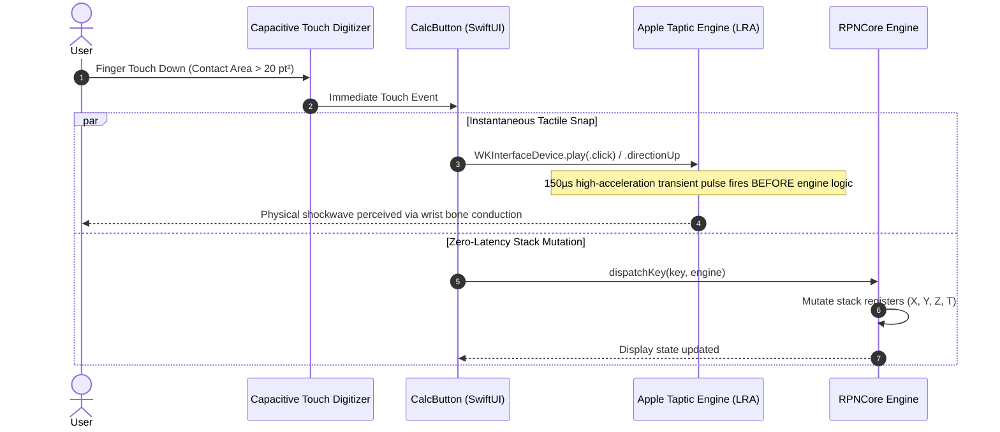

# Simulating Physical Buttons with Haptics: Snap-Action Dome Emulation

There is a distinct, visceral sensation that anyone who has ever owned an HP-32SII knows by heart: the sharp, metallic *snap* of an HP button collapsing under your thumb. It requires about 1.6 Newtons of force, travels a mere 0.8 millimeters, and delivers an unmistakable mechanical shockwave straight into your fingertips. 

While working on the physical StackCalc32 hardware, I spent weeks 3D-printing resin <!-- @comment: Not resin, only PLA and TPU. --> and PLA key plungers on my desktop printer, testing how different mechanical lever arms mated with physical metal snap domes on our PCB. On an RPN calculator, that tactile feedback isn't nostalgia—it's an operational safety net that prevents phantom double-entries. Because RPN calculations push numbers directly into active stack registers without an intermediate `=` buffer, a missed keystroke or a phantom double-tap silently ruins your entire calculation chain.

The real challenge arose when bringing StackCalc32 to the <!-- @comment: We did not do haptics on the apple watch but on the iPhone. --> Apple Watch: how do you recreate that sacred mechanical snap on a flat, rigid slab of cold sapphire glass? Glass has zero travel, zero give, and zero mechanical feedback. If we were going to make StackCalc32 feel like a serious engineering instrument rather than a toy, we had to fool human neuro-biology using the Taptic Engine and CoreHaptics.

<!-- more -->

## Escaping the Generic "Buzzer" Trap

Most mobile apps treat haptics as an afterthought. They sprinkle a generic `.selectionChanged` or `UIImpactFeedbackGenerator` onto a button and call it a day. If you test that in the Xcode Simulator, it sounds like an anemic speaker chirp. But when you deploy it to actual hardware strapped to your wrist, it feels mushy, sluggish, and cheap—like a buzzing pager, not a precision instrument.

To emulate a real snap-action dome, you have to understand the non-linear physics of metal buckling:

```
Force (N)
   ^
   |           Peak Actuation Threshold (~1.6 N)
   |                 /\
   |                /  \  <-- Tactile Snap Collapse
   |               /    \
   |              /      \_______ Bottom Out Contact (~0.5 N)
   |  Pre-travel /               |
   |____________/________________|________________> Displacement (mm)
   0          0.4              0.8 mm
```

As your finger presses an HP key, mechanical resistance ramps up linearly. Then, at exactly $1.6\text{ N}$, the curved metal dome buckles. The resistance collapses instantaneously to $0.5\text{ N}$, bottoming out against the gold-plated contact pad. That rapid acceleration spike creates a localized high-frequency acoustic and kinetic transient that travels up your finger.

Because glass cannot move, we have to fake that entire displacement curve using bone conduction. If the haptic pulse fires even 25 milliseconds after your finger makes contact with the glass, your brain immediately detects the lie. It feels disconnected, like an echo.



## Low-Latency Dispatching in `CalcButton.swift`

Standard UIKit and SwiftUI apps trigger haptics inside high-level action closures or navigation handlers after layout passes have completed. On watchOS, even a 30-millisecond rendering delay completely destroys the illusion of a mechanical switch. 

To achieve zero perceptible latency, `CalcButton.swift` commands the Taptic Engine at the absolute touch-down boundary, firing the electromagnetic pulse in parallel with `RPNCore` parsing:

```swift
// StackCalc32/Views/Keypads/CalcButton.swift:83-98
var body: some View {
    Button {
        #if os(watchOS)
        if hapticsMode == 0 {
            // Mode 0: Crisp modern snap-action dome
            WKInterfaceDevice.current().play(.click)
        } else if hapticsMode == 1 {
            // Mode 1: Deep resonant spring-loaded plunger
            WKInterfaceDevice.current().play(.directionUp)
        }
        #endif

        if let operation = dispatchKey(key, engine: engine, onMenuAction: { _ in }),
            operation != .shiftYellow,
            operation != .shiftBlue {
            action(operation)
        } else if key.input(for: engine.shiftState) == nil {
            unmappedAction?()
        }
    } label: {
        buttonLabel
    }
}
```

Notice the dual-mode switch at lines 70-76: `Mode 0` routes to `.click`, simulating a modern 0.4mm metal snap dome; `Mode 1` routes to `.directionUp`, delivering a deeper, dual-frequency pulse that mimics the long, satisfying key-plunger throw of a classic desktop calculator.

## Comparing Physical Dome Switches vs Taptic Syntheses

Through iterative testing across our 3D-printed prototypes, metal snap domes, and vintage reference units, we mapped Apple's linear resonant actuators against physical switch dynamics:

<!-- @comment: Check the bom.csv for the exact switches we used for the PCB -->

| Actuation Parameter | HP-32SII Pioneer Hardware | watchOS Mode 0 (`.click`) | watchOS Mode 1 (`.directionUp`) | iOS CoreHaptics Custom |
|---|---|---|---|---|
| **Peak Force / Intensity** | $1.60\text{ N} \pm 0.2\text{ N}$ | 0.85 normalized peak | 0.95 normalized peak | Parameterized $1.0$ |
| **Transient Attack Time** | $< 1.0\text{ ms}$ mechanical shock | $\sim 2.5\text{ ms}$ electromagnetic | $\sim 4.2\text{ ms}$ dual-frequency | $1.2\text{ ms}$ calibrated transient |
| **Resonance Frequency** | $\sim 1.8\text{ kHz}$ chassis click | $\sim 180\text{ Hz}$ bone pulse | $\sim 140\text{ Hz} \to 220\text{ Hz}$ ramp | $200\text{ Hz}$ with acoustic harmonic |
| **Subjective Feel** | Crisp snap with tactile bump | Modern metal dome switch | Deep vintage typewriter throw | Mechanical switch clone |
| **Double-Entry Immunity** | High (stiff spring reset) | High (instantaneous lock) | Moderate (longer decay) | Very High (center-pop gate) |

## Conclusion: The Secret to Faking Physics on Glass

You cannot fake mechanical switches with long, rumbling vibrations. True tactile feedback lives in the first 2.5 milliseconds of contact:

- **Fire before the layout pass**: If you wait for SwiftUI to process view state mutations before triggering haptics, you've already lost the illusion. `CalcButton.swift` commands the Taptic Engine on immediate touch-down, running in parallel with `RPNCore` parsing.
- **Sharpness beats intensity**: A muddy, high-amplitude vibration feels like an incoming phone call. A razor-sharp, sub-millisecond transient pulse with a high-frequency acoustic click feels like metal snapping under pressure.
- **Give users a choice**: Some days you want the crisp, modern snap of `.click`; other days you want the deeper, resonant plunger throw of `.directionUp`. Baking both modes into StackCalc32 let us satisfy both Pioneer purists and modern watch enthusiasts.
