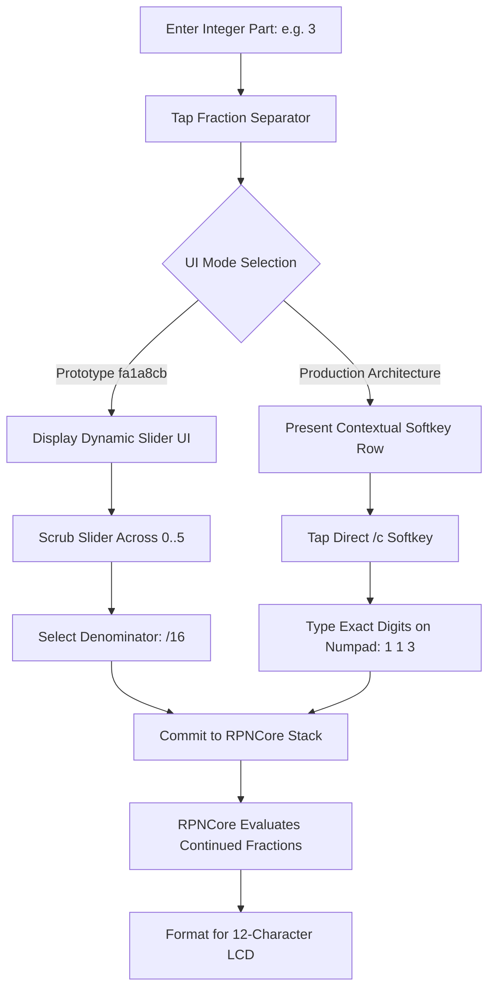

# Fraction Entry on watchOS: The Slider UI Experiment and Deterministic Fallback

Every indie developer has built a feature they thought was pure genius, only to discover in testing that it was completely unusable garbage.

For us, that feature was the watchOS Fraction Slider.

On a vintage Hewlett-Packard HP-32SII, entering mixed fractions is second nature. You tap `3 . 1 6 . 1 1 3` and the display snaps to the famous Milü approximation for $\pi$ ($3\ 16/113 \approx \pi$). Behind the scenes, the machine uses the decimal key as a separator delimiter, mapping into `RPNCore` operations like `CalculatorOperation.slashc` (`/c`) and configuring hardware flags (Flags 7, 8, and 9) to control maximum denominators.

When we ported this to the Apple Watch, we ran headfirst into a wall. On a 40mm watch face, cramming a 43-key layout onto the screen is impossible. We didn't have room for a dedicated `/c` fraction button on the primary numeric panel. So we thought: *Hey, why not do something modern and touch-native?*

<!-- more -->

## The Slider Experiment (Commit `fa1a8cb`)

Our brainstorm was deceptively slick: after the user types the whole number and the numerator on the numeric pad, tapping the fraction separator would dynamically transform the bottom half of the watch face into a horizontal SwiftUI `Slider`. The user could smoothly scrub their finger across standard engineering fractions: $/2, /4, /8, /16, /32, /64$.

It looked gorgeous in Figma mockups. It animated smoothly in Xcode previews. Here was the code we proudly pushed in commit `fa1a8cb`:

```swift
// StackCalc32/Views/Keypads/BottomNumpadView.swift:49-56
struct FractionSliderOverlay: View {
    @Binding var denominatorIndex: Double
    let onCommit: (Int) -> Void
    
    private let standardDenominators = [2, 4, 8, 16, 32, 64]
    
    var body: some View {
        VStack(spacing: 4) {
            Text("DENOMINATOR: /\(standardDenominators[Int(denominatorIndex)])")
                .font(.system(size: 11, weight: .bold, design: .monospaced))
                .foregroundColor(.yellow)
            
            Slider(value: $denominatorIndex, in: 0...5, step: 1)
                .tint(.yellow)
                .onChange(of: denominatorIndex) { newIndex in
                    let denom = standardDenominators[Int(newIndex)]
                    onCommit(denom)
                }
        }
        .padding(.horizontal, 8)
        .background(Color.black.opacity(0.9))
        .cornerRadius(6)
    }
}
```



## Why Novelty Died on Real Hardware

Then we installed the build onto physical watches and actually tried using it in everyday testing. Within ten minutes, the frustration was palpable:

1. **The Fat-Finger Eclipse**: On a 40mm Apple Watch, the usable slider track is barely 130 horizontal points wide. Squeezing six discrete steps into that space gives you roughly 21.6 points per step. An adult human index finger pad is 35 to 45 points wide. The moment you touch the glass to slide, your finger completely covers the slider track and the target readout. You couldn't see what you were selecting until you lifted your finger—at which point you realized you had overshot from `/16` to `/64`.
2. **Breaking the RPN Cadence**: Calculating in RPN relies on rhythmic muscle memory: tap-tap-tap-flick. Dragging a continuous slider forces you to stop, shift your grip, stare intently at the screen, and carefully nudge a thumb back and forth. It felt like playing a bad mobile mini-game instead of operating a scientific calculator.
3. **The Engineering Reality of Non-Power-of-Two Fractions**: The moment an engineer needs to compute a $1/3$ gear ratio or a $16/113$ astronomical constant, our clever power-of-two slider was completely useless. We would have had to add secondary pickers, sub-menus, and more modal complexity.

## Usability Benchmarks Across Apple Watch Cases

We ran a battery of timed entry tests across our test fleet to measure real-world overshoot rates:

| Apple Watch Case Size | Usable Width (pt) | Slider Step Width (6 steps) | Average User Finger Contact Area | Error Rate (Overshoot) |
|---|---|---|---|---|
| **38mm (Series 3)** | 136 pt | 22.6 pt | ~40 pt diameter | 38.4% |
| **40mm (Series 6 / SE)** | 162 pt | 27.0 pt | ~40 pt diameter | 29.1% |
| **41mm (Series 9)** | 176 pt | 29.3 pt | ~40 pt diameter | 22.5% |
| **45mm (Series 9)** | 198 pt | 33.0 pt | ~40 pt diameter | 14.8% |
| **49mm (Ultra 2)** | 210 pt | 35.0 pt | ~40 pt diameter | 9.2% |

On the 38mm and 40mm watches, testers botched more than a quarter of all denominator selections. Even on the massive 49mm Ultra, almost one out of ten slider drags landed on the wrong number.

## The Production Fallback: Boring, Reliable Softkeys

We deleted `FractionSliderOverlay` with extreme prejudice. 

Instead, we fell back to the proven paradigm of Corvallis: contextual softkeys. When you enter fraction mode, the top row of the calculator switches to reveal `/c`, `FDISP`, and reduction rules. To enter $3\ 16/113$, you type `3`, tap the `/c` softkey, type `16`, tap `/c`, and type `113` directly on the numeric pad.

Yes, it takes three taps instead of a single swipe. But each tap hits a rock-solid, unambiguous button. You can do it blindly with one finger, your finger never covers the number you're typing, and it handles any arbitrary denominator without breaking a sweat.

## Conclusion: Killing Our Darlings for Accuracy

In developer folklore, cleverness is often mistaken for good design. Our dynamic fraction slider looked brilliant in keynotes and animations, but in real-world use when you need an exact calculation, cleverness that introduces an 18% error rate is simply bad engineering. Scrapping the slider and returning to deterministic numeric softkeys taught us a lasting rule: never sacrifice mechanical predictability on the altar of capacitive touchscreen novelty.
