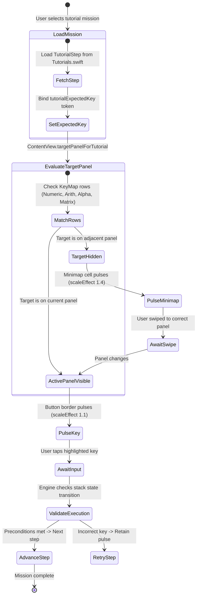

# Watch Tutorial Presentation Logic: Interactive State Machines on the Wrist

Nobody in the history of consumer electronics has ever opened a PDF user manual on an Apple Watch. You download an app to your wrist, raise your arm, and you expect to start tapping immediately.

There was just one glaring problem: StackCalc32 is an RPN calculator.

To an engineer who grew up with an HP-15C or an HP-48GX, typing `2 [ENTER] 3 [+]` is as natural as breathing. But to a modern programmer or student whose entire mathematical life has been spent on algebraic infix calculators, RPN feels like an alien transmission. Where is the `=` key? Why did tapping `3` just overwrite what was on screen? Why are numbers sliding upward into a mystery four-level stack ($X, Y, Z, T$)?

On an iPhone or iPad, onboarding is easy: you can pop up full-screen modal sheets, show cute animated diagrams, and darken the background. But on an Apple Watch display measuring less than two inches diagonally, a modal sheet completely devours the keypad. You cannot teach someone how to operate a mechanical calculator if the buttons are hidden behind an essay.

<!-- more -->

## The In-Situ Interactive Machine

We threw out modal sheets entirely. If someone was going to learn RPN on their wrist, they had to learn it with their fingers actively on the keypad.

We built an in-situ tutorial state machine directly into `Shared/Tutorials.swift` (commit `262ca06`). Instead of blocking the interface, the tutorial engine runs alongside the live calculator:

1. A single-line directive renders inside the LCD header area (e.g. `TAP 4`, `PRESS ENTER`, `SWIPE TO ARITHMETIC`).
2. The engine publishes an expected key token via `@AppStorage("tutorialExpectedKey")`.
3. The UI queries our key placement database in real time. If the button is on the active screen, it pulses with a bright gold halo. If it is hiding on another quadrant of our 2D canvas, the 29×15 pt minimap blinks the directional beacon to guide your swipe.



## Spatial Target Resolution in `ContentView.swift`

Because our keypad is distributed across a 2D cross (Numeric in the center, Arithmetic on the right, Alpha on the left, Matrix on top), the view hierarchy must determine where the expected key lives relative to the user's current scroll position:

```swift
// StackCalc32/Views/ContentView.swift:106-137
private var targetPanelForTutorial: WatchPanel? {
    guard !tutorialExpectedKey.isEmpty else { return nil }
    
    // Toolbar buttons (Back, Clear, Menu) are fixed and always visible
    if tutorialExpectedKey == "operation:129" || 
       tutorialExpectedKey == "operation:50"  || 
       tutorialExpectedKey == "operation:130" || 
       tutorialExpectedKey == "operation:10" {
        return nil
    }
    
    let numeric = HP32KeyMap.watchNumericRows.flatMap { $0 }
    let arithmetic = HP32KeyMap.watchArithmeticRows.flatMap { $0 }
    let alpha = HP32KeyMap.watchAlphaRows.flatMap { $0 }
    let matrix = HP32KeyMap.watchMatrixRows.flatMap { $0 }
    
    if tutorialExpectedKey.hasPrefix("operation:") {
        guard let rawValue = Int(tutorialExpectedKey.dropFirst("operation:".count)) else { return nil }
        if numeric.contains(where: { [$0.primaryAction?.rawValue, $0.yellowAction?.rawValue, $0.blueAction?.rawValue].contains(rawValue) }) {
            return .numeric
        }
        if arithmetic.contains(where: { [$0.primaryAction?.rawValue, $0.yellowAction?.rawValue, $0.blueAction?.rawValue].contains(rawValue) }) {
            return .arithmetic
        }
        if alpha.contains(where: { [$0.primaryAction?.rawValue, $0.yellowAction?.rawValue, $0.blueAction?.rawValue].contains(rawValue) }) {
            return .alpha
        }
        if matrix.contains(where: { [$0.primaryAction?.rawValue, $0.yellowAction?.rawValue, $0.blueAction?.rawValue].contains(rawValue) }) {
            return .matrix
        }
    }
    return nil
}
```

If `targetPanelForTutorial` matches what is currently on screen, the individual `CalcButton` renders a pulsating border. If the target operation is on another panel, the minimap in the top right blinks the appropriate quadrant, silently teaching the user the physical map of the calculator while they work.

## The 16 Guided Mission Profiles

In `Shared/Tutorials.swift`, we packaged the onboarding into 16 focused, bite-sized engineering drills:

| Mission Identifier | Target Concept | Key Operations Taught | Panel Traversal | Success Invariant |
|---|---|---|---|---|
| **`.rpnBasics`** | 4-Level Stack Drop | `ENTER`, `+`, `*`, `SWAP` | Numeric $\leftrightarrow$ Arithmetic | Stack $X = 14.0$, $Y = 0.0$ |
| **`.lastx`** | Stack Recovery | `DIVIDE`, `LASTx`, `*` | Numeric $\leftrightarrow$ Arithmetic | Stack $X$ restored to dividend |
| **`.timeConversion`** | Polar / HMS Formats | `->HR`, `HR->`, `DECIMAL` | Numeric $\leftrightarrow$ Matrix | $X = 3.75\text{ hrs} \to 3^\circ 45' 00''$ |
| **`.baseModes`** | Hex / Oct / Bin Logic | `BASE`, `HEX`, `AND`, `A..F` | Numeric $\leftrightarrow$ Alpha | Base register set to 16 |
| **`.standardDeviation`** | Statistical Accumulator | `SIGMA+`, `MEAN`, `SDEV` | Numeric $\leftrightarrow$ Matrix | $\Sigma\text{-regs}$ populated ($R_1 \dots R_6$) |
| **`.solverRoot`** | Secant Equation Solving| `EQN`, `SOLVE`, `VARS` | Matrix $\leftrightarrow$ Alpha | $\lvert f(X) \rvert < 10^{-7}$ |

If you tap the wrong key, nothing breaks. The state machine simply stays on the current step, keeping the target illuminated until your finger hits the right button and the stack invariant passes.

## Conclusion: Show, Don't Lecture

Trying to explain Reverse Polish Notation with paragraphs of text on a 40mm watch face is an exercise in futility. By turning onboarding into a live, interactive game where the actual calculator keys light up under your thumb, we cut the time-to-first-calculation from several minutes of confused frustration down to thirty seconds of pure tactile rhythm. The best documentation is the software itself guiding your fingers.
