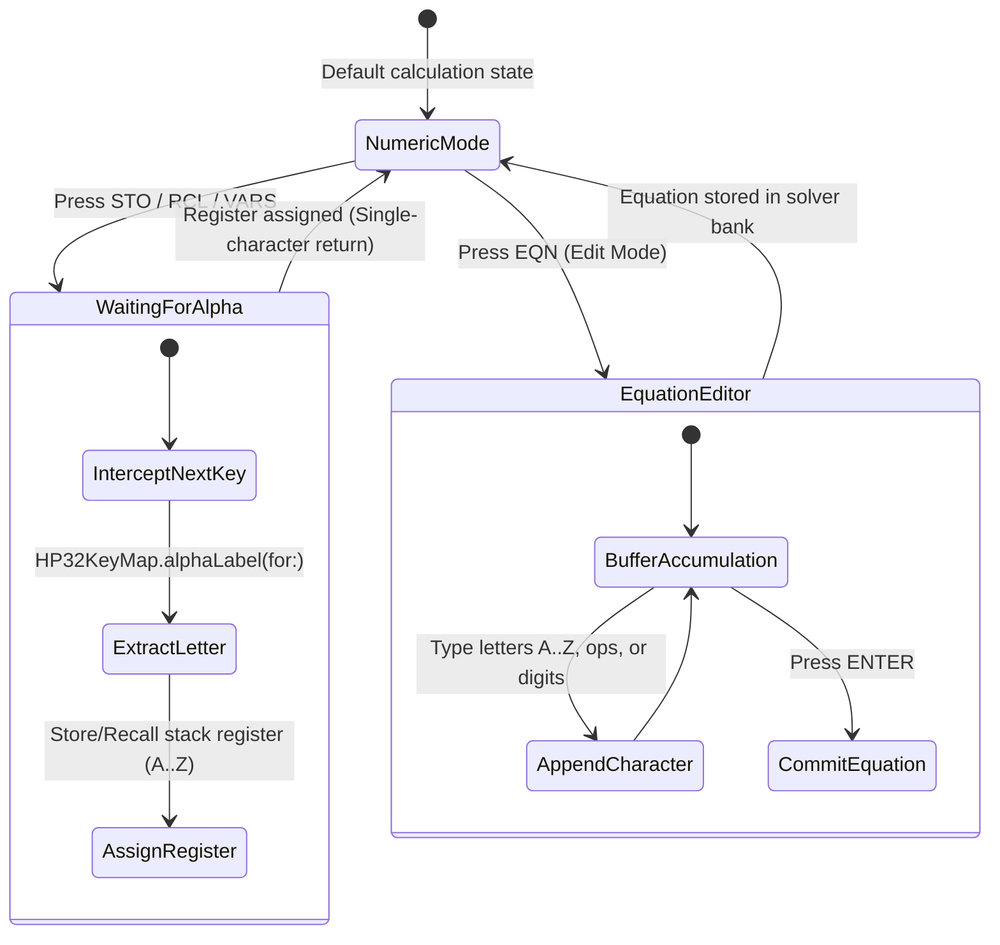

# Alpha Mode Input Handling: Text Entry Without a Full Keyboard

Nothing snaps you out of the retro calculator trance faster than typing `STO` to save a variable and having iOS suddenly pop up a giant, translucent, system QWERTY keyboard that violently covers your entire screen.

On watchOS, it gets even more comedic: the system tries to summon Apple's "Scribble" handwriting recognition. There you are, trying to carefully finger-draw an uppercase "X" on a tiny 40mm screen while the watch misinterprets it as an "8" or a multiplication sign.

It felt like an insult to the engineering elegance of the 1980s.

A physical Hewlett-Packard HP-32SII never needed a QWERTY keyboard. It handled variables (`STO A` through `STO Z`) and symbolic equations (`2*PI*R^2 + H*R = 0`) using a beautifully simple multiplexing layer: you tapped the `ALPHA` key, and every existing button on the faceplate temporarily adopted the tiny letter printed in yellow or blue silkscreen beside it. It was fast, deterministic, and felt like operating an old Nokia phone with T9 muscle memory.

<!-- more -->

## The `isWaitingForAlpha` State Machine

We refused to let UIKit or watchOS modal keyboards touch our application. If a user was going to name a register or type a formula, they were going to do it inside the calculator's native state machine.

In commit `469d706`, we moved alpha handling directly into `RPNCore/Sources/RPNCore/CalculatorEngine.swift`. The calculation core manages text entry as an internal modal state:

```swift
// RPNCore/Sources/RPNCore/CalculatorEngine.swift:1414-1442
public var isWaitingForAlpha: Bool = false
public var alphaBuffer: String = ""

public func handleAlphaInput(_ character: Character) {
    guard isWaitingForAlpha || isEquationEditMode else { return }
    
    if isEquationEditMode {
        equationBuffer.append(character)
        recomputeDisplayForEquation()
    } else {
        // Register Storage Mode: STO or RCL waiting for destination
        alphaBuffer = String(character)
        isWaitingForAlpha = false
        commitRegisterOperation(registerName: alphaBuffer)
    }
}
```

When you tap `STO` or `RCL`, `isWaitingForAlpha` flips to `true`. On the very next key event, `CalculatorEngine` intercepts the action before it can trigger an arithmetic operator or number, instantly resolving the button's designated character:



## Cross-Surface Resolution: `HP32KeyMap`

To keep our views clean and declarative, all character resolution logic lives inside `HP32KeyMap.swift`:

```swift
// Shared/HP32KeyMap.swift:507-521
public func alphaLabel(
    for primaryAction: CalculatorOperation?,
    capabilities: CalculatorCapabilities = .current
) -> String? {
    guard let primaryAction else { return nil }
    var result: String? = nil
    HP32KeyMap.forEachKey(capabilities: capabilities) { key in
        if result == nil,
           (key.primaryAction == primaryAction || 
            key.yellowAction == primaryAction  || 
            key.blueAction == primaryAction),
           !key.alphaLabel.isEmpty {
            result = key.alphaLabel
        }
    }
    return result
}
```

On iOS, pressing `ALPHA` illuminates the vintage hardware `ALPHA` annunciator on the LCD. The physical keys stay right where they are, but their legends brighten, letting you tap letters using the exact muscle memory of an HP-32SII.

On watchOS, where you can't read tiny sub-legends, swiping left to the Alpha Panel (`horizontalPage = 0`) presents a high-contrast 5×6 matrix of bold letter keys that look like a dedicated telegraph pad.

## Key Matrix Multiplexing Specifications

The mapping between physical calculator operations and alpha characters strictly adheres to the HP-32SII silkscreen layout:

| Physical Key Position | Primary Math Legend | Alpha Assignment | Register Memory Index | Solver Variable Mapping |
|---|---|---|---|---|
| **Row 1, Col 1** | `sqrt(x)` | **A** | Register 0 | Primary Independent Variable |
| **Row 1, Col 2** | `e^x` | **B** | Register 1 | Secondary Variable |
| **Row 1, Col 3** | `LN` | **C** | Register 2 | Constant / Parameter |
| **Row 1, Col 4** | `y^x` | **D** | Register 3 | Arbitrary Variable |
| **Row 1, Col 5** | `1/x` | **E** | Register 4 | Arbitrary Variable |
| **Row 2, Col 1** | `STO` | **F** | Register 5 | Function Target |
| **Row 2, Col 2** | `RCL` | **G** | Register 6 | Gravitational Constant |
| **Row 3, Col 1** | `SIN` | **K** | Register 10 | Thermal / Stiffness Coefficient |
| **Row 3, Col 2** | `COS` | **L** | Register 11 | Length / Inductance |
| **Row 4, Col 6** | `ENTER` | **[SPACE]** | N/A | Delimiter in Equation Strings |

## Conclusion: The Joy of Deterministic Chord Entry

Modern software has conditioned us to expect full 104-key QWERTY keyboards or AI-powered voice transcription for every single text interaction. But when you are naming a memory register on a piece of precision hardware, you don't need predictive text or autocorrect. You need a rock-solid, single-cycle chord that never misses. Building Alpha mode directly into `RPNCore` kept our interface blisteringly fast and true to the retro heritage that inspired it.
