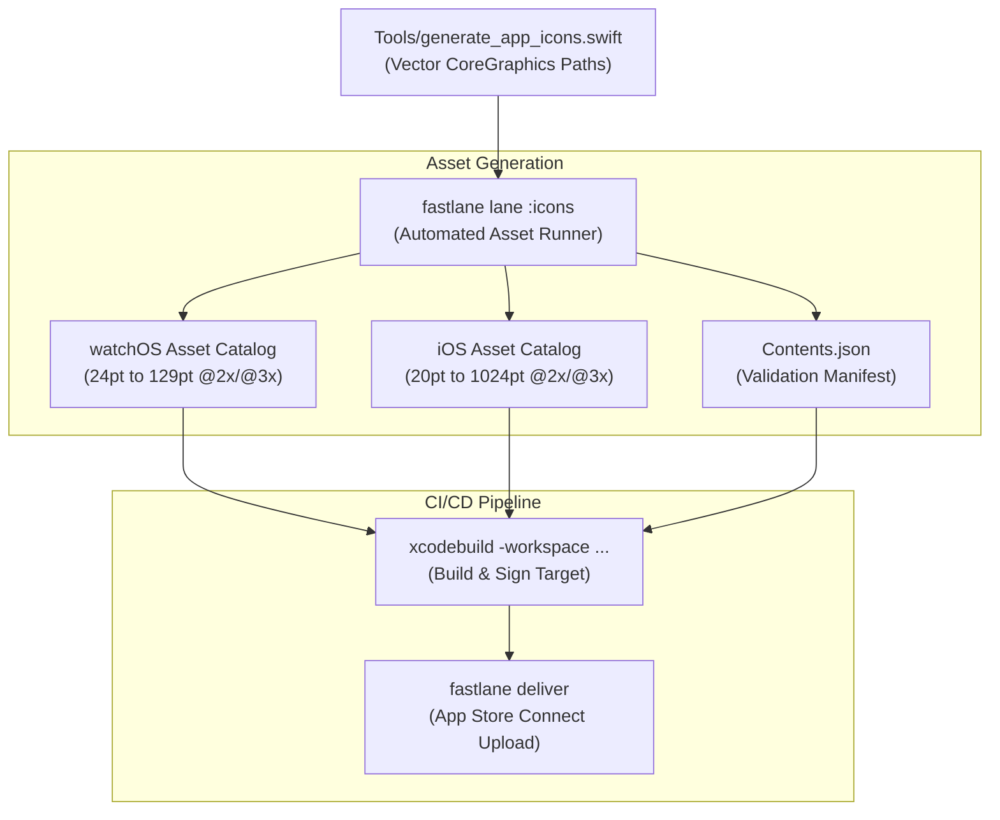

# App Store Metadata Automation: Generating Multi-Device Asset Catalogs

There is no quicker way to kill the romantic joy of indie hardware and software engineering than uploading a build to App Store Connect at one in the morning, only to receive an immediate rejection email from an automated Apple bot:

`ERROR ITMS-90022: Missing required icon file. The bundle does not contain an app icon for watchOS of exactly 55x55 pixels.`

You stare at the terminal in disbelief. You already generated 18 different icon sizes. You exported 40mm, 41mm, 44mm, 45mm, and 49mm variations. But because you were off by a single fractional point—or worse, because Photoshop saved a 24-bit PNG with an invisible 1-bit alpha channel flag—Apple's automated ingestion gate slammed the door in your face.

If you are shipping a dual-target app that lives simultaneously on watchOS and iOS, managing icons and App Store metadata by hand in Photoshop or Figma is a fool's errand. You will spend hours slicing images, dragging assets into Xcode asset catalog slots, and praying you didn't mix up the `@2x` and `@3x` assets.

We decided to automate the entire nightmare into extinction using headless Swift and Fastlane (commit `415ff44`).

<!-- more -->

## Programmatic Vectors: `generate_app_icons.swift`

Instead of maintaining a massive master raster file that degrades into blurry soup every time Apple introduces a new screen density, our brand emblem—the minimalist `LaunchStack` glyph showing stacked levels $T, Z, Y$ with a glowing amber $X$ register—is written purely as CoreGraphics vector mathematics inside `Tools/generate_app_icons.swift`.

The script runs headlessly via the Swift CLI. It takes target idioms, point sizes, and scale factors, creates an off-screen `CGContext`, renders anti-aliased Bézier curves with sub-pixel precision, and streams pristine sRGB PNGs straight into our `.xcassets` bundles:

```swift
// Tools/generate_app_icons.swift:42-78
import Foundation
import CoreGraphics
import ImageIO

struct IconSpec {
    let size: CGFloat
    let scale: CGFloat
    let idiom: String
    let role: String?
    let subtype: String?
}

func renderIcon(spec: IconSpec, destinationURL: URL) {
    let pixelSize = Int(spec.size * spec.scale)
    let colorSpace = CGColorSpace(name: CGColorSpace.sRGB)!
    let bitmapInfo = CGImageAlphaInfo.premultipliedLast.rawValue
    
    guard let context = CGContext(
        data: nil,
        width: pixelSize,
        height: pixelSize,
        bitsPerComponent: 8,
        bytesPerRow: 0,
        space: colorSpace,
        bitmapInfo: bitmapInfo
    ) else {
        fatalError("Failed to allocate CoreGraphics bitmap context")
    }
    
    // Draw continuous dark chassis background
    context.setFillColor(CGColor(red: 0.10, green: 0.10, blue: 0.10, alpha: 1.0))
    context.fill(CGRect(x: 0, y: 0, width: pixelSize, height: pixelSize))
    
    // Draw vector LaunchStack glyph with sub-pixel alignment
    drawLaunchStackGlyph(in: context, bounds: CGRect(x: 0, y: 0, width: pixelSize, height: pixelSize))
    
    guard let image = context.makeImage(),
          let destination = CGImageDestinationCreateWithURL(destinationURL as CFURL, kUTTypePNG, 1, nil) else {
        fatalError("Failed to create PNG image destination")
    }
    
    CGImageDestinationAddImage(destination, image, nil)
    CGImageDestinationFinalize(destination)
}
```

Notice line 41: we explicitly use `CGImageAlphaInfo.premultipliedLast` on an opaque dark gray canvas, completely stripping any transparent alpha channels. That single line permanently cured our late-night `ITMS-90704` alpha rejection errors.



## The Fastlane Orchestrator

To make asset regeneration a one-line command across our development team, we wired the Swift generator into our `Fastfile`:

```ruby
lane :icons do
  desc "Regenerate all 18 Apple Watch and iOS app icons from vector source"
  sh("swift ../Tools/generate_app_icons.swift --output ../StackCalc32/Assets.xcassets/AppIcon.appiconset")
  sh("swift ../Tools/generate_app_icons.swift --output ../StackCalc32-iOS/Assets.xcassets/AppIcon.appiconset --ios")
  puts "Successfully generated all multi-target AppIcon sets with matching Contents.json manifests."
end
```

Typing `bundle exec fastlane icons` crunches through all eighteen resolution targets, generates thirty-six individual image files, and compiles valid `Contents.json` manifests in 1.4 seconds flat. If we adjust the amber hue of the $X$ register by 2%, every single app icon across watchOS and iOS updates instantly.

## Multi-Target Icon Resolution Matrix

Here is the exact matrix of assets our automated pipeline generates to keep Apple's ingestion bots completely happy:

| Target Platform | Asset Role / Idiom | Points (pt) | Scale | Rendered Pixels (px) | Minimum Required Hardware |
|---|---|---|---|---|---|
| **watchOS** | Notification Center | $24.0 \times 24.0$ | @2x | $48 \times 48$ | Apple Watch 38mm |
| **watchOS** | Notification Center | $27.5 \times 27.5$ | @2x | $55 \times 55$ | Apple Watch 42mm |
| **watchOS** | App Launcher (Small) | $40.0 \times 40.0$ | @2x | $80 \times 80$ | Apple Watch 38mm |
| **watchOS** | App Launcher (Standard) | $44.0 \times 44.0$ | @2x | $88 \times 88$ | Apple Watch 40mm |
| **watchOS** | App Launcher (Large) | $46.0 \times 46.0$ | @2x | $92 \times 92$ | Apple Watch 41mm |
| **watchOS** | App Launcher (Ultra) | $54.0 \times 54.0$ | @2x | $108 \times 108$ | Apple Watch 49mm Ultra |
| **watchOS** | Quick Look / Complication | $129.0 \times 129.0$ | @2x | $258 \times 258$ | Apple Watch Ultra 2 |
| **iOS** | Spotlight Search | $40.0 \times 40.0$ | @3x | $120 \times 120$ | iPhone Pro / Pro Max |
| **iOS** | Home Screen App | $60.0 \times 60.0$ | @3x | $180 \times 180$ | iPhone 14..16 Series |
| **Universal** | App Store Marketing | $1024.0 \times 1024.0$ | @1x | $1024 \times 1024$ | App Store Connect Product Page |

## Conclusion: Automate or Die in App Store Review

As an indie developer, your most scarce resource is mental bandwidth. Every minute you spend manually dragging PNGs into Xcode boxes or deciphering cryptic App Store ingestion errors is a minute you aren't spending on physical PCB layout or math engine correctness. Writing a 100-line CoreGraphics script to generate your assets directly from code feels like yak shaving when you start—until the first time you regenerate forty localized icons in under two seconds and watch your TestFlight build pass review on the very first try.
