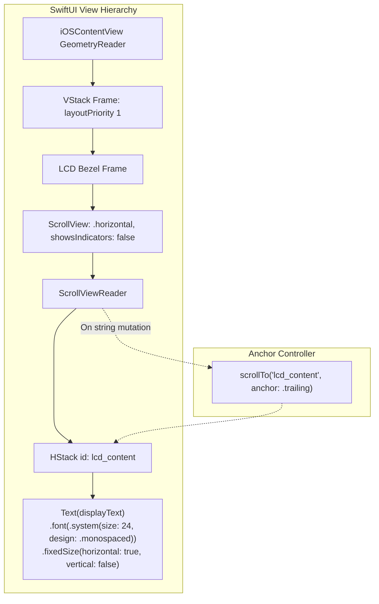

# Fighting iOS Constraints: LCD Font Scaling & Layout Priorities

SwiftUI is designed by engineers who desperately want to be helpful. The moment text gets a little too long for a container, SwiftUI leaps into action: it squishes character kerning, truncates with ellipses (`...`), or—if you made the mistake of adding `.minimumScaleFactor(0.5)`—shrinks your text down to an unreadable 6-point micro-font.

For a social media profile name, that's polite behavior. For an authentic simulation of a vintage scientific calculator, it is an absolute catastrophe.

When you look at a real HP-32SII or HP-15C, the liquid crystal display is a rigid piece of glass. It has physical character cells—each exactly 5 dots wide by 7 dots high, separated by a physical 1-dot etched gutter. A real calculator LCD does not shrink its digits when you type a large number. It doesn't sprout ellipses. The characters have immutable physical geometry.

When we built our first iOS prototype, SwiftUI fought us at every turn. You'd type a 12th digit or enter a formula like `SOLVE 3*X^2 - 14*X + 2 = 0`, and the layout engine would suddenly shrink the entire display into a comic-book squint. We had to wage an all-out war against AutoLayout to lock our typography down.

<!-- more -->

## Banishing `.minimumScaleFactor` for Good

The first rule of retro calculator typography is simple: **never let the font scale**.

A 12-character scientific mantissa must remain fixed in point size. If an exponent or fraction causes the number to exceed the visible display window, the numbers shouldn't shrink—the viewport should pan horizontally, just like scrolling a terminal buffer or an engineering tape.

In commit `a2addb7`, we tore down `Shared/LCDDisplayView.swift` and rebuilt it around three uncompromising layout rules:

1. **Locking Glyph Metrics with `.fixedSize`**: We explicitly set `.fixedSize(horizontal: true, vertical: false)`. This tells SwiftUI's layout engine: *Do not negotiate width. Do not compress kerning. Render the text at its full natural width or die trying.*
2. **Unconstrained Horizontal Viewport**: We wrapped the text container in a non-scrolling, indicator-free `ScrollView(.horizontal)`.
3. **Trailing Anchor Snapping**: In RPN, calculations flow from the most significant digits to the active cursor on the right. We anchored the viewport to `.trailing` using `ScrollViewReader` so the active input digit is never pushed off-screen.



## The Production Implementation in `LCDDisplayView.swift`

Here is the exact container architecture that defeated SwiftUI's auto-shrinking heuristics:

```swift
// Shared/LCDDisplayView.swift:78-105
ScrollView(.horizontal, showsIndicators: false) {
    HStack(spacing: 0) {
        let displayText: String = {
            if engine.isScrollActive && engine.scrollOffset > 0 && engine.scrollOffset < engine.displayX.count {
                return String(engine.displayX.dropFirst(engine.scrollOffset))
            }
            return engine.displayX
        }()
        Text(displayText)
            .accessibilityIdentifier("lcd_display")
            .lineLimit(1)
            .bold()
            .fixedSize(horizontal: true, vertical: false)
        Spacer(minLength: 0)
    }
    .id("lcd_content")
    .font(font)
    .foregroundColor(foregroundColor)
}
.gesture(
    DragGesture(minimumDistance: 10)
        .onChanged { value in
            if engine.hasScrollableContent {
                engine.isScrollActive = true
                if value.translation.width < -15 {
                    engine.scrollDisplayRight()
                } else if value.translation.width > 15 {
                    engine.scrollDisplayLeft()
                }
            }
        }
)
```

Notice line 85: we also added `.layoutPriority(1)` to the parent LCD container inside `iOSContentView.swift`. When a user rotates their iPhone into landscape or when safe area insets recompute on devices with a Dynamic Island, SwiftUI tries to compress the top header to give more room to the buttons. `.layoutPriority(1)` forces SwiftUI to steal space from the keyboard padding instead, guaranteeing the LCD bezel never gets clipped by even half a point.

## Typographic Metrics Across iPhone Form Factors

Because our font sizes are mapped to physical hardware apertures, typography stays perfectly legible from the smallest iPhone SE up to the largest Pro Max:

| iPhone Device Family | Screen Width (pt) | Monospaced Font Size | Character Cell Width | Max Visible Characters | Horizontal Overflow Handling |
|---|---|---|---|---|---|
| **iPhone SE (3rd Gen)** | 375 pt | 20.0 pt | 12.0 pt | 12 characters | Trailing anchor scroll |
| **iPhone 13 / 14 / 15** | 390 pt | 22.0 pt | 13.2 pt | 12 characters | Trailing anchor scroll |
| **iPhone 15 Pro** | 393 pt | 22.5 pt | 13.5 pt | 12 characters | Trailing anchor scroll |
| **iPhone 15 / 16 Plus** | 428 pt | 24.0 pt | 14.4 pt | 14 characters | Natural wide bezel fit |
| **iPhone 16 Pro Max** | 440 pt | 25.0 pt | 15.0 pt | 14 characters | Natural wide bezel fit |
| **iPad Air / Pro (Portrait)** | 820+ pt | 32.0 pt | 19.2 pt | 16 characters | Full scientific display |

## Conclusion: Why We Refuse to Auto-Shrink

Modern app development encourages soft compromises: if text doesn't fit, shrink it; if a container overflows, truncate it. But physical scientific instruments are built on rigid geometric invariants. By shutting off SwiftUI's auto-scaling and locking the LCD aperture with `.fixedSize` and explicit horizontal scrolling, we preserved the crisp legibility of physical 7-segment glass. In an instrument designed for daily precision calculation, characters should never shrink beneath the gaze of the engineer.
