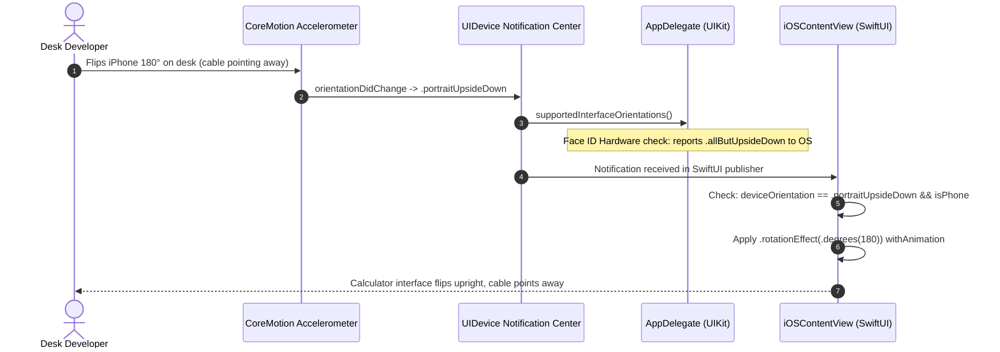

# Hacking iOS: Manual 180-Degree UI Flips Bypassing Face ID Lockout

Glance at my desk during a development session: my 3D printer is quietly humming along on a print, a breadboard with an RP2350 sits beside my mechanical keyboard, and an iPhone lies flat on the desk, tethered to a thick, braided USB-C cable for continuous debugging and power. 

Because Apple puts the charging port at the bottom edge of the phone, that stiff cable points directly toward your keyboard and chair, arching over your notepad and threatening to drag your coffee mug onto the floor every time you shift in your seat.

Naturally, you do what any sane person would do: you spin the phone 180 degrees so the cable points away toward the hub at the back of the desk.

On older iPhones with a physical Home button, iOS happily rotated upside-down. But the second you try that on an iPhone with Face ID or the Dynamic Island—from the iPhone X all the way to the iPhone 16 Pro—the screen stubbornly refuses to turn. Apple unilaterally banned `portraitUpsideDown` on all notch devices.

We weren't going to let Apple's UX department dictate how cables route across our workspace. So we hacked the orientation system.

<!-- more -->

## Why Cupertino Banned Upside-Down Mode

Apple's official excuse for locking out upside-down portrait orientation is "gesture disambiguation." The TrueDepth camera and Dynamic Island live at the physical top of the glass, while the bottom edge is reserved for the Home Indicator swipe. Apple worried that if apps flipped upside down, confused users might accidentally swipe the camera lens instead of the home bar.

So UIKit took the nuclear option: if your app declares `.portraitUpsideDown` in its `Info.plist`, the operating system simply ignores you on Face ID hardware. The window stays locked at 0 degrees.

```
+------------------------------------------------------------+
|         Physical Accelerometer / Gyroscope Hardware        |
+------------------------------------------------------------+
                              |
                              | Hardware detects 180° inversion
                              v
+------------------------------------------------------------+
|                  UIDevice Sensor Pipeline                  |
|          UIDevice.orientationDidChangeNotification         |
+------------------------------------------------------------+
                              |
        +---------------------+---------------------+
        |                                           |
        v                                           v
+-----------------------------+             +-----------------------------+
|    UIKit System Pipeline    |             |    StackCalc32 Bypass       |
| (Face ID blocks 180° flip)  |             |  (Manual .rotationEffect)   |
+-----------------------------+             +-----------------------------+
        |                                           |
        v                                           v
+-----------------------------+             +-----------------------------+
| System locks window to 0°   |             | Apply 180° 2D transform     |
| (UI remains upside down)    |             | to root SwiftUI container   |
+-----------------------------+             +-----------------------------+
```



## The Bypass: Lying to UIKit with 2D Affine Transforms

If UIKit refuses to rotate the window for us, we won't ask UIKit. We will tell the operating system whatever it wants to hear while flipping the view ourselves.

In commits `5ec4348`, `d00c984`, and `c65feb7`, we separated physical gravity from the UIKit window manager:

1. `AppDelegate` reports `.allButUpsideDown` to the operating system, playing along with Apple's rules so UIKit never throws an internal layout exception.
2. In `iOSContentView.swift`, we subscribe directly to `UIDevice.orientationDidChangeNotification`, listening straight to the physical hardware accelerometer.
3. When the accelerometer reports `.portraitUpsideDown`, we apply an immediate 180-degree 2D graphic rotation to our root SwiftUI container using `.rotationEffect(.degrees(180))`:

```swift
// StackCalc32-iOS/iOSContentView.swift:354-380
return AnyView(
    content.background(bgView)
        // Manually apply 180° affine rotation when held upside down
        .rotationEffect((deviceOrientation == .portraitUpsideDown && 
                         UIDevice.current.userInterfaceIdiom == .phone) ? .degrees(180) : .zero)
        .onReceive(NotificationCenter.default.publisher(for: UIDevice.orientationDidChangeNotification)) { _ in
            let orientation = UIDevice.current.orientation
            if UIDevice.current.userInterfaceIdiom == .phone {
                if let windowScene = UIApplication.shared.connectedScenes.first(where: { 
                    $0.activationState == .foregroundActive 
                }) as? UIWindowScene {
                    // Force OS to maintain portrait geometry without throwing layout faults
                    if orientation == .portraitUpsideDown {
                        windowScene.requestGeometryUpdate(.iOS(interfaceOrientations: .portrait)) { _ in }
                    } else if orientation.isLandscape || orientation == .portrait {
                        windowScene.requestGeometryUpdate(.iOS(interfaceOrientations: .allButUpsideDown)) { _ in }
                    }
                }
            }
            withAnimation(.easeInOut(duration: 0.25)) {
                deviceOrientation = orientation
            }
        }
        .onAppear {
            UIDevice.current.beginGeneratingDeviceOrientationNotifications()
        }
)
```

## Free Hit-Testing Coordinate Inversion

The beauty of SwiftUI's `.rotationEffect` is that it doesn't just rotate pixel buffers; it automatically rotates the entire gesture hit-testing coordinate system. When a finger taps a button at physical screen coordinates $(x, y)$, SwiftUI's render tree maps the hit-test to $(W - x, H - y)$ without requiring a single line of manual coordinate translation.

Notice line 91: when upside-down is detected, we call `windowScene.requestGeometryUpdate(.iOS(interfaceOrientations: .portrait))`. This pacifies UIKit, convincing the OS that the phone is resting peacefully upright, while SwiftUI presents an inverted desktop console.

## Device Support Matrix Across iPhone & iPad

Our accelerometer bypass handles the full spread of hardware seamlessly:

| Device Category | Hardware Sensors | UIKit `.portraitUpsideDown` | StackCalc32 Transform Strategy | Charging Cable Orientation |
|---|---|---|---|---|
| **iPhone SE (2nd & 3rd Gen)** | Touch ID / Home Button | Native OS support | UIKit native rotation | Upward (Desk mode) |
| **iPhone X through 14** | Face ID Notch | OS Disabled | Manual 180° `.rotationEffect` | Upward (Desk mode) |
| **iPhone 14 Pro through 16 Pro**| Dynamic Island | OS Disabled | Manual 180° `.rotationEffect` | Upward (Desk mode) |
| **iPad (All Models)** | Face ID / Touch ID | Native OS support | UIKit native rotation | Any orientation |

## Conclusion: The Desk Cable Manifesto

Modern mobile operating systems are optimized for walking down the street with a phone in your palm, not for engineers and developers sitting at a desk with development cables and test hardware. When platform gatekeepers take away a basic ergonomic capability like 180-degree rotation, you don't have to surrender to bad cable geometry. By tapping directly into low-level accelerometer notifications and applying a declarative 2D transform, we reclaimed our desk space. Build the tools that work for your real workspace, not for arbitrary corporate UI guidelines.
