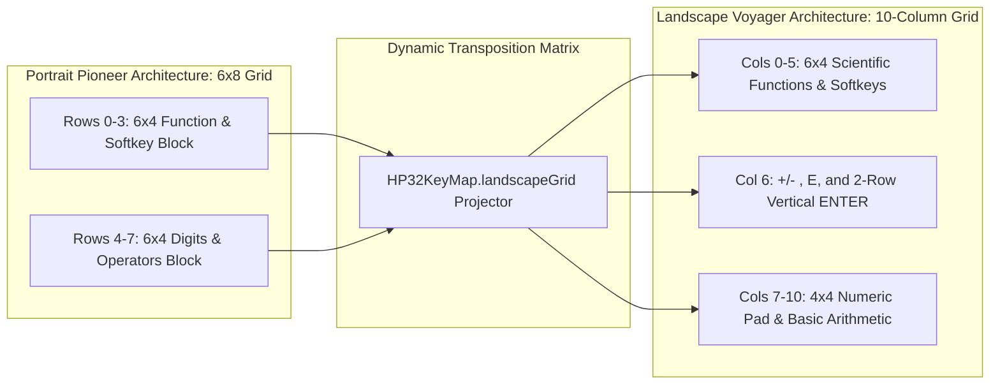

# The Voyager Layout: 10-Column HP-15C Landscape Mode

Why does almost every mobile calculator treat landscape mode like an embarrassing design afterthought?

You rotate your phone sideways, and what do you get? A generic 4×5 grid of buttons that has been stretched horizontally like warm taffy, turning clean circular keys into giant, cartoonish oval pills. Half the screen is empty black void, while scientific functions are either missing entirely or stuffed into an awkward secondary drawer.

In 1981, Hewlett-Packard did something revolutionary: they turned the pocket calculator sideways on purpose.

They called it the "Voyager" series—the legendary HP-15C Advanced Scientific and HP-12C Financial calculators. Instead of a cramped vertical faceplate, the Voyager gave engineers a wide horizontal console: a sprawling 10-column keyboard, a panoramic LCD, and an enormous, double-height vertical `ENTER` key anchored right where your right thumb naturally lands. It was the peak of 20th-century ergonomic industrial design.

When we built the landscape mode for StackCalc32, we refused to stretch buttons into ugly hot dogs. In commit `cc2c083`, rotating your iPhone sideways dynamically morphs the vertical 6-column HP-32SII Pioneer interface into a full-blooded, 10-column HP-15C Voyager console.

<!-- more -->

## Solving the Landscape Geometry Puzzle

On an iPhone 15, landscape viewport dimensions give you roughly $852 \times 393\text{ pt}$. If you try to maintain the portrait 6×8 grid, your keys end up $120\text{ pt}$ wide and $35\text{ pt}$ tall—an ergonomic monstrosity that forces your thumbs to make long, clumsy sweeps across the glass.

Worse, hiding advanced functions behind submenus completely defeats the purpose of turning the phone sideways. In the original HP-15C, every single matrix operation, complex number calculation, and trigonometric function lived right on the faceplate. 

We established a non-negotiable architectural invariant: our 10-column landscape mode must expose 100% of the portrait calculator's capabilities simultaneously, with zero shifted legend drift and zero hidden menus:

```
+-----------------------------------------------------------------------------+
|  STACKCALC32  Voyager Console                   123,456.7890                |
+-----------------------------------------------------------------------------+
| [LFU0][LFU1][LFU2][LFU3][LFU4][LFU5] | [+/-] | [ 7 ] [ 8 ] [ 9 ] [  /  ]     |
| [SQRT][EXP ][LN  ][Y^X ][1/X ][SIG+] | [ E ] | [ 4 ] [ 5 ] [ 6 ] [  *  ]     |
| [STO ][RCL ][ RDN][SIN ][COS ][TAN ] | [   ] | [ 1 ] [ 2 ] [ 3 ] [  -  ]     |
| [ C  ][ YEL][ BLU][XEQ ][X<>Y][ <- ] | [ENT] | [ 0 ] [ . ] [PLT] [  +  ]     |
+-----------------------------------------------------------------------------+
  <------ Function Block (Cols 0-5) ---->  Col 6  <-- Digits/Ops (Cols 7-10) -->
```



## Declarative Transposition in `HP32KeyMap.swift`

Rather than duplicating button definitions or creating a separate, fragile view hierarchy, our Voyager console is written as a pure placement-only projection of the primary key catalog inside `HP32KeyMap.swift`:

```swift
// RPNCore/Sources/RPNCore/Display/HP32KeyMap.swift:489-502
#if canImport(CoreGraphics)
/// Voyager is a placement-only projection of the portrait key catalog.
/// It cannot drift in operation, legend, or shifted behavior from iPhone.
public static let landscapeGrid: [HP32Key] = [
    key(for: .lfu0).placed(row: 0, col: 0), key(for: .lfu1).placed(row: 0, col: 1), 
    key(for: .lfu2).placed(row: 0, col: 2), key(for: .lfu3).placed(row: 0, col: 3), 
    key(for: .lfu4).placed(row: 0, col: 4), key(for: .lfu5).placed(row: 0, col: 5),
    key(for: .sqrt).placed(row: 1, col: 0), key(for: .exp).placed(row: 1, col: 1), 
    key(for: .ln).placed(row: 1, col: 2),   key(for: .power).placed(row: 1, col: 3), 
    key(for: .reciprocal).placed(row: 1, col: 4), key(for: .statAdd).placed(row: 1, col: 5),
    key(for: .sto).placed(row: 2, col: 0), key(for: .rcl).placed(row: 2, col: 1), 
    key(for: .rollDown).placed(row: 2, col: 2), key(for: .sin).placed(row: 2, col: 3), 
    key(for: .cos).placed(row: 2, col: 4), key(for: .tan).placed(row: 2, col: 5),
    key(for: .c).placed(row: 3, col: 0), key(for: .shiftYellow).placed(row: 3, col: 1), 
    key(for: .shiftBlue).placed(row: 3, col: 2), key(for: .xeq).placed(row: 3, col: 3), 
    key(for: .swapXY).placed(row: 3, col: 4), key(for: .backspace).placed(row: 3, col: 5),
    
    // Column 6: Sign, Scientific Exponent, and the Iconic Double-Height ENTER Key
    key(for: .toggleSign).placed(row: 0, col: 6), key(for: .e).placed(row: 1, col: 6), 
    key(for: .enter).placed(row: 2, col: 6, rowSpan: 2),
    
    // Columns 7-10: 4x4 Standard Numeric Pad and Arithmetic Operators
    key(for: .digit7).placed(row: 0, col: 7), key(for: .digit8).placed(row: 0, col: 8), 
    key(for: .digit9).placed(row: 0, col: 9), key(for: .divide).placed(row: 0, col: 10),
    key(for: .digit4).placed(row: 1, col: 7), key(for: .digit5).placed(row: 1, col: 8), 
    key(for: .digit6).placed(row: 1, col: 9), key(for: .multiply).placed(row: 1, col: 10),
    key(for: .digit1).placed(row: 2, col: 7), key(for: .digit2).placed(row: 2, col: 8), 
    key(for: .digit3).placed(row: 2, col: 9), key(for: .subtract).placed(row: 2, col: 10),
    key(for: .digit0).placed(row: 3, col: 7), key(for: .decimal).placed(row: 3, col: 8), 
    key(for: .plot).placed(row: 3, col: 9),   key(for: .add).placed(row: 3, col: 10)
]
#endif
```

## The Double-Height `ENTER` Key

The centerpiece of the entire layout is column 6:
`key(for: .enter).placed(row: 2, col: 6, rowSpan: 2)`

In RPN calculations, `ENTER` is your heartbeat. Giving it a `rowSpan` of 2 re-creates the physical thumb landing zone of the HP-15C. Your left hand commands transcendental functions, your right hand punches digits, and your right thumb effortlessly drops down onto that tall `ENTER` target without looking.

## Automated Parity Invariants in CI

To make sure a code refactor never causes a button or shifted legend to desync between portrait and landscape modes, our test suite enforces a 100% bi-directional audit in `KeyRoutingTests.swift`:

```swift
for voyagerKey in HP32KeyMap.landscapeGrid {
    let portraitKey = portrait.first { $0.primaryAction == voyagerKey.primaryAction }
    XCTAssertEqual(voyagerKey.primaryAction, portraitKey?.primaryAction)
    XCTAssertEqual(voyagerKey.yellowAction, portraitKey?.yellowAction)
    XCTAssertEqual(voyagerKey.blueAction, portraitKey?.blueAction)
    XCTAssertEqual(voyagerKey.alphaLabel, portraitKey?.alphaLabel)
}
```

Every single key matches its portrait sibling in primary behavior, yellow-shift action, blue-shift action, and LCD legend.

## Conclusion: The 1981 Engineering Triumph That Still Beats Modern UI

Rotating an iPhone should feel like opening a classic engineering tool chest, not stretching a toy. Hewlett-Packard's 1981 Voyager architecture was not an accident; it was the result of exhaustive ergonomic research into how human hands actually interact with numbers. By projecting that classic 10-column layout onto modern OLED glass and anchoring it with an unyielding double-height `ENTER` key, StackCalc32 proves that great industrial design from forty-five years ago still runs circles around modern mobile design conventions.
