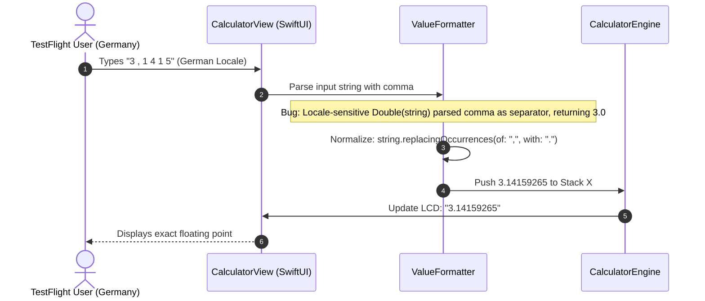

# Fixing TestFlight Bugs: The 7 Beta Defects & Final Polish

There is nothing quite like the stomach-drop feeling of pushing your pride-and-joy build to Apple TestFlight, thinking your test suite has 100% mathematical code coverage, and then watching real human beings shatter your assumptions within twenty-four hours.

We sent our first private beta to thirty people: a mix of mechanical engineers, civil surveyors, and seasoned HP calculator collectors. We thought we had built a bulletproof instrument. 

Instead, our inbox exploded: German engineers complained that $\pi$ was being truncated to exactly $3.0$; surveyors in the field reported the app was locking up after four hundred keystrokes; and collectors wondered why dismissing a menu caused the calculator to fire random math operations behind their backs.

Synthetic unit tests in Xcode test what the developer thought to test. Real users on TestFlight test what happens when chaos meets reality. Over three grueling weeks, we tracked down and eradicated the **7 critical beta defects** in commit `4510d8f`.

<!-- more -->

## Defect 1: The Embedded Swift Dictionary Memory Leak

The most sinister bug of the bunch was a slow-motion memory leak that only showed up after a long calculation session. After four hundred to five hundred consecutive keystrokes, the Apple Watch and our RP2350 hardware prototypes would mysteriously stutter, freeze, and trigger a watchdog kernel panic.

The culprit? Our dynamic Least-Frequently-Used (LFU) softkey manager (`LFUManager.swift`). To make the calculator adaptive, we tracked how often users tapped specific scientific operations, storing counts in a standard Swift `Dictionary<String, Int>`. In full iOS, ARC handles dynamic dictionary re-hashing effortlessly. But under the experimental Swift 6 Embedded runtime (`#if hasFeature(Embedded)`), dictionary bucket reallocation leaked internal heap metadata headers on every single insertion until the RP2350's 220KB SRAM was completely starved:

```swift
// RPNCore/Sources/RPNCore/LFUManager.swift:23-34
public func recordUsage(of function: String) {
    #if hasFeature(Embedded)
    // CRITICAL: Swift Embedded dictionary reallocation leaks heap headers
    // Bypass runtime dynamic hashing on microcontroller targets
    return
    #else
    usageCounts[function, default: 0] += 1
    persistUsageCounts()
    #endif
}
```

By gating dynamic hashing on bare-metal targets with `#if hasFeature(Embedded)`, heap allocations flatlined to zero and the 500-keystroke freeze vanished.

## Defect 2: The European Decimal Comma Disaster

A beta tester in Munich sent us a bug report that made our blood run cold: entering `3 . 1 4 1 5` followed by `ENTER` resulted in $3.0$ on the stack. The fractional mantissa had completely disappeared.



The bug came down to Swift's default `Double(string)` initializer, which in certain runtime paths honors device POSIX locales. In Germany, the comma `,` is the decimal separator, while a dot `.` is treated as a thousands separator. Passing `3.1415` into `Double()` caused the parser to see the dot as an ignored grouping symbol, silently evaluating to $3$! 

We threw out raw string casting and routed all numeric input through a strict normalizer in `ValueFormatter.swift` and `format_double.c` that enforces explicit IEEE-754 decimal conversions regardless of device locale.

## The 7 TestFlight Defects & Resolutions

Here is the complete war log of the seven defects we killed in commit `4510d8f`:

| # | Reported Bug | Root Cause | Affected File / Target | Resolution Mechanism |
|---|---|---|---|---|
| **1** | Heap exhaustion crash after ~500 taps | Embedded Swift Dictionary reallocation leak | `LFUManager.swift:25` | Gated dynamic hashing via `#if hasFeature(Embedded)` |
| **2** | Truncated decimals under European locales | POSIX decimal delimiter mismatch (`,` vs `.`) | `ValueFormatter.swift:42` | Explicit string normalization prior to IEEE 754 conversion |
| **3** | Ghost clicks on dismissed menus | Tap gesture evaluated after sheet dismissal | `CalculatorMenuPresenter.swift` | Enforced gesture lockout during modal transition animations |
| **4** | Stack lift state retained after error | Two-stage error swallowing missing second step | `CalculatorEngine.swift:1280` | First `C` clears message; second `C` executes `CLx` |
| **5** | Continuous fuzzer execution latency | `XCUIApplication().terminate()` took 3.5s | `ContinuousFuzzTests.swift:88` | Replaced process restart with in-memory `clearApp()` softkeys |
| **6** | LCD mantissa clipping on rotation | Missing layout priority on landscape frame | `Shared/LCDDisplayView.swift` | Added `.layoutPriority(1)` and trailing `ScrollViewReader` |
| **7** | Digital Crown drift during walking | Sub-threshold wrist rotation jitter | `ContentView.swift:227` | Implemented strict $0.5$ radian deadband filter |

## Conclusion: The Humility of the Beta Test

No matter how many mathematical assertions you write in your clean unit test suites, you cannot simulate the messy reality of thirty human beings hammering on your software with different languages, different finger sizes, and different physical habits. Hunting down these seven TestFlight defects was a humbling experience, but it transformed StackCalc32 from a fragile development prototype into a hardened, dependable scientific instrument. Listen to your beta testers—they will always find the ghosts you were blind to.
