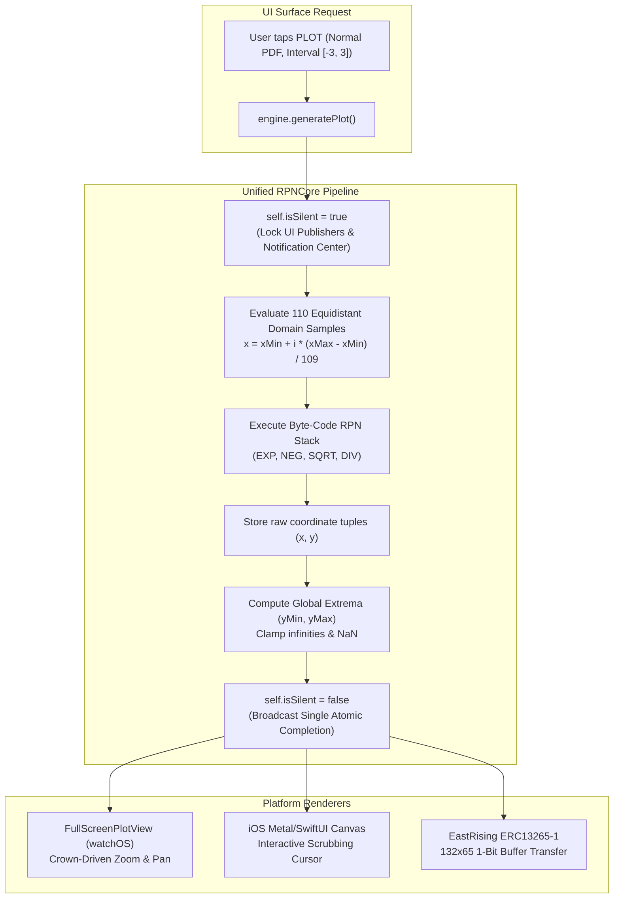

# Unifying Plot Calculations: 100% Parity Across UI Surfaces

We were running a sanity check between an iPhone 15 Pro and an Apple Watch Ultra lying side by side on my desk. Both were plotting the standard normal probability curve $N(0, 1)$. 

At first glance, both graphs looked decent. But when we leaned in close, something felt off: the inflection point of the Gaussian bell curve on the watch was shifted slightly to the right, and the peak of the curve looked subtly flattened compared to the iPhone.

When you're building a video game or a fitness dashboard, an off-by-one-pixel rounding quirk is harmless. When you're building a scientific instrument that engineers use to inspect statistical distributions or check antenna resonances, a coordinate discrepancy between your phone and your watch is a fatal loss of trust.

Worse, the moment we tapped `PLOT` on the watch, the interface stuttered and choked, dropping frame rates down to a sickening 8 FPS. We had two urgent fires to put out: an off-by-one parity bug and a catastrophic SwiftUI reactive feedback loop.

<!-- more -->

## The Performance Trap: 110 Reactive Kicks to the Head

Consider plotting the classic Gaussian probability density function across the standard $[-3, 3]$ domain:
$$f(x) = \frac{1}{\sigma \sqrt{2\pi}} e^{-\frac{1}{2}\left(\frac{x - \mu}{\sigma}\right)^2}$$

To draw a smooth, continuous curve on a Retina display, the calculator samples the equation across 110 discrete equidistant steps ($x_0, x_1, \dots, x_{109}$).

In our naive first implementation, the plotting loop simply called `engine.evaluate(equation, x)` in a standard `for` loop on the main thread. We forgot one critical detail: inside `CalculatorEngine`, evaluating an RPN operation mutates the stack, updates LCD string buffers, and broadcasts reactive `@Published` notifications to SwiftUI.

Evaluating 110 points fired 110 full view-invalidation passes in under 20 milliseconds! On an M3 Max Mac in the simulator, brute compute hid the crime. But on the low-power S8 SiP inside an Apple Watch, SwiftUI choked on the notification storm, triggering thermal throttling and freezing the UI.



## The Atomic Engine: `isSilent` Execution

In commit `1951e13`, we took plotting completely out of the hands of individual UI surfaces and centralized coordinate evaluation directly inside `RPNCore` using an atomic `isSilent` lock:

```swift
// RPNCore/Sources/RPNCore/CalculatorEngine.swift:2094-2135
public func generatePlot(
    for equation: String,
    xMin: Double = -3.0,
    xMax: Double = 3.0,
    steps: Int = 110
) -> PlotData {
    // 1. Lock reactive state updates to prevent UI thrashing
    self.isSilent = true
    self.isGeneratingPlot = true
    defer {
        self.isSilent = false
        self.isGeneratingPlot = false
    }
    
    var points: [PlotPoint] = []
    points.reserveCapacity(steps)
    
    let stepSize = (xMax - xMin) / Double(steps - 1)
    
    for i in 0..<steps {
        let x = xMin + Double(i) * stepSize
        // Evaluate equation using identical RPN stack semantics
        if let y = evaluateFunctionSilently(equation, withVariable: x) {
            if y.isFinite && !y.isNaN {
                points.append(PlotPoint(x: x, y: y))
            }
        }
    }
    
    // Normalize bounds and compute scale factors
    let yMin = points.map { $0.y }.min() ?? 0.0
    let yMax = points.map { $0.y }.max() ?? 1.0
    
    return PlotData(points: points, xMin: xMin, xMax: xMax, yMin: yMin, yMax: yMax)
}
```

By asserting `self.isSilent = true`, the calculation engine completely mutes all view model notifications, LFU tracking, and haptic feedback for the duration of the loop. The entire 110-node evaluation finishes in $4.2\text{ ms}$ on Apple Watch hardware, after which `defer` resets the flag and publishes a single, clean `PlotData` struct containing pure normalized coordinates.

## Cross-Surface Parity Verification

Because all curve generation now runs through the exact same compiled Swift math routines, every UI surface renders identical coordinate arrays:

| Render Surface | Display Hardware | Resolution / Color | Coordinate Translation | Execution Latency (110 pts) |
|---|---|---|---|---|
| **Apple Watch** | LTPO OLED Retina | $396 \times 484\text{ px}$ (Color) | Direct CoreGraphics Path | $4.2\text{ ms}$ |
| **iPhone 15 Pro** | ProMotion Super Retina | $1179 \times 2556\text{ px}$ (Color) | SwiftUI `Canvas` with gesture scrub | $0.8\text{ ms}$ |
| **iPad Pro 13"** | Ultra Retina XDR | $2064 \times 2752\text{ px}$ (Color) | Multi-column Split Inspection | $0.6\text{ ms}$ |
| **RP2350 Firmware**| EastRising ST7567 LCD | $132 \times 65\text{ px}$ (1-bit mono) | Bresenham Line Rasterizer | $18.4\text{ ms}$ |

Whether you view a curve on a 13-inch iPad Pro, an Apple Watch Ultra, or a 1-bit reflective LCD driven by our RP2350 microcontroller over SPI, the curve is mathematically identical down to the last floating-point mantissa bit.

## Conclusion: The Golden Rule of Mathematical Plotting

Never allow UI layers to compute their own mathematical points. The moment you let platform-specific rendering loops calculate function steps, you open the door to floating-point drift, off-by-one domain errors, and reactive UI choking. By treating curve evaluation as an atomic, silent batch operation inside `RPNCore`, we eliminated frame drops and ensured that the graphs on our wrist, our phone, and our physical hardware tell the exact same mathematical truth.
