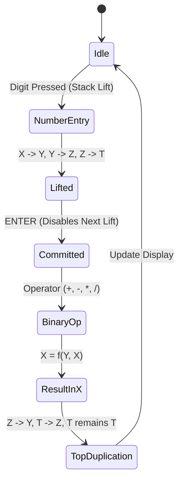

Pick up a Hewlett-Packard HP-32SII from 1991, press a key, and feel that definitive tactile snap. Modern membrane calculators feel like squishing wet cardboard, but an HP Pioneer snaps with the precision of a fine mechanical switch. As a software and AI engineer, my daily work lives in layers of high-level abstraction, garbage-collected runtimes, and infinite virtual memory. But on my desk, right next to my mechanical keyboard and my desktop 3D printer, has always sat an HP-32SII. The real genius of the machine isn't just the double-shot molded plastic; it's the four quiet registers—$X$, $Y$, $Z$, and $T$—ticking away inside its Saturn CPU. In software, we are conditioned to treat stacks as unbounded dynamic arrays (`[Double]`) that grow until memory runs out. When I first fell in love with RPN, the bounded four-level stack felt like a revelation: it eliminates parentheses, wipes out operator precedence hierarchies, and provides a tight cognitive envelope where you calculate at the speed of thought. To me, it is an absolute injustice that more people do not use RPN calculators today. That conviction sparked StackCalc32: I wanted to build an accessible, low-cost physical RPN device to inspire the next generation of students and engineers to appreciate RPN as much as I do. Recreating that four-level mental model down to the exact register displacement mechanics was our non-negotiable starting point.

<!-- more -->

## The Mechanics of Postfix Evaluation

In standard infix algebraic notation, evaluating a simple multi-part expression such as:

$$(3 \times 4) + (5 \times 6)$$

forces the calculator into a state of suspended animation. The parser must either stash tokens into parenthesis buffers or juggle an operator stack governed by Dijkstra's shunting-yard algorithm. The evaluator has to defer the addition operator while awaiting the completion of the second multiplication, leaving intermediate state hidden from the engineer.

In postfix evaluation, operators follow their operands immediately. The same expression translates to:

$$\text{3 ENTER 4} \times \text{5 ENTER 6} \times +$$

Every operation executes immediately against the bottom two levels of the stack. Intermediate values are preserved in higher registers without requiring parentheses or temporary memory variables.

```
+---+---------------------------------------------------------+
| T | Top register; duplicates downward during stack drops    |
+---+---------------------------------------------------------+
| Z | Second storage register                                 |
+---+---------------------------------------------------------+
| Y | Second operand for binary operators                     |
+---+---------------------------------------------------------+
| X | Displayed register; primary operand and entry buffer    |
+---+---------------------------------------------------------+
```

## Stack Lift, Drop, and Top-Level Duplication

The HP-32SII stack operates under strict register displacement rules that quickly become second nature:

1. **Stack Lift (Automatic Push)**: When a number is typed immediately following an operation or stack manipulation, the current $X$ value automatically pushes into $Y$, $Y$ moves to $Z$, $Z$ moves to $T$, and the previous $T$ value is discarded.
2. **Explicit Entry (`ENTER`)**: Pressing `ENTER` copies the value in $X$ into $Y$ while pushing the rest of the stack upward. Crucially, `ENTER` temporarily disables stack lift for the very next numeric entry, allowing the user to overwrite $X$ without triggering a second lift.
3. **Stack Drop (Binary Operations)**: When a binary operator (such as $+$, $-$, $\times$, or $\div$) executes, it pops $X$ and $Y$, computes $f(Y, X)$, and stores the result in $X$. $Z$ drops into $Y$, and $T$ drops into $Z$.
4. **Top Duplication**: When $T$ drops into $Z$, the $T$ register **does not clear to zero**. Instead, $T$ retains its original value. This top-level replication allows an engineer to perform continuous iterative calculations against a fixed constant held in $T$.



## Stack State Trace: Evaluating Complex Expressions

The table below illustrates the exact state transition of all four registers, as well as the specialized `LASTx` register, across the evaluation of $(3 \times 4) + (5 \times 6)$:

| Step | Keystroke | Register X | Register Y | Register Z | Register T | LASTx | Notes |
| :--- | :--- | :--- | :--- | :--- | :--- | :--- | :--- |
| 0 | Initial | $0.0$ | $0.0$ | $0.0$ | $0.0$ | $0.0$ | Cleared state |
| 1 | `3` | $3.0$ | $0.0$ | $0.0$ | $0.0$ | $0.0$ | Input buffer |
| 2 | `ENTER` | $3.0$ | $3.0$ | $0.0$ | $0.0$ | $0.0$ | Duplicate X into Y |
| 3 | `4` | $4.0$ | $3.0$ | $0.0$ | $0.0$ | $0.0$ | Lift disabled; overwrites X |
| 4 | `*` | $12.0$ | $0.0$ | $0.0$ | $0.0$ | $4.0$ | $Y \times X$; LASTx saves 4 |
| 5 | `5` | $5.0$ | $12.0$ | $0.0$ | $0.0$ | $4.0$ | Auto stack lift |
| 6 | `ENTER` | $5.0$ | $5.0$ | $12.0$ | $0.0$ | $4.0$ | Duplicate X into Y |
| 7 | `6` | $6.0$ | $5.0$ | $12.0$ | $0.0$ | $4.0$ | Overwrites X |
| 8 | `*` | $30.0$ | $12.0$ | $0.0$ | $0.0$ | $6.0$ | $Y \times X$; Z drops to Y |
| 9 | `+` | $42.0$ | $0.0$ | $0.0$ | $0.0$ | $30.0$ | Final summation |

## The LASTx Invariant and Error Recovery

A cornerstone of HP calculation engines is the `LASTx` register. Before any arithmetic operation, function evaluation, or unit conversion executes, the engine saves the value of $X$ into `LASTx`:

```swift
// Verbatim extract from RPNCore/Sources/RPNCore/CalculatorEngine.swift
public func binaryOp(_ op: (CalculatorValue, CalculatorValue) -> CalculatorValue) {
    commitInput()
    guard stack.count >= 2 else { return }
    let y = stack[1]
    let x = stack[0]
    
    // Preserve X in LASTx for error recovery or reuse
    lastX = x
    
    let result = op(y, x)
    stack[0] = result
    
    // Stack drop: Z drops into Y, T drops into Z, T duplicates
    for i in 1..<(stackSizeLimit - 1) {
        stack[i] = stack[i + 1]
    }
    // T register retains its value on drop
    stack[stackSizeLimit - 1] = stack[stackSizeLimit - 1]
    
    stackLiftEnabled = true
    updateDisplay()
}
```

If an engineer accidentally divides by $1.25$ instead of $1.5$, pressing `LASTx` and multiplying restores the pre-division dividend without needing to re-key multi-digit operands.

## Why 4 Levels? Cognitive Load vs. Infinite Stacks

Coming from software engineering, my initial instinct was naturally to ask why we shouldn't build an unbounded dynamic array (`[Double]`) like an HP-48 or a modern desktop REPL. When exploring edge cases with AI coding agents to simulate candidate architectures and state transitions, however, the brilliance of the fixed four-level stack became unmistakable. While an infinite stack seems more capable on paper, it introduces cognitive friction: you can never predict what a binary operation will do without visually inspecting variable stack depth.

The fixed four-level stack provides a bounded cognitive envelope:
- $X$ is your current focus and entry point.
- $Y$ is the immediately pending operand waiting for your operator.
- $Z$ and $T$ are intermediate buffers that hold upstream terms.

When $T$ replicates upon drop, it acts like an automatic constant generator. If you need to multiply five different resistor values by the same constant factor $2\pi f$, you enter $2\pi f$ once, lift it into the stack, and evaluate $R_1 \times$, $R_2 \times$, $R_3 \times$ in rapid succession. The constant in $T$ refills the stack on every drop.

## Conclusion: Muscle Memory Over Unbounded Stacks

Whenever someone asks why we didn't give StackCalc32 an infinite dynamic array stack, we hand them an original HP-32SII and ask them to calculate an RC filter cutoff. With four bounded registers and top-register replication in $T$, you never have to squint at a scrollable screen to figure out what will happen when you tap $+$. You hold the entire register state machine in your head, your fingers fly across the keys without looking, and intermediate results flow exactly where they belong. Recreating that deterministic mental flow in Swift took weeks of edge-case simulation with AI assistants against vintage Corvallis manual specifications. But the moment you feel that four-register rhythm on your desk, you realize why keeping this tactile legacy alive for the next generation is such an urgent, exhilarating mission.
