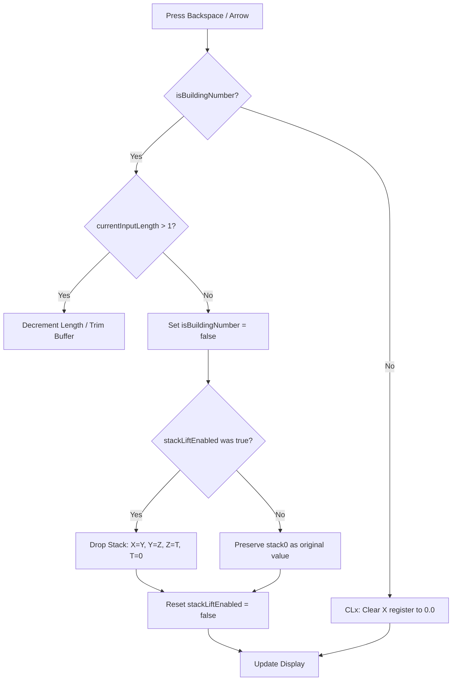

Picture this: you've just chained five complex operations together, and your intermediate result—say, $142.857$—is sitting comfortably in the $X$ register. You start typing the next number in your formula: you hit `3`, but your finger slipped; you meant `4`. Naturally, you tap Backspace. On a naive RPN calculator, you look at the screen and freeze in horror: $X$ is now `0.0`, your $142.857$ has been permanently shoved up into $Y$, and the entire stack history you spent three minutes building is desynchronized.

As software developers, our instinct is to think of Backspace as merely popping a character off an input string buffer (`string.popLast()`). But on an authentic RPN calculator, typing a digit is inextricably tied to the stack-lift state machine. That exact scenario sparked a week-long debate on our team that we forever call "The Backspace Debate"—and led us to pair with AI coding agents to exhaustively map out HP-32SII state transition tables to ensure our engine forgives human hesitation without corrupting registers.

<!-- more -->

## The Stack Lift Hazard

When an operation (such as $5 \times 5 = 25$) finishes, the result $25$ rests in the $X$ register with `stackLiftEnabled = true`. If the user now presses `3`, the engine executes an automatic stack lift:

$$X \to Y, \quad Y \to Z, \quad Z \to T, \quad T \text{ is discarded}$$

The newly typed digit `3` becomes an uncommitted number entry buffer in $X$. 

If the user realizes they made an error and presses Backspace (`<-`), naive calculator engines simply clear the input buffer to `0.0`. But this creates an insidious state corruption: $Y$ still holds $25.0$, $Z$ holds the old $Y$, and the pre-entry state of the stack has been destroyed. The user cannot simply start over without manually dropping or clearing the stack.

```
Initial Stack:       Typing '3' (Lifted):     Naive Backspace:       HP-32SII Corrected:
+----+---------+    +----+---------+         +----+---------+       +----+---------+
| T  |  10.0   |    | T  |  20.0   |         | T  |  20.0   |       | T  |  10.0   |
+----+---------+    +----+---------+         +----+---------+       +----+---------+
| Z  |  20.0   |    | Z  |  30.0   |         | Z  |  30.0   |       | Z  |  20.0   |
+----+---------+    +----+---------+         +----+---------+       +----+---------+
| Y  |  30.0   |    | Y  |  25.0   | (Lift!) | Y  |  25.0   | (Bad!)| Y  |  30.0   | (Restored)
+----+---------+    +----+---------+         +----+---------+       +----+---------+
| X  |  25.0   |    | X  |   3_    |         | X  |   0.0   |       | X  |  25.0   | (Restored)
+----+---------+    +----+---------+         +----+---------+       +----+---------+
```

## The HP-32SII Stack Reversal Parity

Under commit `18b7813` (refined in `f8a7565`), we set our prototype side-by-side with a physical HP-32SII and keyed dozens of destructive sequences. The HP-32SII enforces an ironclad invariant: **canceling an uncommitted entry buffer must completely restore the stack state prior to that entry**.

If the user deletes the last remaining digit of an uncommitted buffer, the engine inspects `stackLiftEnabled`. If stack lift was triggered when typing began, the engine drops the stack to reverse the lift.



## Implementation in CalculatorEngine.swift

Here is the exact implementation from `RPNCore/Sources/RPNCore/CalculatorEngine.swift`:

```swift
public func backspace() {
    if isBuildingNumber {
        if currentInputLength > 1 {
            let last = currentInputBuffer[currentInputLength - 1]
            currentInputLength -= 1
            if last == 46 { hasDecimal = false } // ASCII '.'
            
            if currentInputLength == 1 && currentInputBuffer[0] == 45 { // ASCII '-'
                currentInputBuffer[0] = 48 // ASCII '0'
            }
        } else {
            currentInputBuffer[0] = 48
            currentInputLength = 1
            isBuildingNumber = false
            
            // HP-32SII Parity: When you completely cancel a number entry
            // by backspacing the last character, the stack should drop
            // to reverse the stack lift that occurred when you started typing.
            if stackLiftEnabled == true {
                // Undo the push (drop the stack)
                for i in 0..<(stackSizeLimit - 1) {
                    stack[i] = stack[i + 1]
                }
                stack[stackSizeLimit - 1] = CalculatorValue()
            } else {
                // Do not clear stack[0]. It retains the value before building started.
            }
            stackLiftEnabled = false
        }
    } else {
        stack[0] = CalculatorValue()
        stackLiftEnabled = false
    }
    updateDisplay()
}
```

## Two-Stage Error Swallowing Parity

A related subtlety is the interaction between Backspace, the `C` key, and error banners. On the HP-32SII, when an arithmetic exception occurs (such as division by zero or taking $\sqrt{-5}$ in real mode), the display locks with an error message: `DIVIDE BY 0`.

Many modern calculator apps immediately clear the $X$ register or purge the stack when `C` or Backspace is tapped during an error. This destroys the user's calculation context.

In `RPNCore`, we implemented strict **two-stage error dismissal**:

```swift
@discardableResult
public func clearError() -> Bool {
    if errorMessage != nil {
        errorMessage = nil
        stackLiftEnabled = false
        updateDisplay()
        return true // Consumed event; do not clear X!
    }
    return false
}

public func clearC() {
    // Stage 1: Clear error message banner without altering stack registers
    if clearError() { return }
    
    // Stage 2: Only executed if no error was present
    if cancelPendingModes() { return }
    clearX()
}
```

| Event | Display State | Register X | Register Y | Stack Altered? |
| :--- | :--- | :--- | :--- | :--- |
| Divide by Zero | `"DIVIDE BY 0"` | $0.0$ | $42.0$ | No (error lock) |
| Press `C` (1st tap) | `"0.0000"` | $0.0$ | $42.0$ | **No** (error dismissed) |
| Press `C` (2nd tap) | `"0.0000"` | $0.0$ | $42.0$ | $X$ cleared (`CLx`) |

By separating error dismissal from stack modification and reversing stack lift upon canceling digit entry, `RPNCore` achieves authentic physical calculator fidelity.

## Conclusion: Forgiving Human Hesitation at the Keyboard

If there's one lasting insight from the Backspace Debate, it's that state machines in physical instruments must forgive human hesitation. A user typing a number hasn't committed to a mathematical operation until they hit an operator or `ENTER`. By tracking whether the initial keystroke triggered a stack lift and quietly dropping the stack when the buffer is erased back to nothing, we made the calculator feel as forgiving as pencil and paper. The Corvallis engineers figured this out thirty years ago on the HP-32SII. As we build StackCalc32 to provide an accessible, low-cost physical RPN device for students and makers, preserving these quiet behavioral subtleties ensures that the next generation falling in love with RPN experiences the exact same confidence and joy that classic HP hardware delivered.
