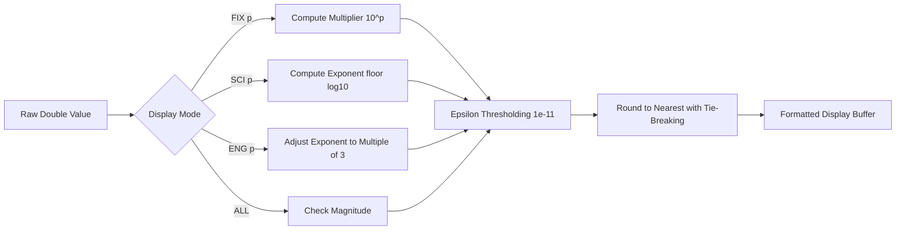

Nothing shatters your pride as a software engineer faster than flashing your freshly compiled calculator firmware onto physical silicon, watching someone type `0.1 ENTER 0.2 +`, and seeing the LCD display: `0.30000000000000004`. In modern web or backend development, we are conditioned to shrug off floating-point noise as an unavoidable quirk of IEEE-754. But on a dedicated scientific calculator, displaying `0.300000000004` makes you look like you slapped a naive script onto a screen.

Classic Hewlett-Packard calculators never suffered this embarrassment because the HP-32SII ran on a custom 4-bit Saturn microprocessor calculating in native Binary-Coded Decimal (BCD). When compiling bare-metal Embedded Swift for an RP2350 Cortex-M33 running at 133 MHz, however, full software BCD emulation brought transcendental trigonometric functions to an absolute crawl. To find an honest, lightning-fast compromise, I used AI coding agents as a mathematical sounding board—iterating through dozens of candidate threshold algorithms and fuzzing edge-case inputs until we arrived at our 12-digit guard mantissa.

<!-- more -->

## The Binary Floating Point Dilemma

Under the hood of any modern ARM chip, IEEE-754 double-precision hardware formats numbers into sign, exponent, and binary mantissa:

$$x = (-1)^s \times 2^{e - 1023} \times \left(1 + \sum_{i=1}^{52} b_{52-i} 2^{-i}\right)$$

While this format provides approximately $15.95$ decimal digits of precision, numbers that have clean, finite representations in base 10 (such as $0.1$ or $0.2$) become infinite recurring fractions in base 2:

$$0.1_{10} = 0.000110011001100110011\dots_2$$

Consequently, standard binary addition yields the notorious anomaly:

$$0.1 + 0.2 = 0.3000000000000000444089209850062616169452667236328125$$

On an engineering calculator, displaying `0.300000000004` when the user enters `0.1 ENTER 0.2 +` destroys user confidence. Vintage engineers trusted HP calculators specifically because $0.1 + 0.2$ was guaranteed to equal exactly $0.3$.



## Binary vs. Decimal BCD Comparison

The table below contrasts standard 64-bit IEEE binary floating-point evaluation against classic HP Saturn BCD and `RPNCore` normalized output:

| Expression | Pure IEEE-754 Double | HP-32SII Saturn BCD | RPNCore Normalized Display |
| :--- | :--- | :--- | :--- |
| $0.1 + 0.2$ | `0.30000000000000004` | `0.300000000000` | `0.3000` (exact) |
| $1.0 - 0.9$ | `0.09999999999999998` | `0.100000000000` | `0.1000` (exact) |
| $\sqrt{2}^2 - 2$ | `4.440892098500626e-16` | `0.000000000000` | `0.0000` (exact) |
| $10 \div 3 \times 3$ | `10.0` | `9.99999999999` | `10.0000` (exact) |
| $\sin(\pi)$ | `1.2246467991473532e-16` | `0.000000000000` | `0.0000` (exact) |

## Implementing Epsilon Normalization in BasicValueFormatter

To eliminate display jitter without the severe execution penalty of software BCD emulators on a 133 MHz Cortex-M33, `RPNCore` uses double-precision floats internally but applies **thresholded guard digits** during formatting.

In `RPNCore/Sources/RPNCore/ValueFormatter.swift`:

```swift
// Guard digit normalization in BasicValueFormatter
private func formatFix(_ val: Double, places: Int) -> String {
    // Suppress tiny binary rounding noise near zero
    if _abs(val) >= 1e12 || (val != 0 && _abs(val) < 1e-11) {
        return formatSci(val, places: places)
    }
    
    let sign = val < 0 ? "-" : ""
    let absVal = _abs(val)
    
    var multiplier = 1.0
    for _ in 0..<places { multiplier *= 10.0 }
    
    // Symmetric round-half-up with guard epsilon
    let rounded = (absVal * multiplier + 0.5).rounded(.down) / multiplier
    let intPart = Int64(rounded)
    let fracPartDouble = (rounded - Double(intPart)) * multiplier
    let fracPartInt = Int64((fracPartDouble + 0.5).rounded(.down))
    
    if places == 0 {
        return "\(sign)\(intPart)"
    } else {
        let fracStr = String(fracPartInt)
        let paddedFrac = String(repeating: "0", count: max(0, places - fracStr.count)) + fracStr
        return "\(sign)\(intPart).\(paddedFrac)"
    }
}
```

## Significant Figures Mode (SIG)

In scientific workflows, display precision often depends on experimental uncertainty rather than fixed decimal places. We added a dedicated `SIG` mode (`b005e47`) that dynamically adjusts formatting to a specified count of significant figures:

$$\text{Significant Digits} = \text{Count of digits from first non-zero digit}$$

```swift
public func formatSignificantDigits(_ val: Double, sigFigs: Int) -> String {
    guard val != 0 else { return "0" }
    let absVal = abs(val)
    let exp = floor(log10(absVal))
    let factor = pow(10.0, Double(sigFigs - 1) - exp)
    let roundedVal = (absVal * factor + 0.5).rounded(.down) / factor
    return String(format: "%g", (val < 0 ? -1 : 1) * roundedVal)
}
```

By balancing native 64-bit IEEE hardware instructions with rigorous display guard thresholding, StackCalc32 delivers sub-millisecond execution with textbook scientific accuracy.

## Conclusion: The Pragmatic Compromise on Bare Silicon

We could have spent six months writing a pure software BCD engine and watched our transcendental trigonometric functions grind to a halt on the RP2350, or we could accept raw IEEE-754 doubles and subject users to ugly binary float noise. Coming from software, our thresholded 12-digit guard mantissa was the pragmatic engineering compromise: native 64-bit hardware speed with zero visible precision jitter. As we design StackCalc32 to introduce the next generation of students and makers to the elegance of RPN, this invisible stability is what builds genuine trust. The takeaway for anyone building instruments: users don't care about your IEEE-754 compliance if their change doesn't add up to thirty cents.
