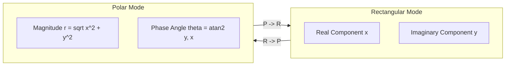

If you want to spark an argument among calculator purists, ask them how complex numbers should live on a 4-level RPN stack. On the classic HP-15C from 1982, turning on Complex Mode split your stack in half: the real parts lived in one place and the imaginary parts in another, cutting your operational headroom down to two levels. If you were calculating AC circuit impedances or phasors, you spent half your time swapping registers instead of doing math. Coming from software engineering, where value types and vector math are second nature, that split-register compromise felt archaic. When we designed `CalculatorValue` in `RPNCore`, we rejected that constraint completely: every single stack level holds a full two-dimensional vector `(real, imag)`. To ensure mathematical rigor across transcendental operations and branch cuts, I paired with AI coding agents to synthesize test suites comparing our Swift implementation against Python's `cmath` ground truth.

<!-- more -->

## Representing Complex Quantities in a 4-Level Stack

A complex number $\mathbf{z}$ is represented in rectangular coordinates as:

$$\mathbf{z} = x + iy, \quad i^2 = -1$$

or in polar coordinates as:

$$\mathbf{z} = r e^{i\theta} = r (\cos\theta + i\sin\theta), \quad r = \sqrt{x^2 + y^2}, \quad \theta = \text{atan2}(y, x)$$

In vintage calculators with simple scalar stacks, performing complex addition required manual splitting across $X$ and $Y$ registers, consuming half of the available stack depth. In `RPNCore`, each level of our 4-level stack holds a full `CalculatorValue` struct:

```swift
// Verbatim from RPNCore/Sources/RPNCore/CalculatorValue.swift
public struct CalculatorValue: Equatable, CustomStringConvertible {
    public var real: Double
    public var imag: Double
    public var decimalPlaces: Int?

    public var isComplex: Bool {
        return imag != 0.0
    }
    
    public var description: String {
        if isComplex {
            return "\(real) + \(imag)i"
        } else {
            return "\(real)"
        }
    }
}
```

This ensures that all four stack registers ($X, Y, Z, T$) can simultaneously store complex impedance vectors ($Z_1, Z_2, Z_3, Z_4$), keeping complex calculations clean and intuitive.



## Complex Arithmetic & Transcendental Operators

The algebraic rules for complex operations must preserve numerical stability across extreme values:

1. **Addition & Subtraction**:
   $$(a + bi) \pm (c + di) = (a \pm c) + i(b \pm d)$$

2. **Multiplication**:
   $$(a + bi)(c + di) = (ac - bd) + i(ad + bc)$$

3. **Division**:
   $$\frac{a + bi}{c + di} = \frac{(ac + bd) + i(bc - ad)}{c^2 + d^2}$$

4. **Complex Trigonometry**:
   $$\sin(x + iy) = \sin x \cosh y + i\cos x \sinh y$$
   $$\cos(x + iy) = \cos x \cosh y - i\sin x \sinh y$$
   $$\tan(z) = \frac{\sin z}{\cos z}$$

In `CalculatorValue.swift`, these identities are implemented directly:

```swift
public static func *(lhs: CalculatorValue, rhs: CalculatorValue) -> CalculatorValue {
    return CalculatorValue(
        real: lhs.real * rhs.real - lhs.imag * rhs.imag,
        imag: lhs.real * rhs.imag + lhs.imag * rhs.real
    )
}

public static func /(lhs: CalculatorValue, rhs: CalculatorValue) -> CalculatorValue {
    let denominator = rhs.real * rhs.real + rhs.imag * rhs.imag
    if denominator == 0 {
        return CalculatorValue(real: Double.infinity, imag: Double.infinity)
    }
    return CalculatorValue(
        real: (lhs.real * rhs.real + lhs.imag * rhs.imag) / denominator,
        imag: (lhs.imag * rhs.real - lhs.real * rhs.imag) / denominator
    )
}

public static func sin(_ v: CalculatorValue) -> CalculatorValue {
    return CalculatorValue(
        real: _sin(v.real) * _cosh(v.imag),
        imag: _cos(v.real) * _sinh(v.imag)
    )
}

public static func cos(_ v: CalculatorValue) -> CalculatorValue {
    return CalculatorValue(
        real: _cos(v.real) * _cosh(v.imag),
        imag: -_sin(v.real) * _sinh(v.imag)
    )
}
```

## Coordinate Transformations: R -> P and P -> R

For rapid engineering workflows, the calculator provides single-keystroke coordinate conversions:

| Operation | Input Stack (X, Y) | Output Stack (X, Y) | Mathematical Formula |
| :--- | :--- | :--- | :--- |
| **$R \to P$** | $X = x, \ Y = y$ | $X = r, \ Y = \theta$ | $r = \sqrt{x^2 + y^2}, \ \theta = \text{atan2}(y, x)$ |
| **$P \to R$** | $X = r, \ Y = \theta$ | $X = x, \ Y = y$ | $x = r\cos\theta, \ y = r\sin\theta$ |
| **$e^z$** | $Z = x + iy$ | $Z = e^x \cos y + i e^x \sin y$ | Euler's identity |
| **$\ln z$** | $Z = x + iy$ | $Z = \ln r + i\theta$ | Principal branch ($-\pi < \theta \le \pi$) |

## Physical Keypad Ergonomics: The (i) Separator Key

On the physical StackCalc32 keypad and watchOS interface, entering complex numbers is as effortless as on the HP-32SII. Tapping the gold shift followed by `(i)` enters the complex delimiter:
```
3.5 (i) 4.2 ENTER
```
This builds a single `CalculatorValue(real: 3.5, imag: 4.2)` directly into the $X$ register. Subsequent arithmetic operations (such as squaring with $\sqrt{x}$ or multiplying by another complex impedance) execute atomically across the entire stack.

## Conclusion: Real-World RF Math on the Bench

Nothing justifies a design decision quite like using it while breadboarding a prototype circuit or testing filter calculations on your workbench. Trying to calculate an $LC$ matching network with a scalar stack that splits real and imaginary parts across $X$ and $Y$ feels like juggling with one hand tied behind your back. By packing real and imaginary components into an atomic 24-byte struct, all four stack levels—$X$, $Y$, $Z$, and $T$—remain fully functional complex registers. You can enter an antenna impedance in polar form, flip to rectangular with one tap, multiply by a shunt capacitive reactance, and drop into $Y$ without ever losing track of where your phase angle went. For students and engineers learning AC electronics, that seamless mathematical clarity makes RPN feel like second nature.
