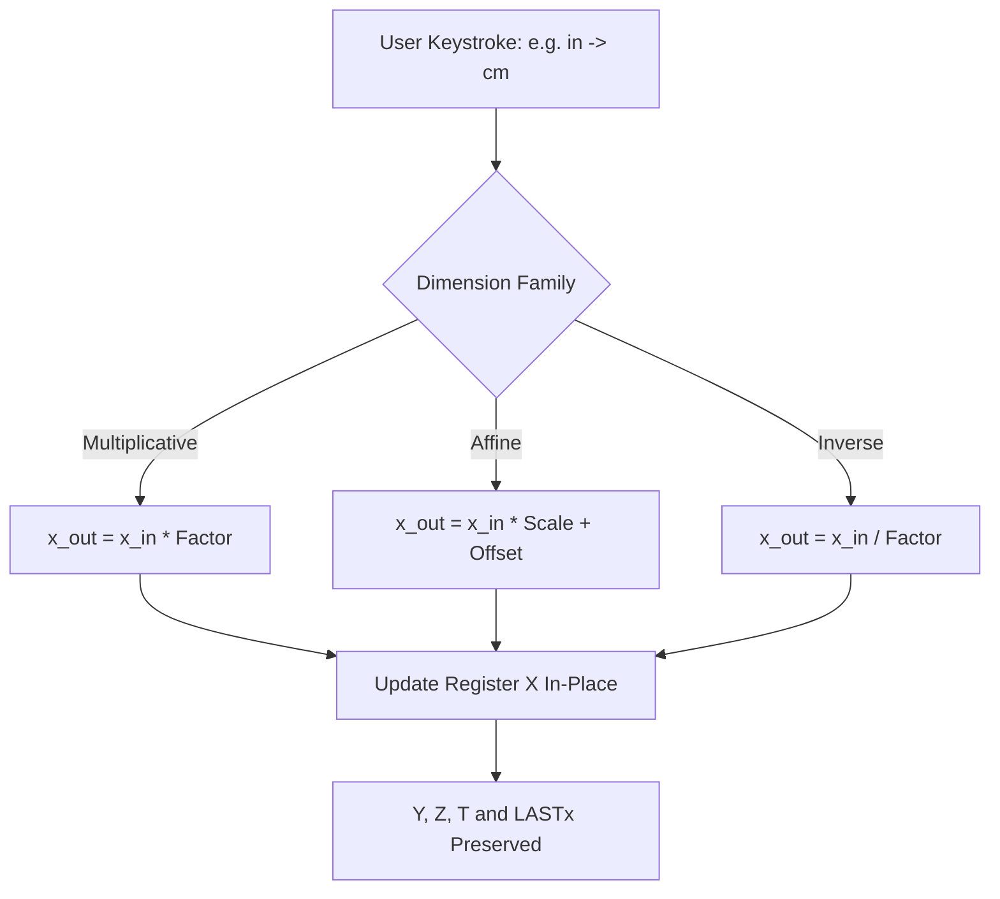

Ask an aerospace engineer about the Mars Climate Orbiter, and they will remind you how a mismatch between pound-force seconds and Newton seconds turned a \$327 million spacecraft into atmospheric confetti. As a software engineer who values strong typing and invariant checks, dimensional integrity is something I take personally. But on a handheld calculator, unit conversion looks deceptively simple—until you start implementing it on an RPN execution stack. Should converting inches to centimeters push the result into $Y$? Does tapping Fahrenheit to Celsius calculate an absolute temperature or a thermal delta? In `RPNCore`, we treated unit conversion not as a superficial menu afterthought, but as an in-place register transformation governed by strict physical invariants. To ensure zero cumulative drift, I used AI coding agents to cross-reference legal NIST conversion ratios and generate exhaustive round-trip property tests across our dimensional catalog.

<!-- more -->

## The Dimension Tree Architecture

Physical units group naturally into dimensional families governed by the International System of Units (SI):

$$[\text{Quantity}] = [L]^a [M]^b [T]^c [I]^d [\Theta]^e [N]^f [J]^g$$

In `RPNCore`, conversions are categorized across five primary engineering dimensions:

1. **Length ($[L]$)**: Inches $\leftrightarrow$ Centimeters, Feet $\leftrightarrow$ Meters, Miles $\leftrightarrow$ Kilometers.
2. **Mass ($[M]$)**: Pounds (avoirdupois) $\leftrightarrow$ Kilograms, Ounces $\leftrightarrow$ Grams.
3. **Temperature ($[\Theta]$)**: Degrees Fahrenheit $\leftrightarrow$ Degrees Celsius, Kelvin $\leftrightarrow$ Celsius.
4. **Volume ($[L^3]$)**: US Gallons $\leftrightarrow$ Liters, Fluid Ounces $\leftrightarrow$ Milliliters.
5. **Pressure & Energy ($[M L^{-1} T^{-2}]$)**: PSI $\leftrightarrow$ Kilopascals, Joules $\leftrightarrow$ Calories.



## Multiplicative vs. Affine Scaling

Most unit conversions are purely multiplicative linear maps ($y = k \cdot x$). However, temperature conversions are **affine transformations** containing an additive zero-point offset:

$$T_F = T_C \times \frac{9}{5} + 32, \quad T_C = (T_F - 32) \times \frac{5}{9}$$

Failing to distinguish between absolute temperature values ($100^\circ\text{C} = 212^\circ\text{F}$) and temperature differentials ($\Delta 10^\circ\text{C} = \Delta 18^\circ\text{F}$) is a classic source of engineering bugs. In `RPNCore`, primary conversion keys evaluate absolute affine transforms, while the `PARTS` submenu provides delta scalers.

## Exact Conversion Constants

To ensure zero numerical drift during bidirectional conversions, `RPNCore` uses exact legal definitions:

| Conversion Pair | Direction | Exact Definition Ratio | Approximate Scaling |
| :--- | :--- | :--- | :--- |
| **Inches $\to$ Centimeters** | Multiplicative | $1\text{ in} \equiv 2.54\text{ cm}$ (exact) | $2.54$ |
| **Feet $\to$ Meters** | Multiplicative | $1\text{ ft} \equiv 0.3048\text{ m}$ (exact) | $0.3048$ |
| **Pounds $\to$ Kilograms** | Multiplicative | $1\text{ lb} \equiv 0.45359237\text{ kg}$ (exact) | $0.45359237$ |
| **Gallons $\to$ Liters** | Multiplicative | $1\text{ gal} \equiv 231\text{ in}^3 = 3.785411784\text{ L}$ | $3.785411784$ |
| **Celsius $\to$ Fahrenheit** | Affine | $F = C \times \frac{9}{5} + 32$ | Linear slope $1.8$, offset $32$ |

## Stack Invariants During Conversion

A critical UX requirement in RPN is that converting the display value in $X$ must not disturb the rest of the stack. If register $Y$ holds a length in inches ($12.0$) and $X$ holds a width in inches ($4.0$), pressing `in -> cm` must transform $X$ to $10.16$ while leaving $Y$ untouched at $12.0$. The user can then press `*` to calculate square-inch area or convert $Y$ separately.

```swift
// Unit conversion implementation in RPNCore/Sources/RPNCore/CalculatorEngine.swift
public func convertUnit(factor: Double, affineOffset: Double = 0.0, isInverse: Bool = false) {
    commitInput()
    guard !stack.isEmpty else { return }
    
    let currentX = stack[0].real
    let converted: Double
    
    if isInverse {
        converted = (currentX - affineOffset) / factor
    } else {
        converted = (currentX * factor) + affineOffset
    }
    
    // In-place update: Stack registers Y, Z, T are NOT shifted
    stack[0] = CalculatorValue(real: converted, imag: stack[0].imag)
    
    // Stack lift is re-enabled so subsequent number entry lifts the converted result
    stackLiftEnabled = true
    updateDisplay()
}
```

By guaranteeing exact conversion factors and in-place register updates, StackCalc32 provides engineers with an effortless, transparent dimensional tool.

## Conclusion: Core Invariants for Dimension Transformations

When designing unit conversions for measurement and engineering tools, keep three rules in mind:
- **In-place mutations only**: A unit conversion is a change of perspective on the current number in $X$; it must never trigger an unintended stack lift or drop that scrambles pending operands.
- **Use legal definitions over approximations**: Never approximate $1\text{ in}$ as $2.540005\text{ cm}$; use the exact international treaty value $2.54\text{ cm}$ so bidirectional conversions return the identical bit pattern.
- **Separate affine values from differentials**: Adding $10^\circ\text{C}$ to a material's temperature is an affine transform, but calculating a temperature rise requires a pure scalar multiplier ($1.8$) without the $+32$ bias.

For students and makers building physical projects, having exact, non-destructive unit conversions directly on the stack prevents catastrophic unit errors before components ever hit the physical assembly bench.
