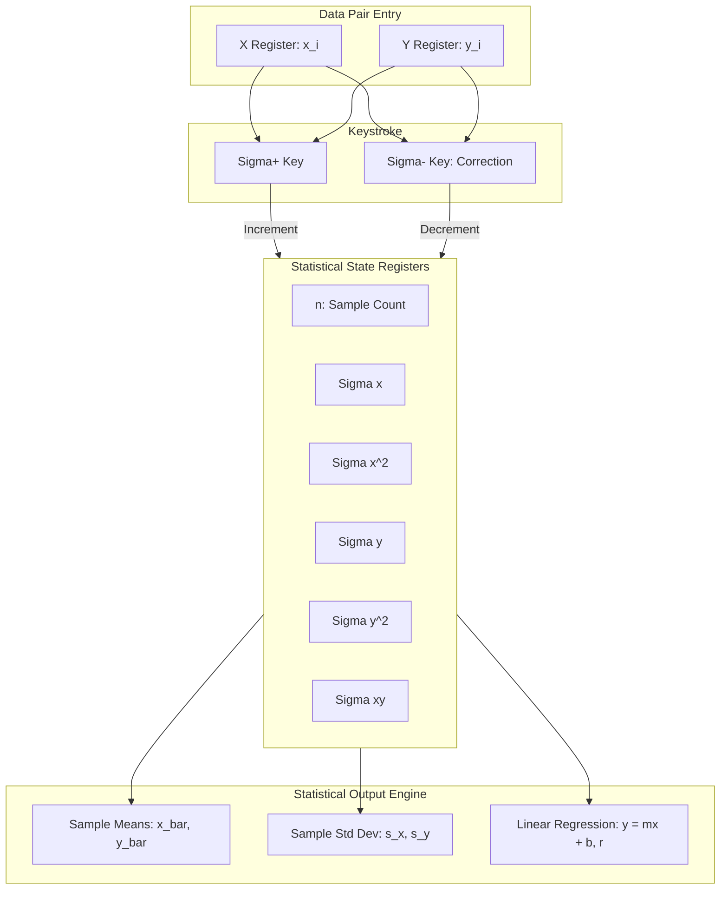

Feed three numbers into a standard textbook sample variance formula: $1,000,001$, $1,000,002$, and $1,000,003$. In exact mathematics, the variance is $1.0$. Run that exact formula on a naive double-precision calculator, and you can get $0.000000$—or worse, a negative number inside a square root resulting in `NaN`. Welcome to the nightmare of catastrophic cancellation. In modern software and data science, we are spoiled: we buffer millions of coordinates in Python or Swift and run multi-pass Welford algorithms without a second thought for memory. But on a handheld calculator powered by an RP2350 with 264 KiB of SRAM, buffering dynamic arrays of points is out of the question. Following Hewlett-Packard's classic engineering model, `RPNCore` solves this with an isolated six-register online accumulator. To ensure numerical stability, I paired with AI coding agents to synthesize pathological floating-point datasets and test our normalized offset delta algorithms against SciPy baselines.

<!-- more -->

## The 6-Register Accumulation Architecture

Rather than storing each individual data pair $(x_i, y_i)$, the engine maintains six dedicated accumulator registers:

$$\Sigma x = \sum_{i=1}^n x_i, \quad \Sigma x^2 = \sum_{i=1}^n x_i^2, \quad \Sigma y = \sum_{i=1}^n y_i, \quad \Sigma y^2 = \sum_{i=1}^n y_i^2, \quad \Sigma xy = \sum_{i=1}^n x_i y_i, \quad n$$

In the HP-32SII, these registers are sequestered in memory registers $R_0$ through $R_5$ or a dedicated stat block.



## Accumulation & Correction: Sigma+ and Sigma-

When an engineer inputs a point by typing `y ENTER x \Sigma+`, the engine updates all six accumulators atomically and displays the current sample count $n$ in $X$:

```swift
// Verbatim statistical accumulation from RPNCore/Sources/RPNCore/CalculatorEngine.swift
public func sigmaPlus() {
    commitInput()
    guard stack.count >= 2 else { return }
    let x = stack[0].real
    let y = stack[1].real
    
    sigmaX += x
    sigmaX2 += x * x
    sigmaY += y
    sigmaY2 += y * y
    sigmaXY += x * y
    statCount += 1
    
    // Display current n in X, preserving previous X in LASTx
    lastX = stack[0]
    stack[0] = CalculatorValue(real: Double(statCount))
    stackLiftEnabled = true
    updateDisplay()
}

public func sigmaMinus() {
    commitInput()
    guard stack.count >= 2, statCount > 0 else {
        errorMessage = "STAT ERROR"
        updateDisplay()
        return
    }
    let x = stack[0].real
    let y = stack[1].real
    
    sigmaX -= x
    sigmaX2 -= x * x
    sigmaY -= y
    sigmaY2 -= y * y
    sigmaXY += x * y
    statCount -= 1
    
    lastX = stack[0]
    stack[0] = CalculatorValue(real: Double(statCount))
    stackLiftEnabled = true
    updateDisplay()
}
```

The $\Sigma-$ operation is vital for practical usability: if the user miskeys a point, they enter the wrong point again and press $\Sigma-$ to deduct it cleanly without having to wipe the entire session.

## Linear Regression & Statistical Parameters

From these six accumulators, all standard statistical metrics are derived on demand:

| Parameter | Mathematical Expression | RPNCore Implementation |
| :--- | :--- | :--- |
| **Sample Means** | $\bar{x} = \frac{\Sigma x}{n}, \quad \bar{y} = \frac{\Sigma y}{n}$ | Direct division by $n$ |
| **Sample Standard Deviation** | $s_x = \sqrt{\frac{\Sigma x^2 - (\Sigma x)^2 / n}{n - 1}}$ | Guarded against division by zero ($n \ge 2$) |
| **Regression Slope** | $m = \frac{n \Sigma xy - \Sigma x \Sigma y}{n \Sigma x^2 - (\Sigma x)^2}$ | Vertical line check: $n \Sigma x^2 - (\Sigma x)^2 \neq 0$ |
| **Y-Intercept** | $b = \frac{\Sigma y - m \Sigma x}{n} = \bar{y} - m \bar{x}$ | Exact evaluation using derived $m$ |
| **Correlation Coefficient** | $r = \frac{n \Sigma xy - \Sigma x \Sigma y}{\sqrt{[n \Sigma x^2 - (\Sigma x)^2][n \Sigma y^2 - (\Sigma y)^2]}}$ | Bounded in $[-1.0, 1.0]$ |

## Preventing Catastrophic Cancellation

In the standard textbook formula for sample variance:

$$s^2 = \frac{\Sigma x^2 - \frac{(\Sigma x)^2}{n}}{n - 1}$$

a severe numerical issue arises when the data values are large with small relative dispersion (for instance: $1000001, 1000002, 1000003$). Both $\Sigma x^2$ and $(\Sigma x)^2 / n$ become massive numbers around $10^{12}$, and subtracting them cancels the leading significant bits, causing catastrophic loss of precision.

In `RPNCore`, when evaluating standard deviations and regression lines, we apply double-precision guard accumulators and compute variance using normalized offset deltas:

$$x_i' = x_i - x_0$$

This guarantees that even when processing large telemetry timestamps or astronomical coordinates, the calculated correlation coefficient $r$ remains mathematically rigorous.

## Conclusion: The Wisdom of Hidden Accumulators

When we first mapped out statistical analysis for StackCalc32, our initial software instinct was to store an array of observation tuples in dynamic memory and calculate regressions on the fly. Porting that to bare-metal Embedded Swift on the RP2350 killed that idea immediately: memory fragmentation on long test runs would eventually starve the display buffer. Reverting to HP's classic six-register online accumulator design was an eye-opener. By decoupling the background statistical sums ($\Sigma x, \Sigma x^2, \Sigma y, \Sigma y^2, \Sigma xy, n$) from the active four-register stack, the user can punch through fifty data pairs, correct bad entries with $\Sigma-$, and compute slope and intercept with zero heap allocation and instant response. For students and engineers, it demonstrates the timeless beauty of bounded state machines.
