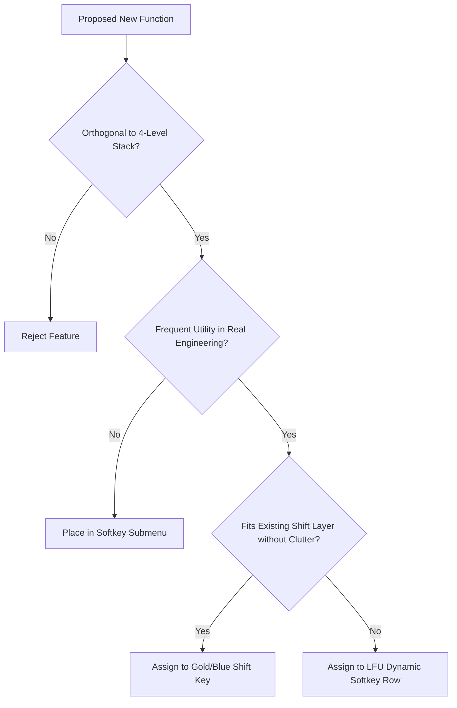

Hold a 1991 HP-32SII under a desk lamp and look at its faceplate. Every millimeter of brushed aluminum around its 43 keys is covered in gold and blue silk-screened type. It is a masterpiece of information density, but it also sits on the absolute edge of human visual bandwidth. If you added even two more labels, the keyboard would turn into an unreadable sea of hieroglyphics. As a software engineer with a desktop 3D printer whirring beside my desk, I am used to digital worlds where adding a feature costs nothing more than a few lines of code. But as I modeled faceplate bezels in OpenSCAD and sliced test prints, the physical limits of plastic and human fingers became starkly obvious. To me, it is an injustice that more people do not use RPN calculators, and building a modern low-cost physical device to inspire the next generation meant honoring that classic layout while adding modern staples like parallel impedance (`x||y`) and integer quotients (`divR`). To resolve candidate assignments without cluttering the faceplate, I used AI coding agents to analyze engineering keystroke frequencies and simulate competing keymaps.

<!-- more -->

## The Button Rubric: Criteria for Addition

To avoid the creeping feature bloat that plagues many modern scientific calculators, we established a strict **Button Rubric** (`documentation/button_rubric.md`). A proposed operation had to satisfy three strict criteria:

1. **Stack Orthogonality**: The operation must obey standard RPN stack lift and drop invariants.
2. **Frequency of Real-World Utility**: It must solve a common engineering calculation that previously required tedious manual multi-step programming.
3. **Zero Faceplate Clutter**: It must not displace essential primary arithmetic or transcendental keys.



## Key Additions to the Engine

Through rigorous auditing against electrical, civil, and software engineering workflows, we introduced six primary functional enhancements:

| Function | Notation | Mathematical / Engineering Purpose | Stack Transformation |
| :--- | :--- | :--- | :--- |
| **Integer Remainder** | `divR` | Computes integer quotient and remainder in a single step | $Y, X \to Y = \lfloor Y/X \rfloor, \ X = Y \pmod X$ |
| **Absolute Value** | `abs` | Computes absolute magnitude $\lvert x \rvert$ or complex magnitude $\sqrt{a^2+b^2}$ | $X \to \lvert X \rvert$ in-place |
| **Parallel Resistance** | `x\|\|y` | Equivalent impedance of two parallel components $\frac{XY}{X+Y}$ | Binary op: $Y, X \to \frac{XY}{X+Y}$ |
| **Time Value of Money** | `TVM` | Financial interest, annuities, and compound amortization | Dedicated solver against $N, I, PV, PMT, FV$ |
| **Polynomial Solver** | `POLY` | Evaluates $P(x) = \sum a_i x^i$ via Horner's method | Efficient $O(n)$ evaluation |
| **Register Inspector** | `REGS` | Rapid inspection of variables $A-Z$ and statistical accumulators | Scrollable non-destructive overlay |

## Spotlight: The Parallel Resistance Operator (x||y)

Electrical engineers calculating parallel resistors or series capacitors constantly evaluate:

$$R_{\text{eq}} = \frac{1}{\frac{1}{R_1} + \frac{1}{R_2}} = \frac{R_1 R_2}{R_1 + R_2}$$

On a standard HP-32SII, this requires six keystrokes: `1/x`, `x<>y`, `1/x`, `+`, `1/x`. In `RPNCore`, we elevated parallel combination to a first-class binary operator:

```swift
// Verbatim from RPNCore/Sources/RPNCore/CalculatorEngine.swift
public func parallelCombination() {
    binaryOp { y, x in
        if y.isComplex || x.isComplex {
            // Complex impedance: Z_eq = (Z1 * Z2) / (Z1 + Z2)
            return (y * x) / (y + x)
        }
        let denom = y.real + x.real
        if denom == 0.0 {
            return CalculatorValue(real: Double.infinity)
        }
        return CalculatorValue(real: (y.real * x.real) / denom)
    }
}
```

By supporting complex impedance natively, `parallelCombination` allows an electrical engineer to find the equivalent impedance of a $100\ \Omega$ resistor in parallel with a $-j50\ \Omega$ capacitor in a single operation.

## Multiplexing Without Clutter: The LFU Dynamic Row

Rather than overwhelming the faceplate with tertiary labels printed in microscopic fonts, StackCalc32 employs a dynamic softkey architecture. The physical top row of keys doubles as dynamic softkeys governed by `LFUManager`. Frequently used operations migrate to the top row, while secondary tools remain organized in cleanly categorised menus (`FLAGS`, `MODES`, `PARTS`, `PROB`).

This synthesis preserves the timeless tactile purity of the HP-32SII while giving modern engineers the expanded power they need.

## Conclusion: The Perpetual Fight Against Feature Creep

Every feature addition to a handheld calculator is a physical compromise. If you put every function on a dedicated key, you ruin tactile muscle memory and force users to hunt through microscopic labels. If you bury everything inside deep nested LCD menus, you destroy the rapid, unconscious flow that makes RPN magical in the first place. The compromise we struck with `RPNCore`—promoting only high-frequency engineering staples like `x||y` and `divR` while letting less common functions live in single-tier menus—cost us weeks of debate. But the first time a student calculates an AC impedance or ring-buffer index with one tap on our 3D-printed prototype, you realize that restraint is the greatest feature of all. It keeps the instrument approachable while delivering genuine professional power.
