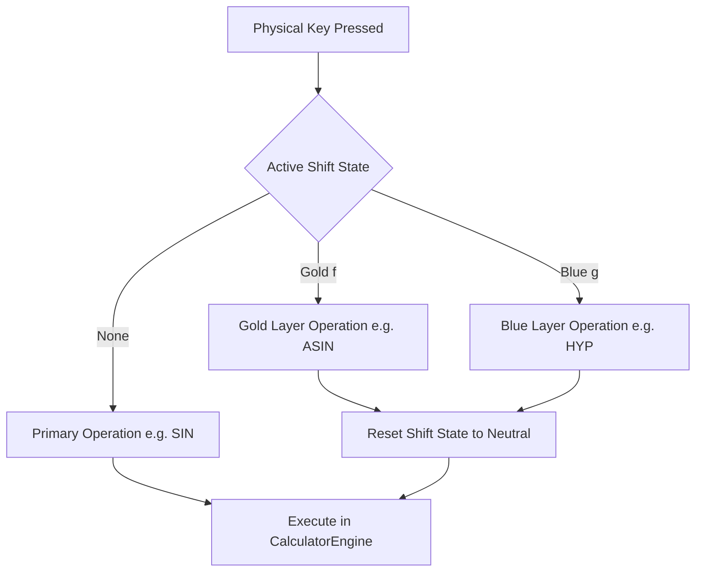

Hold a set of digital calipers up to an HP Pioneer chassis. The key pitch is exactly $11.0\text{ mm}$ center-to-center; the keycaps themselves measure $8.0\text{ mm}$ across. As an amateur 3D-printing enthusiast and software engineer, measuring that vintage HP-32SII on my desk was my first step before firing up OpenSCAD. Slicing and test-printing faceplate bezels on my desktop 3D printer taught me quickly: if you compress those switches by just two millimeters to squeeze in an extra column, human fingers start accidentally hitting adjacent keys. That physical anatomical limit means you have exactly 43 tactile switches to work with. How do you fit an entire undergraduate STEM curriculum—single-variable calculus, trigonometry, complex phasors, and probability—onto 43 switches without turning key navigation into an endless puzzle? To solve this without cluttering the faceplate, I used AI coding agents to analyze mathematical operator frequencies across real engineering problem sets. In Part 1 of this series, we walk through how we engineered the physical layout, shift matrices, and frequency-tiering for StackCalc32.

<!-- more -->

## Keypad Real Estate: The Ergonomic Equation

A handheld calculator faceplate is strictly bounded by human hand anthropometry: keys must be at least $8.0\text{ mm}$ wide with at least $3.0\text{ mm}$ of inter-key spacing to prevent accidental double-hits. On the HP-32SII envelope ($72.0\text{ mm} \times 142.4\text{ mm}$), this limits the layout to a matrix of 6 columns and 8 rows—yielding **43 physical switches** plus a double-wide `ENTER` key.

With 43 keys, every physical surface must be utilized:
- **Primary Face (Unshifted)**: Single-stroke instant access.
- **Gold Shift ($f$ / Yellow)**: Top-printed faceplate functions accessed with gold prefix.
- **Blue Shift ($g$ / Cyan)**: Front-slant-printed functions accessed with blue prefix.

$$43 \text{ switches} \times 3 \text{ states} = 129 \text{ direct access operations}$$



## Frequency-of-Use Analysis

When mapping mathematical operations to keypad locations, we categorized all engineering functions into four frequency tiers:

| Frequency Tier | Access Target | Functions Assigned | Rationale |
| :--- | :--- | :--- | :--- |
| **Tier 1: Core Flow** | Primary unshifted keycap | Digits `0-9`, `.`, `ENTER`, `+`, `-`, `*`, `/`, `C`, `<-` | Used in 80% of all calculations; must be accessible without shift modifiers. |
| **Tier 2: Fast Scientific** | Primary / Gold shift | $\sqrt{x}$, $1/x$, $y^x$, $e^x$, $\ln x$, $\sin$, $\cos$, $\tan$, $\pi$ | Essential STEM daily tools; single stroke or gold shift. |
| **Tier 3: Secondary Math** | Blue shift / Shift combo | $\sinh$, $\cosh$, $\tanh$, $\text{MOD}$, $n!$, $n P r$, $n C r$, $R \to P$, $P \to R$ | Advanced scientific and probabilistic operations. |
| **Tier 4: Submenus** | Softkey catalog | `FLAGS`, `MODES`, `PARTS`, `BASE`, `SOLVE`, `INTEG` | Complex multi-parameter setups best managed via dynamic softkeys. |

## The Least Frequently Used (LFU) Dynamic Row

A historic pain point with fixed shift keys is that different engineers have different specialties. An electrical engineer frequently needs $R \to P$ and parallel resistance ($x||y$), while a civil engineer needs linear regression and cubic root.

To address this, StackCalc32 introduces the **LFU Dynamic Softkey Row** (`RPNCore/Sources/RPNCore/LFUManager.swift`). The top row of five keys above the numeric matrix can be assigned dynamically to softkey menus:

```swift
// LFUManager snippet tracking usage frequency
public class LFUManager {
    private var accessCounts: [String: Int] = [:]
    
    public func recordAccess(functionName: String) {
        accessCounts[functionName, default: 0] += 1
    }
    
    public func topFunctions(limit: Int = 5) -> [String] {
        return accessCounts.sorted { $0.value > $1.value }
                           .prefix(limit)
                           .map { $0.key }
    }
}
```

## Menu Prompt Digit Handling

When secondary functions require a numeric parameter (such as `FIX 4` for display rounding, `STO 05` for register storage, or `SF 08` for setting flags), the engine enters an intercept mode (`75493d9`):

```swift
// RPNCore/Sources/RPNCore/MenuSystem.swift
public func handleMenuInput(key: String) -> Bool {
    guard let active = currentActivePrompt else { return false }
    if active.requiresDigit {
        if let digit = Int(key) {
            applyParameter(digit)
            currentActivePrompt = nil
            updateDisplay()
            return true
        }
    }
    return false
}
```

By pairing the classic, high-contrast three-tier keycap typography of the Pioneer series with dynamic LFU softkeys, StackCalc32 delivers unmatched speed and cognitive clarity.

## Conclusion: Rules of Thumb for Keypad Curation

When laying out a high-density physical engineering keypad, follow three strict rules:
- **The 80% rule on unshifted keys**: Digits, core operators ($+$, $-$, $\times$, $\div$), `ENTER`, and Backspace must never require a shift modifier. The moment an engineer has to look down to find a basic arithmetic operator, the tool has failed.
- **Group opposites on shift layers**: Pair operations logically—$\sin$ on the face with $\arcsin$ on the gold layer; $e^x$ on the face with $\ln$ on the gold layer. Predictability beats catalog order every time.
- **Dynamic softkeys for the long tail**: Use a small reconfigurable softkey row for deep domain functions instead of cluttering the faceplate with tertiary labels.

By adhering to these rules, StackCalc32 captures the timeless tactile brilliance of Corvallis while staying affordable enough to put in the hands of any STEM student discovering RPN for the very first time.
