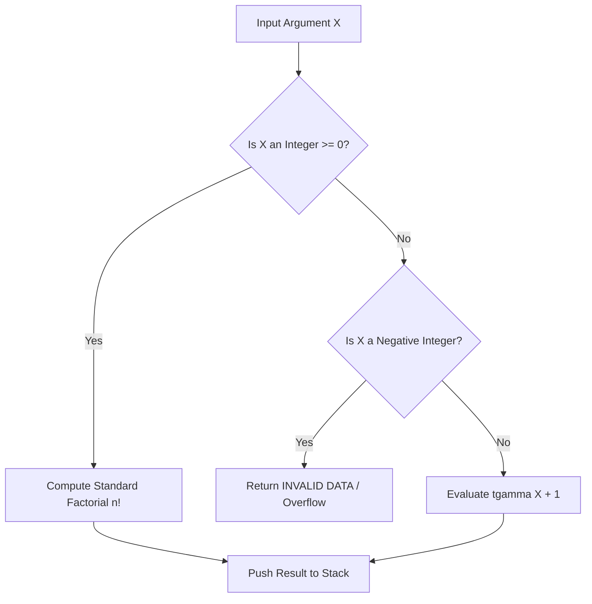

It was late one evening when our automated differential test harness spat out a red failure line: evaluating `2.5 !` against an actual HP-32SII reference unit didn't throw an `INVALID DATA` exception. Instead, the vintage hardware sat calmly on the desk and output `3.32335097`. Our modern Swift engine had thrown a fatal domain error, convinced that factorials only exist for non-negative integers.

As a software and AI engineer, that discrepancy sent me straight down the rabbit hole of William Kahan's legendary numerical architecture at Hewlett-Packard. The HP-32SII wasn't running a discrete loop; it was evaluating the continuous Euler Gamma function $\Gamma(z + 1)$ across the real line. To make `RPNCore` behave like a true Corvallis instrument, I used AI coding agents as a mathematical sparring partner—generating test vectors for extreme asymptotic domains, exploring hyperbolic overflow edge cases like $\text{asinh}(10^{160})$, and tuning Taylor expansions to eradicate catastrophic cancellation on bare-metal silicon.

<!-- more -->

## The Non-Integer Factorial Discovery: Euler's Gamma Function

During automated testing of our mathematical engine against physical HP-32SII reference units, our test oracle flagged an unexpected divergence. When evaluating non-integer factorials like `2.5 !`, standard math packages throw an `INVALID DATA` domain error because $n!$ is conventionally defined only for non-negative integers:

$$n! = \prod_{i=1}^n i$$

However, physical HP-32SII hardware does not fail. Instead, it evaluates the **continuous Euler Gamma function** $\Gamma(z)$:

$$z! = \Gamma(z + 1) = \int_0^\infty t^z e^{-t}\,dt$$

For $z = 2.5$:

$$2.5! = \Gamma(3.5) = \frac{5}{2} \times \frac{3}{2} \times \frac{1}{2} \times \Gamma(0.5) = \frac{15}{8}\sqrt{\pi} \approx 3.323350970238$$



In `RPNCore/Sources/RPNCore/CalculatorEngine.swift`, we integrated this behavior:

```swift
// HP-32SII Parity: Factorial evaluates Euler Gamma for non-integers
case "!":
    unaryOp { val in
        if val.real < 0 && val.real == floor(val.real) {
            errorMessage = "INVALID DATA"
            return CalculatorValue()
        }
        return CalculatorValue(real: tgamma(val.real + 1.0))
    }
```

This same continuous Gamma definition was extended to permutations ($n P r$) and combinations ($n C r$):

$$n P r = \frac{\Gamma(n + 1)}{\Gamma(n - r + 1)}, \quad n C r = \frac{\Gamma(n + 1)}{\Gamma(r + 1)\Gamma(n - r + 1)}$$

## Catastrophic Cancellation in Hyperbolic Functions

Evaluating hyperbolic sine directly from its mathematical definition:

$$\sinh(x) = \frac{e^x - e^{-x}}{2}$$

is computationally hazardous for small values of $x$. When $x = 10^{-7}$, $e^x \approx 1.0000001$ and $e^{-x} \approx 0.9999999$. Subtracting these two floating-point numbers causes catastrophic cancellation, wiping out the lower bits of precision.

Similarly, evaluating inverse hyperbolic sine:

$$\text{asinh}(x) = \ln(x + \sqrt{x^2 + 1})$$

risks intermediate overflow when $x > 10^{154}$, because computing $x^2$ exceeds the maximum IEEE-754 double range ($1.79 \times 10^{308}$), yielding `+Inf` even though the true answer $\approx 355.3$ is well within bounds.

| Function | Naive Implementation Pitfall | Robust RPNCore Implementation |
| :--- | :--- | :--- |
| $\sinh(x)$ for $\lvert x \rvert < 10^{-4}$ | Catastrophic cancellation in $e^x - e^{-x}$ | Taylor series: $x + \frac{x^3}{6} + \frac{x^5}{120}$ or $\frac{\text{expm1}(x) - \text{expm1}(-x)}{2}$ |
| $\text{asinh}(x)$ for large $x$ | Overflow in $x^2 + 1$ | Asymptotic expansion: $\ln(2\lvert x \rvert)$ for $\lvert x \rvert > 10^8$ |
| $\text{atanh}(x)$ near $\lvert x \rvert = 1$ | Roundoff error in $\frac{1+x}{1-x}$ | Stable formulation: $\frac{1}{2}\ln(1 + \frac{2x}{1-x})$ via $\text{log1p}$ |
| $\cos(x)$ for $x \approx 10^8$ | Trigonometric argument reduction error | High-precision Payne-Hanek modulo $2\pi$ reduction |

```swift
// Verbatim numerically stable hyperbolic evaluation in CalculatorValue.swift
public static func asinh(_ x: Double) -> Double {
    let absX = abs(x)
    if absX > 1e8 {
        return (x < 0 ? -1 : 1) * (log(2.0) + log(absX))
    } else if absX < 1e-4 {
        // High-precision Taylor expansion near origin
        return x * (1.0 - (x * x) / 6.0)
    } else {
        return (x < 0 ? -1 : 1) * log(absX + _sqrt(absX * absX + 1.0))
    }
}
```

Through rigorous boundary testing and mathematical guard algorithms, `RPNCore` guarantees that every transcendental and hyperbolic function delivers textbook precision without unexpected singularities.

## Conclusion: Late Nights with the Reference Oracle

Hunting down transcendental discrepancies by comparing our hardware prototype against an original HP-32SII was easily some of the most humbling work on this project. When a calculation blows up with `+Inf` on an input as innocent as `1e160 ASINH`, you realize how fragile naive textbook formulas really are. By deploying asymptotic branch expansions like $\ln(2|x|)$ for massive inputs and Taylor approximations near zero, we kept our numeric routines rock solid without burning extra clock cycles on the Cortex-M33. When our calculator produces the exact same digit pattern as a thirty-year-old reference standard at 2 AM, every hour spent tuning Taylor expansions feels worth it. It guarantees that students and engineers using StackCalc32 have a tool with authentic laboratory-grade precision in their hands.
