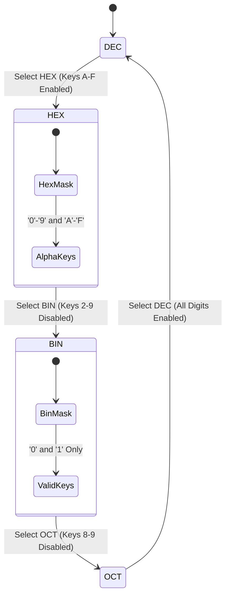

When you are writing bare-metal firmware or working with embedded bit protocols, continuous decimal math isn't what you need. As a software engineer diving into low-level microcontroller code, you don't care about $\sin(x)$ or Euler's constant; you care that bit 7 in a control register is high, that `0xDEADBEEF` masked against `0x00FF0000` shifts cleanly, and that negative integers roll over according to two's complement arithmetic. The HP-32SII addressed this with its dedicated `BASE` menu, but implementing multi-radix support on an RPN execution stack is full of traps. In Part 1 of this series, we explore how `RPNCore` handles radix switching, dynamic key matrix masking, and bit-level register synchronization without corrupting floating-point stack history. To make sure our state transitions were airtight, I used AI coding agents to model the mode-switching state machine and test dynamic keypad masking logic across all four radices.

<!-- more -->

## The Radix Switching Architecture

Switching the active base of a calculation engine is deceptively complex. In a pure RPN stack, what should happen to existing values on the stack when the user switches from `DEC` to `HEX`?

1. **Stack Invariant**: All values currently on the stack ($X, Y, Z, T$) must retain their exact underlying numerical magnitude.
2. **Display Transmutation**: The LCD formatting pipeline must instantly re-render all visible registers in the selected radix.
3. **Fractional Value Handling**: Binary and hexadecimal modes traditionally operate on integer bit patterns. If $X$ contains a fractional value (e.g. $12.75$), `RPNCore` truncates or rounds toward zero based on active flags, preventing non-integer corruption of bit registers.



## Dynamic Keypad Masking

A critical usability triumph of the HP-32SII was **dynamic keypad masking**. When in Binary mode, pressing `7` or `9` must not register as an invalid error message that requires pressing `C` to clear; instead, invalid keys are completely deactivated at the hardware matrix level.

In `RPNCore/Sources/RPNCore/Display/RetroUIController.swift`:

```swift
public func isKeyValidForCurrentMode(_ key: String) -> Bool {
    switch engine.baseMode {
    case .bin:
        return key == "0" || key == "1" || isNonNumericKey(key)
    case .oct:
        guard let d = Int(key) else { return isNonNumericKey(key) }
        return d >= 0 && d <= 7
    case .dec:
        guard let d = Int(key) else { return isNonNumericKey(key) }
        return d >= 0 && d <= 9
    case .hex:
        if let d = Int(key) { return d >= 0 && d <= 9 }
        return ["A", "B", "C", "D", "E", "F"].contains(key.uppercased()) || isNonNumericKey(key)
    }
}
```

On iOS and watchOS, buttons that are invalid in the current radix are dimmed to 30% opacity and disabled. On physical hardware, the GPIO scanning matrix simply discards switch closures outside the active radix mask.

## Radix Representation Comparison

The table below contrasts how a single 16-bit word ($42,158_{10}$) is represented across the four supported radices:

| Base Mode | Radix Symbol | Formatted Display | Valid Input Characters | Max Word ($W=16$) |
| :--- | :--- | :--- | :--- | :--- |
| **Decimal** | `DEC` | `42,158` | `0` through `9`, `.` | $65,535$ |
| **Hexadecimal** | `HEX` | `A4AE` | `0`–`9`, `A`–`F` | `FFFF` |
| **Octal** | `OCT` | `122256` | `0` through `7` | `177777` |
| **Binary** | `BIN` | `1010 0100 1010 1110` | `0` and `1` | `1111 1111 1111 1111` |

## Two's Complement vs. Signed Magnitude

When handling negative values in non-decimal bases, ambiguous representations can lead to critical bugs. For example, does `-5` in 8-bit hex represent signed magnitude (`0x85`) or two's complement (`0xFB`)?

In `RPNCore`, all base-N operations adhere to **two's complement binary arithmetic**:

$$-X = (\sim X) + 1$$

This ensures that bitwise additions (`A ENTER B +`) in `HEX` or `BIN` mode behave identically to the ALU instructions executed on real microcontrollers.

## Conclusion: The Compromises of Hybrid Radix Engines

Blending continuous floating-point mathematics with discrete integer bitwise logic forces tough trade-offs. If a user enters $14.92$ in decimal mode and taps `HEX`, should the calculator throw an error, round to nearest, or silently truncate? In `RPNCore`, we chose explicit truncation toward zero: it mimics integer casting in C and prevents fractional garbage from polluting bitmask operations. By deactivating illegal digit keys directly at the matrix scanning layer, we eliminated frustrating error modal locks. You can toggle between `DEC` and `HEX` in the middle of a debug session with absolute confidence that the bits under your fingers match what's sitting in your microcontroller's peripheral registers. For students exploring computer architecture and digital logic, having that tactile certainty on a physical RPN device is transformative.
