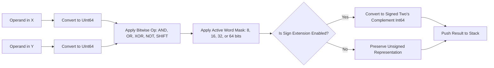

Take the number `0` in hex, hit `NOT`, and ask yourself what should appear on the screen. In high-level software, our default integer types in Swift or Python are 64-bit and unbounded, so you get `0xFFFFFFFFFFFFFFFF`. That might be mathematically correct in an abstract 64-bit universe, but if you're simulating an 8-bit microcontroller register, you just blew right past your peripheral's boundaries. In physical computing, bit inversion and shifts only make sense relative to an explicit hardware bus width. To ensure our engine models hardware faithfully without heap allocations, I used AI coding agents to generate comprehensive boundary test suites across 8, 16, 32, and 64-bit modes, validating sign-extension in arithmetic shift right (`ASR`) and circular rotation edge cases. In Part 2 of this series, we look at how `RPNCore` enforces word size constraints, handles arithmetic versus logical shifts, and parses hex strings on bare silicon with zero allocations.

<!-- more -->

## The Challenge of Fixed Word Sizes in Software

In hardware digital logic, an inversion gate operates on a specific physical bus width. An 8-bit `NOT` of `0x00` produces `0xFF` ($255$), whereas a 16-bit `NOT` produces `0xFFFF` ($65,535$), and a 32-bit `NOT` produces `0xFFFFFFFF` ($4,294,967,295$).

If a calculator engine performs bitwise logic using unbounded 64-bit native integers without word size masking:

$$\sim(0x00) = 0xFFFFFFFFFFFFFFFF$$

which corrupts low-byte register testing. 

In `RPNCore`, the active word size ($W \in \{8, 16, 32, 64\}$) is enforced globally on every bitwise and shift operation via a bitmask filter:

$$\text{mask}(W) = (1 \ll W) - 1, \quad x_{\text{bounded}} = x \ \& \ \text{mask}(W)$$



## Bitwise Truth Tables & Shift Semantics

`RPNCore` implements the full complement of logical and shift operators:

| Operator | Syntax | Mathematical Definition (w/ Mask $M$) | Description |
| :--- | :--- | :--- | :--- |
| **Bitwise AND** | `AND` | $(Y \ \& \ X) \ \& \ M$ | Bitwise intersection |
| **Bitwise OR** | `OR` | $(Y \ \mid \ X) \ \& \ M$ | Bitwise union |
| **Bitwise XOR** | `XOR` | $(Y \ \oplus \ X) \ \& \ M$ | Exclusive disjunction |
| **Bitwise NOT** | `NOT` | $(\sim X) \ \& \ M$ | One's complement bit inversion |
| **Logical Shift Left**| `SL` | $(X \ll 1) \ \& \ M$ | Shift bits left by 1, zero fill |
| **Logical Shift Right**| `SR` | $(X \gg 1) \ \& \ M$ | Shift bits right by 1, zero fill |
| **Arithmetic Shift Right**| `ASR` | Sign bit duplicated downward | Preserves negative two's complement sign |
| **Rotate Left** | `RL` | $(X \ll 1) \mid (X \gg (W-1))$ | Circular rotation through word width |

## Zero-Allocation Byte Parsing on Embedded Swift

On bare-metal ARM Cortex-M33 microcontrollers, converting between binary/hexadecimal text buffers and 64-bit integers must not trigger heap allocations. In `RPNCore/Sources/RPNCore/CalculatorEngine.swift`, we implemented a zero-allocation byte scanner operating on `ArraySlice<UInt8>`:

```swift
// Zero-allocation base parser in RPNCore
public func parseBaseBuffer(_ buffer: ArraySlice<UInt8>, radix: Int) -> UInt64? {
    var result: UInt64 = 0
    let radix64 = UInt64(radix)
    
    for byte in buffer {
        let val: UInt64
        switch byte {
        case 48...57: // ASCII '0'-'9'
            val = UInt64(byte - 48)
        case 65...70: // ASCII 'A'-'F'
            val = UInt64(byte - 55)
        case 97...102: // ASCII 'a'-'f'
            val = UInt64(byte - 87)
        default:
            return nil
        }
        guard val < radix64 else { return nil }
        result = result * radix64 + val
    }
    return result & wordMask
}
```

By computing bitwise results against strict hardware word masks with zero dynamic memory allocations, StackCalc32 functions as a bulletproof low-level engineering tool.

## Conclusion: Rules of Thumb for Base-N Programmer Engines

When implementing low-level bitwise operations on a scientific calculator, keep three rules front and center:
- **Always bound operations by word width**: An unmasked `NOT` or shift in 64-bit space creates insidious bugs when users are debugging 8-bit or 16-bit microcontrollers. Mask every intermediate output against $(1 \ll W) - 1$.
- **Distinguish logical shifts from arithmetic shifts**: A logical right shift (`SR`) fills leading bits with zero; an arithmetic right shift (`ASR`) preserves the sign bit for signed two's complement division. Engineers need both.
- **Zero allocations during string conversion**: Parse hex and binary ASCII bytes using slice index scanning rather than higher-level string interpolation to prevent memory fragmentation on bare-metal targets.

By grounding `RPNCore` in these real hardware boundaries, StackCalc32 serves as both a scientific powerhouse and an authentic computer engineering tool, helping students understand bit-level operations on silicon they can hold in their hands.
