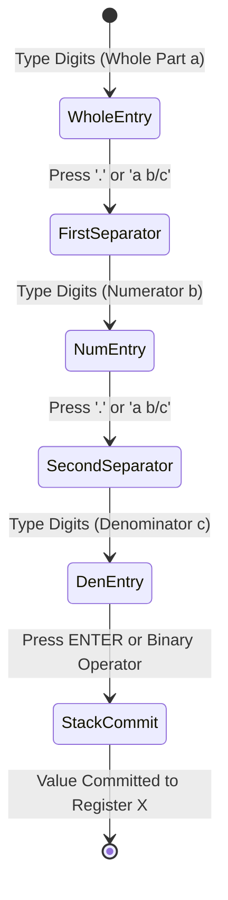

Step into a workshop or fire up a desktop 3D printer for mechanical prototyping, and you quickly notice that the physical world does not run in continuous decimals or arbitrary floats. Whether sizing clearances in fractional inches, measuring drill bit diameters, or designing mating joints, physical dimensions demand mixed fractions. Trying to calculate physical clearances on a standard calculator means constantly juggling mental conversions on scrap paper: you divide $3$ by $16$, get $0.1875$, add $1.625$, and then squint at a fractional chart to remember that $1.8125$ is $1\ 13/16$. The HP-32SII was legendary among craftspeople and engineers because it bypassed that madness entirely: mixed fractions were first-class values on the stack. In Part 1 of this series, we unpack how `RPNCore` models mixed fraction entry, state transitions, and exact Euclidean reductions.

<!-- more -->

## The Mixed Fraction Cognitive Model

In traditional calculators, evaluating $2\ 3/8 + 1\ 1/2$ requires manual conversion:

$$2 + 3/8 = 2.375, \quad 1 + 1/2 = 1.5, \quad 2.375 + 1.5 = 3.875 \implies 3\ 7/8$$

Forcing an engineer on a jobsite or in a machine shop to memorize decimal equivalents or perform mental conversions introduces errors. 

In `RPNCore`, a fraction is structured as a mixed entity:

$$a \ \frac{b}{c} = a + \frac{b}{c}, \quad a \in \mathbb{Z}, \quad b, c \in \mathbb{N}^+, \quad b < c$$

```
+-------------------------------------------------------------+
| Typical LCD Display:   3 7/16                               |
+-------------------------------------------------------------+
| [Whole Part: 3]  [Space: ' ']  [Num: 7]  [Slash: '/']  [Den: 16] |
+-------------------------------------------------------------+
```



## Input State Machine: The Fraction Delimiter Key

To enter mixed fractions naturally without adding three new physical buttons, the HP-32SII multiplexed the decimal point key (`.`) during fraction entry mode:
- First `.` press separates whole number $a$ from numerator $b$.
- Second `.` press separates numerator $b$ from denominator $c$.

In `RPNCore/Sources/RPNCore/CalculatorEngine.swift`:

```swift
public func inputFractionSeparator() {
    guard isBuildingNumber else { return }
    
    // Check if we are already in fraction building mode
    if fractionPartIndex == 0 {
        // Transition from whole to numerator
        currentInputBuffer[currentInputLength] = 32 // ASCII ' '
        currentInputLength += 1
        fractionPartIndex = 1
    } else if fractionPartIndex == 1 {
        // Transition from numerator to denominator
        currentInputBuffer[currentInputLength] = 47 // ASCII '/'
        currentInputLength += 1
        fractionPartIndex = 2
    }
    updateCurrentInputDisplay()
}
```

## Exact Rational Representation vs. Floating-Point Rounding

A key architectural design decision was whether to represent fractions internally as floating-point `Double` values or as exact rational structs:

```swift
public struct Rational<T: BinaryInteger>: Equatable {
    public var numerator: T
    public var denominator: T
    
    public init(_ num: T, _ den: T) {
        let d = gcd(num, den)
        self.numerator = num / d
        self.denominator = den / d
    }
}
```

When evaluating rational expressions like:

$$\frac{1}{3} + \frac{1}{3} + \frac{1}{3} = \frac{3}{3} = 1$$

floating-point arithmetic yields $0.333333333333 + 0.333333333333 + 0.333333333333 = 0.999999999999$. By preserving rational structures up to user display commitment, `RPNCore` avoids decimal drift during continuous fraction addition and multiplication.

## Maximum Denominator Modes (/c)

Different engineering trades operate under different standard denominator limits:
- **Cabinetmaking & Carpentry**: Denominators typically limited to $16$ ($/c = 16$).
- **Machining & Sheet Metal**: Denominators limited to $32$ or $64$ ($/c = 64$).
- **General Science**: Denominators up to $4095$ ($/c = 4095$).

| Trade / Application | Denominator Limit `/c` | Decimal Input `0.4` Displayed As | Error Delta |
| :--- | :--- | :--- | :--- |
| Carpentry | `16 /c` | `3/8` ($0.375$) or `7/16` ($0.4375$) | $\approx 0.025$ |
| Machining | `32 /c` | `13/32` ($0.40625$) | $0.00625$ |
| Toolmaking | `64 /c` | `26/64 \implies 13/32` | $0.00625$ |
| Exact Math | `1000 /c` | `2/5` ($0.40000$) | **$0.00000$ (Exact)** |

By integrating mixed fraction parsing directly into the RPN stack, StackCalc32 honors the utilitarian spirit of the HP-32SII while delivering exact modern performance.

## Conclusion: Respecting the Physical Craftsperson

Coming from software engineering, my initial instinct was to think entirely in IEEE-754 doubles. But as an amateur 3D-printing enthusiast measuring parts with calipers and tuning physical clearances on my desktop printer, I quickly realized that decimal floats feel clumsy and unnatural when working with physical materials. Designing our `Rational` struct with automatic Euclidean GCD simplification gave us the best of both worlds: zero cumulative rounding drift during repeated additions and an interface that speaks the native tongue of the maker. I paired with AI coding agents to test boundary conditions in our rational reduction algorithms and stress-test the three-stage `.` delimiter state machine in `inputFractionSeparator()`. Having $3\ 7/16 + 1\ 5/8$ resolve instantly to $5\ 1/16$ on the LCD makes the calculator feel like an indispensable physical instrument for the next generation of builders.
