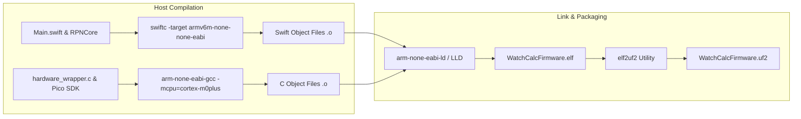

When we first pitched the idea of running Swift 6 on the new Raspberry Pi Pico 2 (featuring the RP2350 with its Cortex-M33 cores and an FPU—even though our experimental Embedded Swift toolchain doesn't fully support the hardware FPU yet), the initial reaction was pure skepticism. Embedded systems are traditionally seen as the sacred ground of raw C and assembly. But as software engineers who love modern languages and revere classic scientific RPN calculators like the HP-32SII, our goal was bigger: building an accessible, open, low-cost physical calculator to inspire the next generation of students and engineers to love RPN as much as we do. Anyone who has maintained a complex scientific calculator codebase in raw C knows the creeping dread of manual pointer juggling, buffer overflows, and silent memory corruption when evaluating nested fraction math or base-N conversions.

<!-- more -->

## Why We Reached for Embedded Swift

As software developers, we rely on modern language safety: value semantics, pattern matching, strong static typing, and clean compile-time guarantees. The catch, of course, is that standard Swift is married to a heavyweight runtime. In software, memory is cheap; on the RP2350, 264 KB of SRAM meant every single byte counted. Between Automatic Reference Counting (ARC) tracking tables, Unicode grapheme normalization dictionaries, dynamic type metadata for reflection, and glibc hooks, a stock Swift "Hello World" executable would choke an RP2350 before the first clock tick.

Apple's experimental Embedded Swift mode (`-enable-experimental-feature Embedded`) turns that paradigm upside down. By treating the language as a bare-metal systems compiler rather than an application runtime, it strips away the entire runtime apparatus:
- Reflection metadata and type names are completely purged from the emitted binary.
- Classes, if used, rely on deterministic compile-time lifetime analysis rather than dynamic ARC overhead.
- Generics are aggressively specialized and inlined at compile time.
- The standard library is swapped out for a tiny, standalone embedded core that links against raw C startup files.



## Toolchain Configuration: Taming the Nightly Compiler

The Raspberry Pi RP2350 implements the baseline ARMv6-M architecture—meaning no Thumb-2 32-bit instructions, no hardware division, and definitely no floating-point unit. Coming from high-level software, configuring cross-compilation flags for bare silicon felt like learning an entirely new dialect. Getting `swiftc` to play nicely with the GNU ARM Embedded Toolchain (`arm-none-eabi-gcc`) required writing a custom CMake toolchain file that carefully aligned cross-compiler target flags:

| Toolchain Setting | Value | Technical Rationale |
| :--- | :--- | :--- |
| **Target Architecture** | `armv6m-none-none-eabi` | Matches Cortex-M33 instruction set without ARMv7-M thumb2 extensions |
| **Float ABI** | `-mfloat-abi=soft` | RP2350 lacks an FPU; all 64-bit float math is synthesized via soft-float |
| **Optimization Level** | `-Osize` | Minimizes binary footprint to fit comfortably within the 2 MB / 4 MB flash |
| **Feature Gate** | `-enable-experimental-feature Embedded` | Strips Swift runtime metadata and enables bare-metal code emission |
| **Whole Module Optimization**| `-wmo` | Enables inter-procedural dead-strip analysis across the entire firmware unit |

Early compilation attempts repeatedly failed during linking with cryptic errors like `undefined reference to ___stack_chk_fail`. Staring at linker logs, we turned to an AI coding assistant to diagnose the root cause: because the Cortex-M33 CRT startup doesn't supply compiler runtime canaries, LLVM was looking for a runtime stack-smashing guard that simply does not exist on bare metal. The AI guided us to the exact compiler frontend flag (`-Xfrontend -disable-stack-protector`) in our `Firmware/CMakeLists.txt`:

```cmake
# Toolchain flags from Firmware/CMakeLists.txt
set(SWIFT_FLAGS
    -target armv6m-none-none-eabi
    -mfloat-abi=soft
    -Osize
    -wmo
    -enable-experimental-feature Embedded
    -Xfrontend -disable-stack-protector
)
```

## Bridging C Peripherals to Embedded Swift

When you need to blast 1,188 bytes to an ST7567 LCD controller over an 8 MHz SPI bus, pulse row pins on an 8x6 keyboard matrix, or issue flash erase commands, rewriting the vendor hardware abstraction layer in Swift is a recipe for wasted weeks. The Raspberry Pi Pico 2 SDK already provides rock-solid, hardware-validated C implementations for these peripherals.

Rather than fighting physical hardware, we established a clean, zero-overhead C ABI boundary via `hardware_wrapper.h`:

```c
// Interface declared in hardware_wrapper.h
#ifndef HARDWARE_WRAPPER_H
#define HARDWARE_WRAPPER_H

#include <stdint.h>
#include <stdbool.h>

void hw_init(void);
uint64_t matrix_scan(void);
uint64_t matrix_scan_wake_key(void);
void display_send_buffer(const uint8_t* buffer);
void hw_display_sleep_c(void);
void hw_display_wake_c(void);
int32_t hw_nv_memory_load_c(uint8_t *destination, uint32_t capacity);
bool hw_nv_memory_save_c(const uint8_t *source, uint32_t length);

#endif
```

In Embedded Swift, these C functions are exposed directly as global symbols without bridging headers or Objective-C runtime overhead. This architectural separation gives us the best of both worlds: deterministic, microsecond-accurate peripheral timing in C, coupled with the expressive elegance of pure Swift structs and pattern matching for our RPN state machine.

## Conclusion: Bringing Modern Software Safety to Bare Silicon

Living on the frontier of Embedded Swift means accepting that experimental toolchains will occasionally throw cryptic linker errors on a Tuesday morning update. But pairing modern language safety with AI-assisted compiler tuning transformed our bare-metal development experience. By decoupling our high-level RPN state machine in Swift from low-level C peripheral drivers, we achieved rock-solid stability and zero-overhead memory safety on an accessible \$4 microcontroller—taking a critical step toward an open, low-cost calculator designed to inspire future generations.
