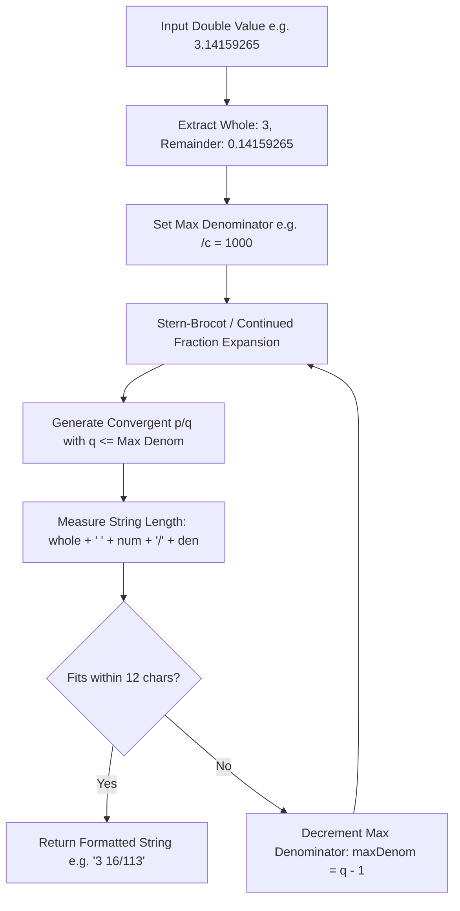

During an early bench test of our EastRising LCD driver, we typed in $\pi$ with fraction mode enabled and watched the screen scramble into garbage. Coming from modern software development where responsive CSS and dynamic fonts handle layout overflow gracefully, moving to a physical 12-character LCD was a stark wake-up call. When our naive continued-fraction converter generated a high-order convergent with a three-digit whole part, a four-digit numerator, and a four-digit denominator, the rendered string `-123 4567/8901` spilled past column 12, overwrote annunciator RAM, and turned on random battery icons.

That visual glitch made an essential reality obvious: in a physical calculator, pure mathematical approximation must live within a rigid, non-negotiable physical glass budget. In Part 2 of this series, we dive into how `RPNCore` couples continued fraction expansion (the Stern-Brocot tree) with display-constrained iterative fitting—reproducing historical marvels like Zu Chongzhi's 5th-century Milü ratio ($355/113$) without ever dropping a character off the edge of the glass. To ensure our adaptive algorithm never hangs in infinite loops on edge cases, I used AI coding agents to stress-test `computeFractionToFit` against hundreds of pathological floats.

<!-- more -->

## Continued Fraction Expansion & Rational Approximation

Every real number $x \in \mathbb{R}$ can be expressed as a continued fraction:

$$x = a_0 + \frac{1}{a_1 + \frac{1}{a_2 + \frac{1}{a_3 + \dots}}}$$

The successive truncations of this fraction, called **convergents** ($p_k / q_k$), provide the mathematically best possible rational approximations for a given denominator bound.

Consider approximating the transcendental constant $\pi \approx 3.1415926535\dots$:
- $a_0 = 3$ $\implies 3/1$
- $a_1 = 7$ $\implies 3 + 1/7 = 22/7 \approx 3.142857$ (Archimedes' Yuelü)
- $a_2 = 15$ $\implies 333/106 \approx 3.141509$
- $a_3 = 1$ $\implies \mathbf{355/113} \approx 3.14159292$ (Zu Chongzhi's Milü)

The Milü fraction $355/113$ is legendary: with a denominator of only three digits, it matches $\pi$ to six decimal places, with an absolute error of less than $2.7 \times 10^{-7}$.



## The Display-Constrained Fitting Algorithm: computeFractionToFit

On a physical 12-character LCD, rendering a fraction like `-123 456/789` requires:
- Sign: 1 character (`-`)
- Whole part: 3 characters (`123`)
- Space separator: 1 character (` `)
- Numerator: 3 characters (`456`)
- Slash: 1 character (`/`)
- Denominator: 3 characters (`789`)
- **Total**: $1 + 3 + 1 + 3 + 1 + 3 = 12$ characters (fits exactly).

If the fraction were `-1234 456/789` (13 characters), it would clip and corrupt the display.

Under commit `c307587`, we implemented `computeFractionToFit`:

```swift
// Verbatim from RPNCore/Sources/RPNCore/CalculatorEngine.swift:361-398
private func computeFractionToFit(valAbs: Double, sign: Double) -> (whole: Int64, num: Int64, den: Int64)? {
    guard valAbs.isFinite, valAbs < 1e11 else { return nil }
    var whole = Int64(valAbs)
    let remainder = valAbs - Double(whole)
    if remainder <= 1e-6 { return (whole, 0, 1) }
    
    let signLen = (sign < 0) ? 1 : 0
    let wholeLen = (whole == 0) ? 0 : String(whole).count
    let spaceLen = (whole == 0) ? 0 : 1
    let available = 12 - signLen - wholeLen - spaceLen - 1
    
    if available < 2 { return nil }
    
    // Flag 8: Forces fraction to nearest factor of /c
    if flags[8] {
        let targetDen = Int64(maxDenominator)
        let targetNum = Int64(round(remainder * Double(targetDen)))
        var fn = targetNum; var fd = targetDen
        if !flags[9] { let d = engineGcd(targetNum, targetDen); fn = targetNum / d; fd = targetDen / d }
        if fn == fd && fd > 0 { fn = 0; whole += 1 }
        if fn == 0 { return (whole, 0, 1) }
        if String(fn).count + String(fd).count <= available { return (whole, fn, fd) }
        return nil
    }
    
    let num = Int64(round(remainder * 1_000_000))
    let den = Int64(1_000_000)
    var currentMaxDenom = Int64(maxDenominator)
    
    // Iterative adaptive fitting
    while currentMaxDenom >= 2 {
        let frac = Rational<Int64>(num, den).limitDenominator(to: currentMaxDenom)
        var fn = frac.numerator; var fd = frac.denominator
        if fn == fd && fd > 0 { fn = 0; whole += 1 }
        if fn == 0 { return (whole, 0, 1) }
        if String(fn).count + String(fd).count <= available { return (whole, fn, fd) }
        currentMaxDenom = fd - 1
    }
    return nil
}
```

## Control Flags Matrix: Flags 7, 8, and 9

The HP-32SII fraction engine is governed by three persistent system flags:

| Flag | Name | Function when Set (True) | Function when Clear (False) |
| :--- | :--- | :--- | :--- |
| **Flag 7** | `FDISP` | Enables mixed fraction display mode globally | Displays standard decimal floating point |
| **Flag 8** | `FACTOR` | Forces fraction to closest `/c` factor (e.g. $8/16 \to 1/2$) | Uses full continued fraction expansion |
| **Flag 9** | `UNREDUCED`| Forces unreduced fraction display (e.g. $8/16$ stays $8/16$) | Automatically reduces by greatest common divisor (`engineGcd`) |

By uniting classical Stern-Brocot continued fractions with physical display character budgeting, `RPNCore` achieves flawless aesthetic and mathematical parity with classic HP engineering calculators.

## Conclusion: The Glass Ceiling of Physical Displays

In pure computer science, continued fraction algorithms can expand until double-precision bits run out. But on real hardware, physical character geometry sets hard boundaries. By making `computeFractionToFit` iteratively peel back convergent denominators when a fraction exceeds the twelve-character budget, we made sure the display never truncates or corrupts adjacent memory segments. It's an honest engineering compromise: you might get Archimedes' $22/7$ or Zu Chongzhi's $355/113$ instead of an unwieldy eight-digit rational, but what appears on the glass is readable, mathematically sound, and physically contained within the bezel. Bringing that level of historic mathematical beauty to an affordable, open-source device is exactly what will inspire the next generation of engineers to love physical computing.
