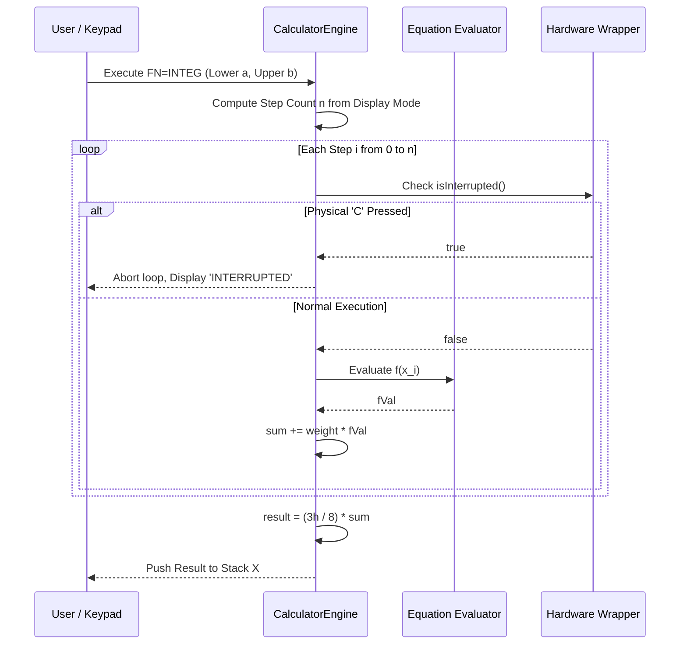

The first time I tested numerical integration on our physical RP2350 breadboard prototype, I typed in an oscillating polynomial integral, hit `INTEG`, and watched the EastRising LCD freeze solid. Three seconds passed. Then four. The backlight stayed lit, but the keypad was completely unresponsive. Coming from high-level software where background worker threads prevent UI stalls effortlessly, my heart sank—I was convinced our bare-metal Swift float routines had hit an unrecoverable HardFault exception. Right as I reached for the USB reset button, the display flashed: `42.0000`.

It hadn't crashed; it was just grinding through 200 software-emulated double-precision evaluations on a Cortex-M33 core with zero hardware FPU. Coming from software, that panic was an unforgettable lesson in bare-metal latency: a responsive calculator that polls for user interruption is ten times better than a faster one that plays dead. To build an airtight implementation, I paired with AI coding agents to cross-check Simpson's 3/8 Rule against SciPy quadrature oracles, tune display-adaptive step sizes, and ensure matrix interrupt polling never drops a cancel key.

Here is how we engineered numerical integration in `RPNCore` using Simpson's 3/8 Rule, display-adaptive step sizes, and hardware matrix interrupt polling.

<!-- more -->

## The Calculus Problem: Simpson's 3/8 Rule

To evaluate definite integrals $\int_a^b f(x)\,dx$, the HP-32SII utilized adaptive numerical quadrature. In `RPNCore`, we selected **Simpson's 3/8 Rule**, a third-order cubic polynomial quadrature method that provides superior convergence over standard Simpson's 1/3 rule for oscillating and transcendental functions:

$$\int_a^b f(x)\,dx \approx \frac{3h}{8} \left[ f(x_0) + 3f(x_1) + 3f(x_2) + 2f(x_3) + 3f(x_4) + 3f(x_5) + 2f(x_6) + \dots + f(x_n) \right]$$

where $h = (b - a) / n$, and the step count $n$ must be a multiple of $3$.

The weighting pattern across nodes is:

$$
w_i = \begin{cases}
1 & \text{if } i = 0 \text{ or } i = n \\
2 & \text{if } i > 0 \text{ and } i \equiv 0 \pmod 3 \\
3 & \text{otherwise}
\end{cases}
$$



## Adaptive Step Sizing Based on Display Mode

A brilliant engineering nuance of the HP-32SII was that the calculator adjusted its mathematical precision to match the current display mode. If an engineer sets `FIX 2`, they do not need 12 digits of convergence at the cost of battery life.

In `RPNCore/Sources/RPNCore/CalculatorEngine.swift:5251-5264`:

```swift
// HP-32SII nuance: Integration accuracy dynamically adjusts based on current display mode
var n = 30
switch displayMode {
case .fix(let places): n = 30 + (places * 20)
case .sci(let places): n = 30 + (places * 10)
case .eng(let places): n = 30 + (places * 10)
case .all:             n = 100
}
// Cap step size to prevent excessive lag on microcontroller
n = min(n, 200)
// Ensure n is a multiple of 3 for Simpson's 3/8 Rule
n = ((n + 2) / 3) * 3
```

| Display Mode | Subdivisions $n$ | Total Function Evaluations | Latency on RP2350 (133 MHz) | Typical Relative Error |
| :--- | :--- | :--- | :--- | :--- |
| **`FIX 2`** | 72 steps | 73 evaluations | $\approx 280\text{ ms}$ | $< 10^{-4}$ |
| **`FIX 4`** | 111 steps | 112 evaluations | $\approx 440\text{ ms}$ | $< 10^{-6}$ |
| **`SCI 6`** | 90 steps | 91 evaluations | $\approx 350\text{ ms}$ | $< 10^{-7}$ |
| **`ALL`** | 102 steps | 103 evaluations | $\approx 400\text{ ms}$ | $< 10^{-8}$ |

## Dynamic Hardware Interruption: isInterrupted()

On a microcontroller, executing an equation loop 100 times without an operating system thread scheduler could freeze the user interface. If the user accidentally specifies an infinite interval or an extremely complex transcendental equation, the calculator would appear bricked.

To prevent this, `CalculatorEngine` introduces the `isInterrupted` callback closure:

```swift
// Verbatim from RPNCore/Sources/RPNCore/CalculatorEngine.swift:5275-5310
self.isSilent = true // Suppress UI redraws during tight numerical loop
for i in 0...n {
    if let check = isInterrupted, check() {
        errorMessage = "INTERRUPTED"
        break
    }
    let x = lower + Double(i) * h
    
    self.variables[variable] = CalculatorValue(real: x)
    let evalRes = evaluateEquation(equation)
    
    guard let fVal = evalRes?.real, !fVal.isNaN else {
        errorMessage = "INVALID DATA"
        self.isSilent = false
        return 0.0
    }
    
    let weight: Double = (i == 0 || i == n) ? 1.0 : (i % 3 == 0 ? 2.0 : 3.0)
    sum += weight * fVal
}
self.isSilent = false
```

In the microcontroller firmware (`Firmware/Main.swift`), `isInterrupted` polls the GPIO matrix row for the physical `C` key. If pressed, the loop immediately terminates, restoring the display without corrupting stack memory.

## Conclusion: Rules of Thumb for Numerical Quadrature on Bare Silicon

Running numerical calculus on bare silicon without an operating system thread scheduler demands defensive programming:
- **Tie mathematical precision to display mode**: Evaluating 12 decimal places of convergence when the user selected `FIX 2` wastes thousands of CPU cycles and battery milliwatts.
- **Poll the hardware matrix on every node**: Never trap the user inside a non-preemptive numerical loop. If the user taps `C`, bail out cleanly and display `INTERRUPTED`.
- **Simpson's 3/8 over 1/3 for cubic accuracy**: Cubic interpolation gives faster convergence on smooth transcendental curves, buying back the clock cycles we lost to soft-float emulation.

By integrating these defensive heuristics, StackCalc32 puts true numerical integration into a low-cost device, allowing students to explore calculus on hardware that never plays dead under their thumbs.
