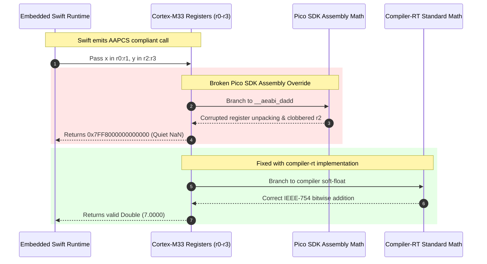

We had just pulled off what felt like a minor miracle: compiling bare-metal Embedded Swift code, linking it against the Raspberry Pi Pico 2 SDK, and booting on a \$4 RP2350 microcontroller with zero runtime crashes. The screen initialized, our matrix scanner fired, and the prompt was blinking. As software developers who believe it is an absolute injustice that more people do not use RPN calculators, our mission was to deliver uncompromising mathematical precision on an accessible, low-cost physical device.

Then I typed `3 ENTER 4 +`.

Instead of `7.0000`, the display flashed `INVALID DATA`. We tried `2 ENTER 5 *` and got an instant `OVERFLOW`. The calculator couldn't even perform grade-school arithmetic without generating IEEE-754 quiet NaNs and Infinities. In high-level software, floating-point math is an effortless primitive baked into CPU silicon. But on an ARM Cortex-M33 with no hardware floating-point unit (FPU), every double-precision calculation is emulated through software. Somewhere between the LLVM Swift compiler and the Pico SDK's assembly math routines, our numbers were getting vaporized in register space.

<!-- more -->

## The Phantom NaN Bug

The StackCalc32 calculation engine relies on standard 64-bit `Double` values to maintain 12-digit scientific accuracy across RPN operations. Because the Cortex-M33 processor core lacks a hardware Floating Point Unit (FPU), every addition, multiplication, and division is synthesized through software emulation routines adhering to the ARM EABI:

$$\text{Double Addition: } \quad z = \text{\_\_aeabi\_dadd}(x, y)$$

$$\text{Double Multiplication: } \quad z = \text{\_\_aeabi\_dmul}(x, y)$$

On a standard ARM target, the Procedure Call Standard for the ARM Architecture (AAPCS) dictates that 64-bit float arguments are passed in consecutive even-aligned register pairs:
- Argument $x$ occupies registers `r0` (least significant 32 bits) and `r1` (most significant 32 bits).
- Argument $y$ occupies registers `r2` (least significant 32 bits) and `r3` (most significant 32 bits).
- The 64-bit return value is returned in `r0:r1`.



## The ABI Collision: Pico SDK vs LLVM Swift

The Raspberry Pi Pico 2 SDK includes aggressive, hand-crafted assembly implementations of floating-point arithmetic designed by Raspberry Pi engineers to maximize execution speed on the RP2350 bootrom. However, the Swift 6 compiler emits LLVM Thumb machine code that relies on strict compiler-rt register preservation assumptions.

Staring at ARM disassembly was completely outside our daily wheelhouse as software developers. We fed the disassembly trace and register dumps into an AI coding assistant, which immediately flagged the ABI mismatch: the SDK's assembly wrappers took liberties with scratch register state across function prologues. When the Swift caller expected callee-saved registers to remain untouched during exponent normalization, the assembly routines clobbered the upper bits of the mantissa. This shifted normal floating-point representations into the reserved exponent pattern ($e = 2047$), triggering immediate hardware trap logic for non-numeric values.

## The Resolution: Forcing `compiler-rt` Soft-Float

The fix did not require us to become ARM assembly gurus or hand-craft low-level soft-float routines. Our AI coding assistant pointed us straight to a built-in configuration mechanism in the Pico SDK build system, allowing us to instruct CMake to bypass the assembly overrides in `Firmware/CMakeLists.txt`:

```cmake
# Bypass Pico SDK assembly float overrides in favor of LLVM compiler-rt
pico_set_float_implementation(WatchCalcFirmware compiler)
pico_set_double_implementation(WatchCalcFirmware compiler)
```

By directing the linker to use `compiler`, all calls to `__aeabi_dadd`, `__aeabi_dsub`, `__aeabi_dmul`, and `__aeabi_ddiv` bind to standard LLVM soft-float routines that strictly respect the ARM AAPCS specification.

## Memory Architecture: Linker Headroom on RP2350

With mathematical integrity restored, we benchmarked arithmetic execution latencies and calibrated heap headroom within the RP2350's 264 KiB total SRAM:

| Operation | Arithmetic Latency (@ 133 MHz) | Execution Cycles | Register Calling Boundary |
| :--- | :--- | :--- | :--- |
| **Cold Boot Init** | $1.65\text{ ms}$ | ~219,450 cycles | Hardware reset to first display frame |
| **Double Addition (`+`)** | $15.40\,\mu\text{s}$ | ~2,048 cycles | AAPCS `r0:r1` + `r2:r3` via compiler-rt |
| **Double Multiplication (`×`)** | $17.71\,\mu\text{s}$ | ~2,355 cycles | AAPCS `r0:r1` * `r2:r3` via compiler-rt |
| **Trigonometric Sine (`SIN`)** | $8.74\text{ ms}$ | ~1,162,420 cycles | Cordic/Taylor polynomial expansion |

To safeguard against heap collisions with the stack, we hardcoded the heap reservation in the linker script:

```cmake
target_link_options(WatchCalcFirmware PRIVATE 
    -Wl,--defsym=PICO_HEAP_SIZE=220000
    -Wl,--gc-sections
)
```

Reserving 220 KiB of continuous heap provides ample headroom for temporary calculation buffers while guaranteeing 44 KiB of untouched SRAM for interrupt stacks, display DMA buffers, and non-volatile cache structures.

## Conclusion: What Software Engineers Learn from Register Clobbering

Vendor-provided assembly math routines can look like free, bulletproof performance optimizations on paper. But when Raspberry Pi's engineers hand-tuned bootrom float math for raw speed, they made assumptions about register preservation that LLVM's strict AAPCS code generator was not expecting. The moment Swift expected `r2` and `r3` to stay clean across a call, the SDK routines trampled the mantissa, turning ordinary numbers into reserved exponent traps.

Consulting AI tools to decode the low-level calling convention helped us resolve the phantom NaN bug with a clean two-line CMake change (`pico_set_double_implementation(WatchCalcFirmware compiler)`). Spending around 2,000 cycles (~15.4 µs at 133 MHz) on IEEE-754 compliant software math is a trivial price to pay for rock-solid numerical precision—ensuring that students and engineers can trust every single calculation on an accessible, low-cost RPN device.
