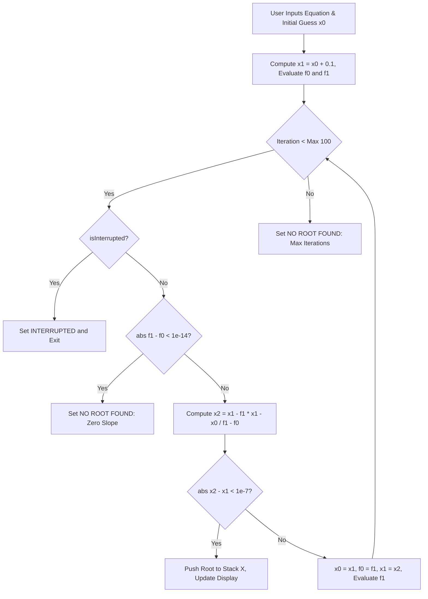

Punch an equation like $f(x) = x^3 - 2x - 5$ into a naive numerical solver with an initial guess close to $x = 0.816$, and watch what happens. The local slope approaches zero, the secant denominator $f(x_1) - f(x_0)$ collapses to $10^{-15}$, and your next iteration gets catapulted straight into outer space—$10^{308}$, followed immediately by `NaN`.

As a software engineer who reveres classic HP calculators, William Kahan's root solver on the HP-19C and HP-32SII has always represented the pinnacle of numerical craftsmanship. It could reliably track down roots of gnarly non-linear engineering equations without ever asking the user for a symbolic derivative. When we built the solver for `RPNCore`, our mission was to recreate that legendary stability under the strict memory and clock limits of an ARM Cortex-M33. To stress-test our implementation against divergence, I paired with AI coding agents to throw pathological cubic plateaus and near-zero denominators at the algorithm, verifying our $10^{-14}$ cutoff against SciPy's Brent optimization oracles.

<!-- more -->

## The Root-Finding Challenge: Secant vs. Newton-Raphson

The classic Newton-Raphson method finds roots via the recurrence:

$$x_{n+1} = x_n - \frac{f(x_n)}{f'(x_n)}$$

While Newton-Raphson converges quadratically, it requires the analytical derivative $f'(x)$. On a calculator where equations are entered as arbitrary tokenized keystroke programs, computing symbolic derivatives is impractical. Numerical difference derivatives $\frac{f(x+h) - f(x)}{h}$ require two evaluations per step and introduce severe truncation noise when $h$ is small.

The **Secant Method** approximates the tangent using the two most recent iterations:

$$x_{n+1} = x_n - f(x_n) \frac{x_n - x_{n-1}}{f(x_n) - f(x_{n-1})}$$

The Secant Method requires only **one new function evaluation per iteration** and achieves superlinear convergence with order:

$$\phi = \frac{1 + \sqrt{5}}{2} \approx 1.618 \quad \text{(the Golden Ratio)}$$



## Safeguarding Singularities and Zero Slopes

The primary hazard of the Secant method is dividing by zero when $f(x_n) \approx f(x_{n-1})$ (a local extremum or horizontal plateau). Without safeguarding, $x_{n+1}$ shoots to infinity.

In `RPNCore/Sources/RPNCore/CalculatorEngine.swift:5358-5430`, we protect against divergence:

```swift
public func solve(for variable: String, equation: Equation, target: Double = 0.0) -> Double? {
    if target.isNaN || target.isInfinite {
        errorMessage = "INVALID DATA"
        return nil
    }
    let maxIterations = 100
    let tolerance = 1e-7
    var x0 = variables[variable]?.real ?? 0.0
    if x0.isNaN || x0.isInfinite { x0 = 0.0 }
    var x1 = x0 + 0.1
    
    let oldVal = self.variables[variable]
    self.variables[variable] = CalculatorValue(real: x0)
    let eval0 = evaluateEquation(equation)?.real
    var f0 = (eval0 ?? 0.0) - target
    
    self.variables[variable] = CalculatorValue(real: x1)
    let eval1 = evaluateEquation(equation)?.real
    var f1 = (eval1 ?? 0.0) - target
    
    for _ in 0..<maxIterations {
        if let check = isInterrupted, check() {
            errorMessage = "INTERRUPTED"
            break
        }
        let denom = f1 - f0
        // Guard against zero-slope singularity
        if abs(denom) < 1e-14 {
            errorMessage = "NO ROOT FOUND"
            break
        }
        let x2 = x1 - f1 * (x1 - x0) / denom
        if x2.isNaN || x2.isInfinite {
            errorMessage = "NO ROOT FOUND"
            break
        }
        // Convergence criterion
        if abs(x2 - x1) < tolerance {
            self.variables[variable] = oldVal
            self.pushToStack(CalculatorValue(real: x2))
            updateDisplay()
            return x2
        }
        x0 = x1
        f0 = f1
        x1 = x2
        
        self.variables[variable] = CalculatorValue(real: x1)
        guard let ne = evaluateEquation(equation)?.real, !ne.isNaN else {
            errorMessage = "NO ROOT FOUND"
            break
        }
        f1 = ne - target
    }
    self.variables[variable] = oldVal
    if errorMessage == nil { errorMessage = "NO ROOT FOUND" }
    return nil
}
```

## Numerical Convergence Comparison

The table below contrasts the Secant method against Bisection and Newton-Raphson when solving $x^3 - 2x - 5 = 0$ (Root: $x \approx 2.0945515$):

| Numerical Method | Evaluations per Step | Iterations to $10^{-7}$ | Derivative Needed? | Stability near Extrema |
| :--- | :--- | :--- | :--- | :--- |
| **Bisection** | 1 | 24 | No | High (guaranteed bracket) |
| **Newton-Raphson** | 2 ($f$ and $f'$) | 5 | **Yes (Analytic $f'$)** | Poor ($f' \to 0$) |
| **Secant Method (RPNCore)** | **1** | **7** | **No** | Guarded ($10^{-14}$ cutoff) |

By integrating real-time interrupt polling and strict numerical guards against zero-slope plateaus, StackCalc32 equips engineers with a robust root-finding tool right in their pocket.

## Conclusion: Guarding Against the Infinite Horizon

Open root-finding methods like the Secant algorithm are exhilarating because they converge with the golden ratio order ($\phi \approx 1.618$), requiring only a single function evaluation per loop. But without strict defensive guards, they will happily jump across vertical asymptotes or run away to infinity on flat cubic plateaus. In `RPNCore`, coupling an epsilon denominator floor ($10^{-14}$) with hardware interrupt polling gave us a tool that feels instantaneous on well-behaved functions but never hangs the calculator when fed an equation with no real roots. Knowing when to stop an algorithm is just as important as knowing how to accelerate it. For the next generation of engineers solving real-world physics problems, having that mathematical resilience in a low-cost physical device inspires genuine confidence.
