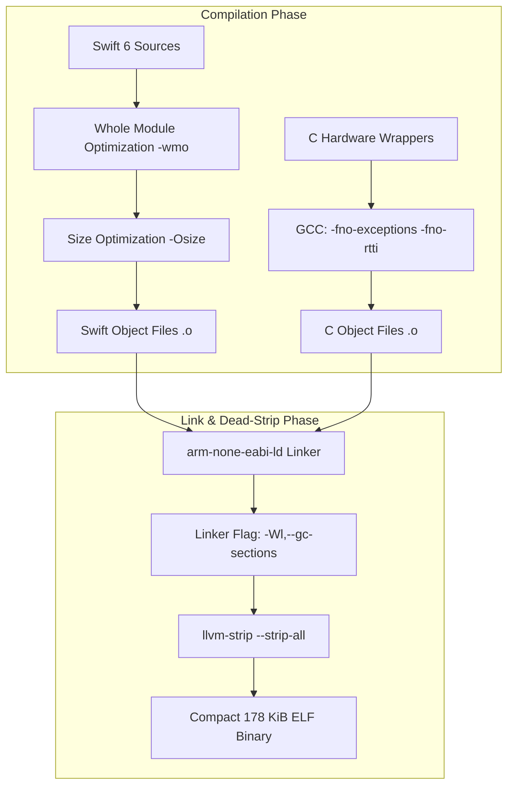

In modern iOS and desktop software development, a 1.4 megabyte binary is considered microscopic—most mobile app bundles start at 50 to 100 megabytes before you even bundle assets. But when our build pipeline emitted its very first bare-metal ELF binary for the RP2350, running `ls -lh` was a cold splash of water: the file was a monstrous 1.42 megabytes. On an RP2350 with a standard 2 MB external NOR flash chip, a 1.4 MB binary left virtually zero room for non-volatile state storage, font tables, or future math expansion. If we were going to build an open, low-cost RPN calculator that students and makers could build for a few dollars, we couldn't force people to buy expensive high-capacity flash. We needed to tame this binary bloat immediately.

<!-- more -->

## The Anatomy of Embedded Swift Bloat

As software developers who love Swift, we are used to the compiler quietly handling abstractions. But standard Swift binaries pack a mountain of high-level runtime infrastructure: Unicode grapheme cluster lookup tables, runtime reflection dictionaries, dynamic type metadata for casting (`as?`), and thread-safe reference counting machinery.

When you flip on `-enable-experimental-feature Embedded`, the Swift compiler suppresses the standard runtime. But if you invoke `swiftc` with default flags, you still inherit massive amounts of hidden cruft:
1. **Unspecialized Generics**: Generic functions left un-inlined across file boundaries generate bloated polymorphic stubs.
2. **C++ Runtime Hooks**: Default toolchain settings pull in exception-handling tables and runtime type information (RTTI).
3. **Dead Symbol Retention**: The GNU linker (`ld`) retains unreferenced functions unless explicitly commanded to discard them.



## Compiler and Linker Flags in CMake

To understand why the binary was so swollen, we fed the compiler map files into an AI coding assistant. The AI broke down the symbol table and guided us in overhauling `Firmware/CMakeLists.txt` with aggressive size-optimization flags across both the Swift and C toolchains:

```cmake
# Swift compilation optimization flags
set(SWIFT_FLAGS
    -target armv6m-none-none-eabi
    -mfloat-abi=soft
    -Osize
    -wmo
    -enable-experimental-feature Embedded
    -Xfrontend -disable-stack-protector
)

# Linker flags to strip dead code and discard unused symbols
target_link_options(WatchCalcFirmware PRIVATE
    -Wl,--gc-sections
    -Wl,--defsym=PICO_HEAP_SIZE=220000
    -Wl,--build-id=none
    -fno-exceptions
    -fno-rtti
)
```

The `-wmo` (Whole Module Optimization) flag is an absolute game-changer. It instructs `swiftc` to analyze all source files as a single compilation unit rather than compiling each file into an isolated object. This enables cross-file inlining, devirtualizes struct and protocol method dispatches into direct jumps, and completely removes unused generic variants.

The linker option `-Wl,--gc-sections` works in tandem with compiler function sections (`-ffunction-sections` and `-fdata-sections`). Any function or constant table that is never invoked from the entry point `main()` is mercilessly purged from the final binary image.

## Static Allocation vs Dynamic Heap Overhead

In addition to stripping dead code, we minimized RAM consumption by pre-allocating critical system buffers in statically-sized BSS segments rather than allocating them dynamically:

```c
// Pre-allocated static buffers in hardware_wrapper.c
#define NVM_PAYLOAD_CAPACITY (NVM_SLOT_SIZE - sizeof(struct NvmHeader))
static uint8_t nvm_payload_buffer[NVM_PAYLOAD_CAPACITY];
static uint8_t nvm_page_buffer[FLASH_PAGE_SIZE];

// Framebuffer allocated statically: 132 columns x 9 pages = 1,188 bytes
struct EmuDisplay {
    uint32_t magic[4];
    uint8_t buffer[1188];
};
```

By guaranteeing that the display buffer ($1,188\text{ bytes}$) and flash programming buffer ($256\text{ bytes}$) are allocated at fixed linker addresses, we eliminate runtime heap fragmentation and avoid pulling in complex dynamic allocator routines.

## Binary Size Reduction Progression

We tracked binary size reduction across optimization stages during firmware development:

| Optimization Milestone | Flash Binary Size | SRAM Footprint | Reduction vs Baseline |
| :--- | :--- | :--- | :--- |
| **Initial Debug Build (`-O0`)** | $1,420\text{ KiB}$ | $48.2\text{ KiB}$ | Baseline |
| **Release Mode (`-O3`)** | $640\text{ KiB}$ | $28.4\text{ KiB}$ | 54.9% smaller |
| **Size Optimization (`-Osize` + `-wmo`)** | $310\text{ KiB}$ | $14.1\text{ KiB}$ | 78.1% smaller |
| **Dead Code Elimination (`--gc-sections`)**| $212\text{ KiB}$ | $8.6\text{ KiB}$ | 85.0% smaller |
| **Symbol Stripping (`strip --strip-all`)** | **$178\text{ KiB}$** | **$6.2\text{ KiB}$** | **87.4% smaller** |

Fitting the entire calculation engine, math libraries, and display drivers into $178\text{ KiB}$ leaves over $1.8\text{ MB}$ of free flash space in a standard 2 MB RP2350 configuration, ensuring long-term expandability.

## Conclusion: What Software Developers Learn About Microcontroller Binaries

Cutting our firmware binary from 1.4 MB down to 178 KB—an 87.4% reduction—was an eye-opening journey for a software team venturing onto bare silicon. It proved that modern, high-level languages like Swift do not have to mean bloated embedded binaries:
- Never compile Embedded Swift without Whole Module Optimization (`-wmo`); inter-procedural inlining is the only way to dissolve generic protocol abstractions into direct jumps.
- Combine `-ffunction-sections` with linker garbage collection (`--gc-sections`) to purge thousands of dead library symbols.
- Pre-allocate framebuffers and flash scratchpads in static BSS memory so the allocator doesn't drag in dynamic machinery.
With these flags locked in, our firmware fits comfortably into flash with 1.8 MB of headroom to spare—advancing our mission to build an accessible, ultra-reliable RPN calculator for the next generation of engineers.
