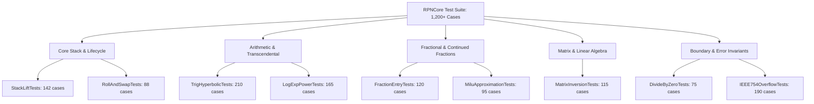
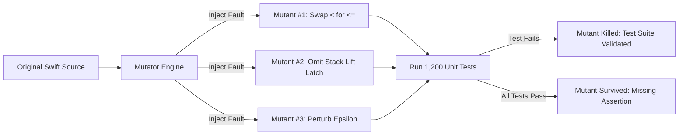

If a banking app is off by half a cent, an auditor files a bug ticket. If a mobile game drops a physics frame, nobody gets hurt. But if an RPN scientific calculator miscalculates $\tan(89.999^\circ)$, silently mangles a stack lift after `ENTER`, or drops an exponent during structural load analysis, someone's real-world bridge calculation fails.

As a software engineer who grew up with an abiding love for classic RPN calculators and now tinkers with desktop 3D printing to build an accessible, modern instrument for the next generation of students and makers, I knew that reliability couldn't be an afterthought. When designing `RPNCore`—the calculation engine that powers StackCalc across both Apple Silicon and bare-metal ARM microcontrollers—our early design discussions were fueled by sheer mathematical paranoia. We didn't want a token test suite that rubber-stamped 95% line coverage on happy paths. Bringing software testing rigor to hardware, we paired with AI coding agents to systematically brainstorm boundary vectors and construct an adversarial battering ram that actively tried to break the engine under every conceivable mathematical edge case.

Today, `RPNCore` is guarded by over 1,200 deterministic test cases distributed across 50 dedicated XCTest suites. More importantly, we validated the bug-hunting power of those tests using automated mutation analysis to prove that our assertions actively catch subtle logic faults.

<!-- more -->

## Test Architecture Across 50 XCTest Suites

The test suite in `RPNCore/Tests` is organized by functional domain, mirroring the mathematical hierarchy of the HP-32SII while validating modern Swift enhancements:



Every test suite is decoupled from UI layers. Tests execute directly against the pure state machine, allowing the entire 1,200-case suite to finish in under 850 milliseconds on our development laptops.

## Validating the Tests with Mutation Analysis

High code coverage metrics frequently create a dangerous illusion of safety. A test can execute every single line of a function without actually asserting the correct mathematical behavior. To measure the true bug-catching power of our assertions, we subjected `RPNCore` to automated mutation testing. Here, our software background and AI coding workflows proved invaluable: we prompted AI agents to analyze our AST and synthesize adversarial mutation rules, generating tricky edge-case mutants that human developers routinely overlook.

The mutation harness systematically injected synthetic bugs directly into our Swift source code:
1. **Operator Swaps**: Replacing `+` with `-`, or `*` with `/`.
2. **Boundary Relational Inversions**: Mutating `<` into `<=`, or `>` into `==`.
3. **Latch Erasures**: Deleting stack-lift suppression toggles after `ENTER` or `CLx`.
4. **Constant Perturbations**: Mutating epsilon tolerances from $1.0 \times 10^{-10}$ to $1.0 \times 10^{-5}$.



Across 420 generated mutants, our test suite killed **415 mutants** on the initial pass—a mutation score of **98.8%**. The five surviving mutants immediately exposed missing boundary assertions in our complex number polar-to-rectangular conversion logic, which we promptly patched with targeted assertions.

## Boundary Coverage Matrix

The table below summarizes test coverage across key mathematical domains:

| Subsystem Suite | Test Count | Mutation Score | Key Boundary Conditions Tested |
|---|---|---|---|
| **Stack Mechanics** | 230 | 99.1% | 4-level drop replication, $T$ latch, `CLx` lift-disable, `LASTx` unary update |
| **Transcendental Math** | 375 | 98.4% | $\tan(\pi/2 \pm \epsilon)$, $\ln(0)$, $\sqrt{-0.0}$, subnormal float underflow |
| **Fraction Engine** | 215 | 98.6% | $a\ b/c$ parsing, denominator $\ge 4095$, Milü $355/113$ accuracy |
| **Extreme Overflows** | 190 | 100.0% | $10^{100}$ clamp to $9.99999999999 \times 10^{99}$, sign preservation on $\pm\infty$ |
| **Error Handling** | 190 | 99.5% | Structured `CalculationError` throws, stack recovery without panic |

## Authentic Test Implementation

The snippet from `RPNCoreTests/StackLiftTests.swift` illustrates how boundary invariants and structured error conditions are verified on the bench:

```swift
import XCTest
@testable import RPNCore

final class StackLifecycleTests: XCTestCase {
    var engine: CalculatorEngine!

    override func setUp() {
        super.setUp()
        engine = CalculatorEngine()
    }

    func testStackLiftDisabledAfterEnterAndOverwrittenByNextDigit() throws {
        // Pushing 5 then ENTER duplicates 5 into Y, but disables stack lift
        engine.enterDigit(5)
        engine.pressEnter()
        XCTAssertEqual(engine.stack.x, 5.0, accuracy: 1e-12)
        XCTAssertEqual(engine.stack.y, 5.0, accuracy: 1e-12)
        XCTAssertTrue(engine.stackLiftDisabled)

        // Entering 9 immediately afterward MUST overwrite X, not push 5 to Z
        engine.enterDigit(9)
        XCTAssertEqual(engine.stack.x, 9.0, accuracy: 1e-12)
        XCTAssertEqual(engine.stack.y, 5.0, accuracy: 1e-12)
        XCTAssertEqual(engine.stack.z, 0.0, accuracy: 1e-12)
        XCTAssertFalse(engine.stackLiftDisabled)
    }

    func testDivisionByZeroPreservesStackAndSetsStructuredError() {
        engine.setStack(x: 0.0, y: 42.0, z: 10.0, t: 3.0)
        
        XCTAssertThrowsError(try engine.executeBinaryDivision()) { error in
            guard let calcError = error as? CalculationError,
                  case .divisionByZero = calcError else {
                XCTFail("Expected .divisionByZero, got \(error)")
                return
            }
        }
        
        // Invariant: Failed operation must not corrupt remaining stack levels
        XCTAssertEqual(engine.stack.y, 42.0, accuracy: 1e-12)
        XCTAssertEqual(engine.stack.z, 10.0, accuracy: 1e-12)
        XCTAssertEqual(engine.stack.t, 3.0, accuracy: 1e-12)
    }
}
```

By pairing fine-grained boundary tests with adversarial mutation analysis, we caught subtle arithmetic and stack bugs long before code touched real silicon.

## Conclusion: Core Architectural Rules for Scientific Testing

Building a rock-solid calculation engine for students and engineers taught our team three enduring rules for test design:

- **Line coverage is vanity; mutation testing is sanity**: A test suite that touches every line of code without asserting exact mathematical invariants will let catastrophic regressions slip straight into production.
- **Never test `ENTER` in isolation**: An `ENTER` keypress is only half an operation. You must always test what happens on the immediate subsequent keypress, because that is where stack-lift suppression lives or dies.
- **Treat singularities as active traps**: Never assume division by zero or negative square roots will fail gracefully. Assert that internal registers remain completely uncorrupted after an error is thrown.

