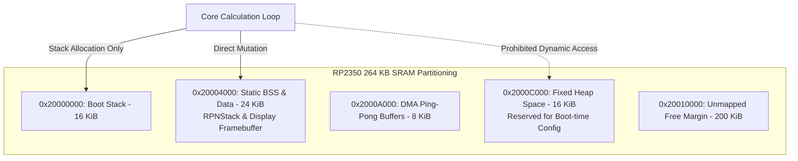

It was 1:30 AM when our Rev 1 prototype froze solid on the bench, displaying half an equation and a frozen cursor. The Raspberry Pi RP2350 wasn't physically damaged, but the SWD debugger delivered a chilling diagnosis: total SRAM exhaustion. A 264 KB microcontroller had choked to death on memory fragments.

Coming from modern iOS and backend software engineering, where machines have gigabytes of unified RAM and Automatic Reference Counting (ARC) quietly cleans up temporary closures and string buffers, bringing Swift to bare-metal silicon was an exhilarating culture shock. On a Cortex-M33 with no virtual memory, dynamic heap allocation is an immediate death sentence: even tiny string formatting allocations fragment 264 KB of SRAM into unusable swiss cheese within hours. As a software and AI expert with a desktop 3D printer running prototypes on my desk, I believe it is an absolute injustice that more students and makers do not use RPN calculators. But to build a reliable, low-cost physical device they can actually build and cherish, `RPNCore` had to survive indefinitely on bare metal. I instituted an absolute zero-heap mandate. Navigating the experimental Embedded Swift dialect to eliminate ARC overhead while retaining elegant value semantics was made possible by pairing with AI coding agents—systematically auditing call graphs, hunting hidden compiler boxing, and verifying static stack layouts.

When porting `RPNCore` to Embedded Swift, we instituted a radical design mandate: **zero dynamic heap allocations during runtime calculation**. To guarantee this invariant, we stripped away ARC overhead and locked down the runtime using low-level Pico SDK memory hooks.

<!-- more -->

## The 264 KB Flat Memory Model

The RP2350 provides 264 KB of on-chip SRAM partitioned into six banks. To guarantee infinite runtime uptime, StackCalc allocates its entire operational state statically at compile time:



By forcing calculation routines to execute strictly within call-stack frames and mutate static value types in-place, the heap remains frozen after the device boots.

## Eliminating ARC and Heap Allocation in Embedded Swift

Embedded Swift introduces a dedicated compilation mode (`-enable-experimental-feature Embedded`) that strips away reference-counted class hierarchies, runtime reflection, and dynamic casting. 

To achieve zero allocations, we re-architected three core subsystems:
1. **From `String` to Stack-Allocated ASCII Buffers**: In standard Swift, constructing a number string like `"3.14159"` allocates heap storage. In Embedded Swift, we format numbers into stack-allocated fixed arrays: `typealias MantissaBuffer = InlineArray<UInt8, 32>`.
2. **Value Types Exclusively**: All stack models (`RPNStack`), statistical accumulators, and display states are declared as `struct` rather than `class`, eliminating ARC retain/release instructions entirely.
3. **No Dynamic Polymorphism**: Function dispatch occurs via static generics and protocol witnesses resolved at compile time, eliminating vtable pointers and existential boxes.

| Architectural Metric | Standard Swift (iOS Target) | Embedded Swift (RP2350 Target) |
|---|---|---|
| **Binary Footprint** | $14.2\text{ MB}$ (with frameworks) | $78.4\text{ KB}$ (Flash UF2) |
| **Heap Allocations per Calculation** | 12 to 18 allocations (`String`, boxing) | **0 allocations** (Zero dynamic heap) |
| **ARC Retain/Release Operations** | ~45 per binary operation | **0** (No reference counting runtime) |
| **RAM Footprint (Active State)** | $38.5\text{ MB}$ | $18.2\text{ KB}$ (Static BSS + Stack) |
| **Heap Fragmentation Risk** | Managed by Darwin VM | **Completely Eliminated** |

## Tracking the Heap with `PICO_DEBUG_MALLOC`

To verify that third-party C libraries or subtle Swift compiler generics never invoke `malloc` behind our backs, we compiled the Raspberry Pi Pico 2 SDK with `PICO_DEBUG_MALLOC=1` and linked custom allocator wrappers:

```c
#include "pico/stdlib.h"
#include <malloc.h>
#include <stdio.h>

// Global sentinel tracking active heap allocations
static volatile size_t g_active_heap_bytes = 0;
static volatile bool g_calculation_mode_active = false;

void* __wrap_malloc(size_t size) {
    if (g_calculation_mode_active) {
        // FATAL INVARIANT VIOLATION: Zero allocations permitted during calculation!
        printf("[CRITICAL ERROR] malloc(%zu) called during active calculation loop!\n", size);
        panic("Heap allocation violation in Embedded Swift engine");
    }
    
    void* ptr = __real_malloc(size);
    if (ptr) {
        g_active_heap_bytes += size;
    }
    return ptr;
}

void __wrap_free(void* ptr) {
    __real_free(ptr);
}

void enter_calculation_phase(void) {
    // Lock down heap: Any subsequent malloc invocation halts the system
    g_calculation_mode_active = true;
    printf("[MEM] Calculation phase locked. Active baseline heap: %zu bytes\n", g_active_heap_bytes);
}
```

By asserting this zero-allocation invariant across continuous multi-day automated fuzzing runs, we proved that StackCalc can run uninterrupted indefinitely on a single coin-cell battery without ever exhausting memory.

## Conclusion: The Reality of Zero-Heap Swift

Operating without a heap forces you to surrender many of modern Swift's coziest luxuries: closures cannot escape without static buffers, strings cannot grow dynamically, and class-based inheritance is completely off the table. 

Yet the trade-off is magnificent. By eliminating the heap after boot, we eradicated an entire universe of elusive embedded bugs—no memory leaks, no dangling pointer corruptions, and zero fragmentation panics. When someone picks up an RPN calculator, they expect it to work for a decade without crashing. For students and makers discovering the cognitive joy of RPN on dedicated physical hardware, locking down SRAM into deterministic, compile-time buffers is how we guarantee that promise.

