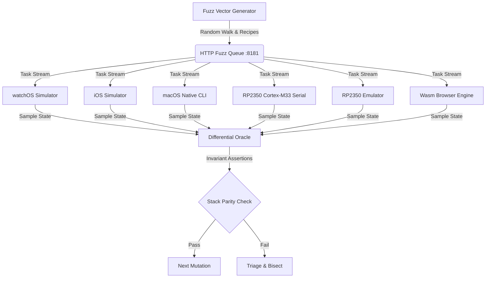

Human test suites suffer from a fatal blind spot: they only verify what the engineer had the imagination to anticipate. We wrote 1,200 deterministic unit tests for `RPNCore` and felt smugly confident in our code coverage—until we unleashed differential fuzzing, one of the greatest superpowers of modern software engineering, directly against physical silicon.

As a software and AI expert with a desktop 3D printer whirring away printing prototype calculator enclosures, I believe it is an absolute injustice that more students, makers, and engineers do not use RPN calculators. But if we were going to build an open, accessible instrument that purists could trust, the engine could not have subtle behavioral quirks. We paired with AI coding agents to synthesize grammar-guided fuzzing vectors and turned loose an automated fuzzing harness that simulated a caffeinated toddler hammering keys at 40 Hz across both an M3 Max Mac and a physical RP2350 microcontroller on our workbench.

Within four minutes, the differential fuzzer caught three subtle state discrepancies that our static unit tests never dreamed of.

In an RPN (Reverse Polish Notation) scientific calculator, our calculation engine had to run with byte-for-byte fidelity across six radically distinct environments: watchOS, iOS, macOS, bare-metal RP2350 (ARM Cortex-M33), RP2350 (ARM Cortex-M33), and a web-based WebAssembly simulator. A user's trust hinges entirely on predictable stack transformations, register lift preservation, and sub-ULP numerical agreement across transcendental functions. To guarantee true behavioral parity, we architected an automated cross-surface fuzzer driven by strict golden path state invariants.

<!-- more -->

## The Multi-Target Parity Challenge

The StackCalc engine is implemented in Swift, utilizing Embedded Swift compilation for bare-metal microcontrollers and standard Swift across Apple platforms. While the core algorithms share source files, the underlying execution environments differ fundamentally:

- **Apple Silicon / x86_64**: Full IEEE 754 double-precision hardware floating-point units (FPU), 64-bit word size, and standard Darwin memory management.
- **RP2350 (Cortex-M33)**: 32-bit architecture without a hardware FPU. Floating-point operations run via soft-float library routines in bootrom (`pico_float` and `pico_double`).
- **RP2350 (Cortex-M33)**: Single-precision hardware FPU with custom double-precision microcode routines.
- **WebAssembly**: 32-bit V8/SpiderMonkey runtime sandbox with specific NaN canonicalization semantics.

A calculation sequence as innocent as `[3, ENTER, 7, /, 7, *, 3, -]` must yield identically signed zeros and preserve exact stack register states across every target.



## Formalizing Golden Path State Invariants

Instead of merely checking final numeric results, our differential fuzzer models the RPN engine as a finite state automaton $S = (R, F, M)$ where $R = \{X, Y, Z, T, L\}$ denotes the five primary registers ($X$ as display register, $Y, Z, T$ as the remaining stack levels, and $L$ as the `LASTx` register), $F$ represents the active status flags (Degrees/Radians/Gradients, Fraction display, Alpha mode), and $M$ tracks the stack-lift enable latch.

Every generated test operation $op \in \mathcal{O}$ transitions the state $S_{k} \xrightarrow{op} S_{k+1}$. The fuzzer asserts four primary invariants after every single instruction transition:

| Invariant Class | Formal Definition | Target Tolerance / Boundary |
|---|---|---|
| **Stack Depth Clamping** | $\lvert R_{stack} \rvert \equiv 4$ | Bottom drop replicated: $T_{k+1} = T_k$ on binary reduction |
| **Numerical Consistency** | $\lvert X_{target} - X_{oracle} \rvert \le \epsilon$ | $\epsilon = 1.0 \times 10^{-10}$ relative drift |
| **LASTx Preservation** | $L_{k+1} = X_k \iff op \in \mathcal{O}_{arithmetic}$ | Exact bitwise identity for IEEE 754 mantissa |
| **Lift Disable Latch** | $M_{k+1} = \text{false} \iff op \in \{\text{ENTER}, \text{CLx}, \Sigma+\}$ | Next digit entry overwrites $X$ rather than pushing |

The stack-lift invariant is notorious in vintage HP-32SII mechanics: pressing `ENTER` duplicates register $X$ into $Y$, but crucially disables stack lift for the immediately following number entry. If an engine fails to track this transient latch, entering `4`, `ENTER`, `5` will push `4` upward into $Z$ rather than replacing the duplicated $X$, corrupting downstream computations.

## Test Harness Vector Assertion

The snippet from our cross-surface harness illustrates how golden states are asserted across disparate runtime telemetry feeds:

```python
def assert_stack_invariants(oracle_state: dict, device_state: dict, tolerance: float = 1e-10) -> list[str]:
    """Validate register and annunciator parity between oracle and target runtime."""
    violations = []
    
    # 1. 4-level stack register parity
    for reg in ("x", "y", "z", "t", "last_x"):
        oracle_val = oracle_state["registers"][reg]
        device_val = device_state["registers"][reg]
        
        if math.isnan(oracle_val):
            if not math.isnan(device_val):
                violations.append(f"Register {reg} NaN mismatch: expected NaN, got {device_val}")
        elif math.isinf(oracle_val):
            if oracle_val != device_val:
                violations.append(f"Register {reg} Infinity mismatch: {oracle_val} vs {device_val}")
        else:
            diff = abs(oracle_val - device_val)
            scale = max(abs(oracle_val), abs(device_val), 1.0)
            if (diff / scale) > tolerance:
                violations.append(
                    f"Register {reg} drift: oracle={oracle_val:.12e}, device={device_val:.12e} (diff={diff:.3e})"
                )

    # 2. Annunciator and mode flag parity
    oracle_flags = oracle_state.get("flags", {})
    device_flags = device_state.get("flags", {})
    for flag in ("rad", "grad", "shift_gold", "shift_blue", "prgm"):
        if oracle_flags.get(flag) != device_flags.get(flag):
            violations.append(f"Flag {flag} mismatch: oracle={oracle_flags.get(flag)}, device={device_flags.get(flag)}")

    return violations
```

By subjecting all six targets to continuous streams of millions of randomized operation vectors, the fuzzer rapidly identified subtle edge cases that manual unit tests overlooked. In Part 2, we dive into the operational bottleneck of physical and simulated testing: eliminating cold-boot latencies through continuous in-memory state resets.

## Conclusion: What the Chaos Taught Us

Subjecting heterogeneous architectures to differential fuzzing humbled our engineering confidence in the best possible way:

- **Fuzzing is software's superpower for hardware**: Handcrafted unit tests walk the paths you intended; random differential walkers explore the dark corners where soft-float libraries round differently than hardware FPUs.
- **Invariants beat expected-value tables**: Asserting mathematical invariants (like stack depth clamping and stack-lift latches) catches logic faults regardless of what random numbers were generated.
- **Rigorous parity inspires confidence**: If we want the next generation of students and makers to fall in love with RPN calculators, the software running on physical hardware must be mathematically bulletproof. In Part 2, we tackle the next bench bottleneck: running 100,000 fuzz runs without melting our CI budget in cold-boot relaunch cycles.

