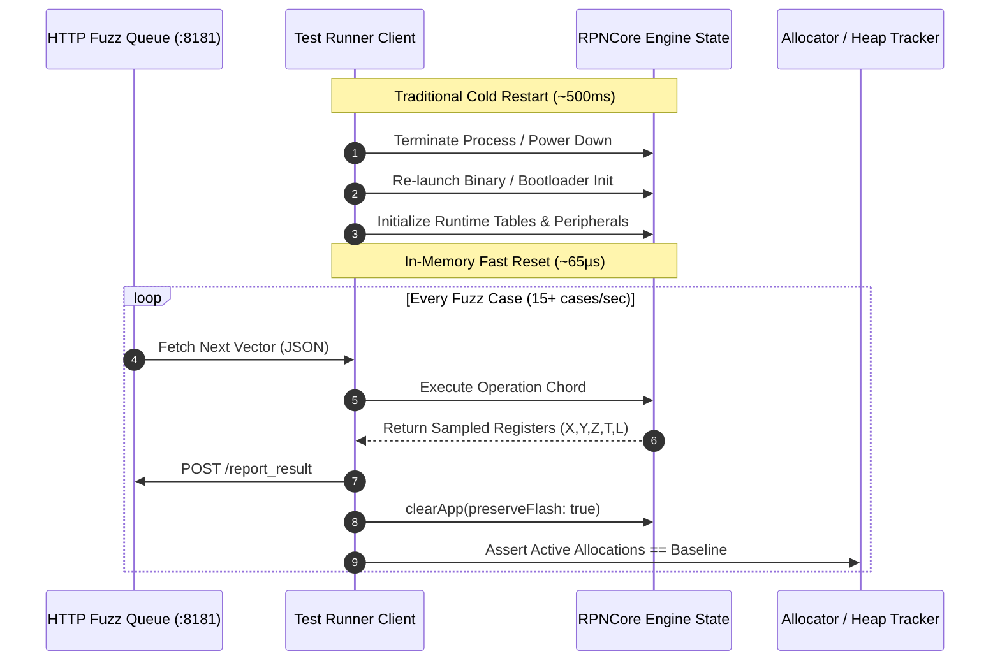

Here is the brutal math of differential fuzzing: if resetting your target device requires a cold boot that takes 500 milliseconds, running a serious 100,000-vector fuzzing campaign takes nearly fourteen hours. That’s not continuous integration; that’s an overnight prayer meeting.

In Part 1, we established our differential oracle pipeline and golden path state invariants across six platforms. But when we sat down to run our first serious campaign, we slammed straight into a brick wall of execution throughput. 

At barely two test cases per second, our CI runners were timing out, our fans were screaming, and rapid local iteration was impossible. Coming from high-level software engineering, waiting fourteen hours for a test run felt completely unacceptable. To make cross-surface fuzzing a practical software superpower that runs during a coffee break, we had to re-architect our engine around an ultra-fast, zero-leak in-memory reset routine that executes in microseconds. Pairing with AI coding agents, we methodically mapped and audited every struct and volatile register in `RPNCore` to guarantee complete state purging without rebooting the microcontroller.

<!-- more -->

## The Cold Boot Bottleneck vs In-Memory Reset

Rebooting the runtime guarantees a sterile state, but 98% of the CPU cycles are wasted re-initializing standard library runtimes, setting up memory allocators, and re-mapping peripheral registers. In contrast, an in-memory reset restores all calculator state variables back to pristine initial values within microseconds, enabling execution rates exceeding 15 test cases per second on physical microcontrollers and over 200 cases per second in native desktop test harnesses.



## Anatomy of the `clearApp()` State Purge

Resetting an RPN engine in memory is far more nuanced than zeroing the 4-level stack. A scientific calculator maintains intricate peripheral state: shift latches, active prompt entry buffers, statistical accumulation matrices, and annunciator display flags. If any transient flag leaks across test boundaries, subsequent calculations suffer phantom state corruption.

The in-memory reset must partition volatile calculation state from persistent device configuration:

| Subsystem State | Volatile (Purged on Reset) | Persistent (Preserved) | Failure Mode if Leaked |
|---|---|---|---|
| **Stack Registers** | $X, Y, Z, T$ and $LASTx$ set to $0.0$ | None | Phantom values lifted into calculation |
| **Statistical Sums** | $\Sigma x, \Sigma y, \Sigma x^2, \Sigma y^2, \Sigma xy, n$ | None | Linear regression skew |
| **Transient Latches** | Gold Shift, Blue Shift, Lift-Disable | Display Contrast, Sleep Timeout | Unexpected shifted key mappings |
| **Entry Buffer** | Mantissa string, exponent sign, decimal point | Angle Mode (Deg/Rad/Grad default) | Merged digits across test cases |
| **Program Storage** | Program counter, subroutine call stack | Flash NVRAM Calibration Data | Crash on return from phantom subroutine |

## Implementation in RPNCore

Below is the authentic reset routine implemented in the StackCalc core engine:

```swift
public extension CalculatorEngine {
    /// Resets all calculation state to baseline factory conditions without
    /// incurring process restart or hardware re-initialization penalties.
    mutating func clearApp(preserveCalibration: Bool = true) {
        // 1. Reset primary 4-level RPN stack and LASTx
        self.stack.x = 0.0
        self.stack.y = 0.0
        self.stack.z = 0.0
        self.stack.t = 0.0
        self.lastX = 0.0
        
        // 2. Clear statistical summation registers
        self.statistics.reset()
        
        // 3. Clear transient input buffers and entry flags
        self.inputBuffer.removeAll(keepingCapacity: true)
        self.isEnteringNumber = false
        self.stackLiftDisabled = false
        
        // 4. Reset operational shift modifiers and prompts
        self.activeShift = .none
        self.currentPrompt = nil
        self.activeMenu = nil
        
        // 5. Reset display formatting to default fixed-4 mode
        self.displayMode = .fix(digits: 4)
        
        // 6. Reset program execution pointers
        self.programCounter = 0
        self.callStack.removeAll(keepingCapacity: true)
        
        // Calibration parameters (e.g. LCD VCOM contrast) are preserved
        if !preserveCalibration {
            self.systemSettings = SystemSettings.factoryDefaults()
        }
    }
}
```

## Guarding Against Cumulative Heap Leaks

The danger of continuous in-memory execution is heap creep: tiny memory allocations (such as string formatting buffers or retained closures) accumulating over millions of cycles, eventually exhausting the RP2350's limited 264 KB SRAM.

To verify absolute heap stability, our firmware fuzz runner hooks directly into `pico_malloc` instrumentation via `PICO_DEBUG_MALLOC=1`. After every 1,000 in-memory reset cycles, the test runner queries the runtime's heap watermark. If total allocated bytes fail to return precisely to the post-boot baseline, the campaign halts immediately, dumping the offending sequence for regression triage. This rigorous balance of speed and isolation turned our fuzzer into an indispensable gatekeeper in continuous integration.

## Conclusion: Rules for High-Speed Fuzzing Runtimes

Turning a 14-hour overnight crawl into a snappy 10-minute CI run taught us three critical lessons for high-throughput testing:

- **Bypass the OS lifecycle whenever possible**: Process creation and dynamic linker setup dominate test execution time. Purging state in-memory shrinks turnaround times by three orders of magnitude.
- **Isolate volatile state from calibration**: Always explicitly define which variables belong to the user's active calculation and which belong to hardware trimming (like LCD contrast). Leaking a shift latch ruins your tests; wiping calibration ruins your display.
- **Audit memory watermarks continuously**: Fast in-memory resets can mask slow memory leaks. Check total allocated heap bytes every thousand iterations to guarantee true zero-leak stability. When building an open tool meant to inspire students, having the test suite execute at the speed of software gives you the freedom to innovate relentlessly.

