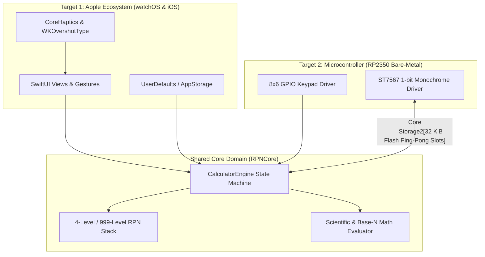

Coming from an iOS and Apple Watch development background, our natural instinct when designing StackCalc32 was to build in SwiftUI. But as passionate calculator lovers who have always revered classic scientific instruments like the HP-32SII, we hold a deep conviction that it is an absolute injustice that more students and engineers do not use RPN calculators today. The four-level operational stack is simply a better, more transparent way to calculate. We didn't want RPN confined to glass screens; we wanted an accessible, low-cost physical handheld calculator that anyone could build. And rather than writing C for the hardware and Swift for the watch, we set out to run the exact same Swift core across an Apple Watch and a \$4 bare-metal Raspberry Pi RP2350 microcontroller.

<!-- more -->

## The Vision: A Single Source of RPN Truth

Classic scientific calculators are defined by dozens of subtle, idiosyncratic behaviors: stack lift enablement on digit entry, stack drop on binary arithmetic, automatic X-register duplication on `ENTER`, base-N conversion truncation, and error state recovery. Re-implementing these delicate rules in two different languages meant that whenever we patched an edge-case bug in complex fraction simplification on watchOS, the hardware calculator would immediately drift out of sync.

We refused to maintain two divergent math engines. Instead, we architected StackCalc32 around a single, shared Swift package: `RPNCore`. The core calculation engine knows nothing about touchscreens, liquid crystal displays, operating systems, or GPIO registers.



## Architectural Decoupling in `CalculatorEngine`

To allow compilation inside Apple's rich Darwin runtime as well as the constrained ARMv6-M Embedded Swift environment, `CalculatorEngine` operates as a pure finite state machine. It accepts strongly-typed enumeration events and mutates internal state without side effects:

```swift
// Pure state machine boundary in RPNCore
public struct CalculatorEngine {
    public private(set) var stack: RPNStack
    public private(set) var registers: [Double]
    public private(set) var currentMode: DisplayMode
    public private(set) var annunciators: AnnunciatorFlags
    
    public mutating func handle(operation: CalculatorOperation) {
        switch operation {
        case .add:
            performAddition()
        case .digit(let d):
            appendDigit(d)
        case .enter:
            pushStack()
        case .clear:
            clearCurrentInput()
        // ... Additional operations handled deterministically
        }
    }
}
```

The engine has zero dependencies on `SwiftUI.View`, `Combine.ObservableObject`, or hardware registers. It consumes no background threads and creates no asynchronous tasks. It is an immutable-friendly reducer that takes an event, mutates its registers, and yields an updated state.

## Input and Display Abstraction Boundaries

While the core math logic remains identical, the physical interaction models diverge fundamentally:

| Dimension | Apple Platforms (watchOS / iOS) | Microcontroller Firmware (RP2350) |
| :--- | :--- | :--- |
| **Language & Profile** | Standard Swift 6 with ARC & Foundation | Embedded Swift (`-enable-experimental-feature Embedded`) |
| **Input Capture** | SwiftUI `Button`, `DragGesture`, Digital Crown | 8x6 GPIO matrix scanning with 10 ms debouncer |
| **Display Pipeline** | SwiftUI declarative views @ 60–120 Hz | 132x72 monochrome buffer over 8 MHz SPI |
| **State Persistence** | `UserDefaults` / `@AppStorage` (JSON) | 32 KiB raw QSPI flash sectors with FNV-1a checksums |
| **Memory Budget** | Gigabytes of unified RAM | 264 KiB SRAM total (220 KiB heap reserve) |
| **Concurrency** | Swift Concurrency (`async`/`await`, Actors) | Single-threaded polling event loop in `Main.swift` |

On the Apple Watch, key events originate from touch callbacks and Digital Crown rotations, prompting SwiftUI view redraws. On the physical calculator, the firmware polling loop scans 48 physical switch junctions, dispatches matching `CalculatorOperation` enums to `CalculatorEngine`, and directly formats pixels into a 1,188-byte framebuffer.

In Part 2, we dive into how event loop synchronization and display throttling maintain bit-for-bit parity across both platforms.

## Conclusion: The Shared State Machine Dividend

Decoupling our RPN engine into a pure Swift state machine felt like extra work during week one, but it paid astronomical dividends throughout the rest of the project. Whenever we found a subtle rounding error in trigonometric conversions or a stack-lift quirk during complex number entry, fixing it once in `RPNCore` automatically resolved it on both the Apple Watch app and the physical handheld calculator on our desk. Bringing pure functional state machines from modern app development to bare-metal hardware proved that good software architecture transcends physical boundaries.
