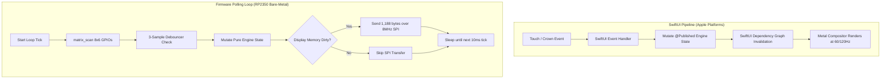

Bridging high-level reactive UI frameworks with bare-metal embedded event loops is a study in contrasting software philosophies. In modern Apple app development, we never write event loops: SwiftUI is a declarative engine that refreshes automatically on top of a 120 Hz Metal compositor, driven by RunLoops and Grand Central Dispatch. On the RP2350, however, we were building on bare metal to create an accessible, low-cost physical RPN calculator—driven by our belief that it is an injustice that more students and engineers do not use RPN. And on bare silicon, there is no compositor, no OS event queue, and no thread scheduler: you have to construct the event loop yourself as an explicit `while(true)` loop executing at 100 Hz.

<!-- more -->

## Declarative Reactivity vs Imperative Polling

On Apple platforms, state changes flow through reactive bindings: when `CalculatorEngine` evaluates an operation, `@Published` state variables notify SwiftUI's rendering pipeline. The operating system handles display compositing, animation curves, and 120 Hz ProMotion refresh timing asynchronously.

On the RP2350 microcontroller, there is no compositor, no graphics framework, and no operating system thread manager. The CPU executes an explicit, deterministic polling loop in `Main.swift`, shown below comparing the two architectures:



## The Bare-Metal Polling Loop in `Main.swift`

The microcontroller firmware loop coordinates matrix sampling, state mutation, and display rendering at a disciplined 100 Hz cadence ($10\text{ ms}$ period):

```swift
// Event loop architecture in Main.swift
while true {
    let loopStart = firmware_profile_loop_begin_c()
    
    // 1. Scan physical keypad contacts
    let matrixState = sleeping ? matrix_scan_wake_key() : matrix_scan()
    
    // 2. Process debouncing and state changes
    if matrixState != lastMatrixState {
        debounceCounter += 1
        if debounceCounter > 2 {
            processCommittedKey(matrixState)
            committedMatrixState = matrixState
            lastMatrixState = matrixState
            debounceCounter = 0
            screenDirty = true
        }
    }
    
    // 3. Render and throttle display transfers
    if screenDirty && !sleeping {
        renderDisplayBuffer()
        display_send_buffer(displayBufferPointer)
        firmware_profile_render_c(true)
        screenDirty = false
    } else {
        firmware_profile_render_c(false)
    }
    
    // 4. Record profile metrics and sleep remaining tick duration
    firmware_profile_loop_end_c(loopStart, sleeping)
    sleep_ms_c(10)
}
```

## Display Throttling: Skipping Unchanged Frames

Clocking a 1,188-byte framebuffer out to the ST7567 display controller over an 8 MHz SPI bus consumes approximately $1.18\text{ ms}$ of transmission time. Executing this transfer on every single 10 ms loop tick would burn more than 11% of our total CPU bandwidth and unnecessarily drain battery current.

The firmware tracks a `screenDirty` flag. If the calculator state, stack registers, and annunciator flags remain unchanged, the SPI transfer is bypassed:

```c
// Profiling hook in hardware_wrapper.c
void firmware_profile_render_c(bool transferred) {
#if WATCHCALC_PROFILE_ENABLED
    firmware_profile_render_count++;
    if (!transferred) {
        firmware_profile_display_skip_count++;
    }
#else
    (void)transferred;
#endif
}
```

During typical usage, skipping idle frames yields a **95% reduction** in SPI bus activity, allowing the RP2350 to stay in low-power idle states between keystrokes.

## Bit-for-Bit Behavioral Parity

To ensure that a calculation performed on the Apple Watch yields the exact same result on the physical handheld hardware, both surfaces pass the same automated conformance suite:

| Functional Behavior | SwiftUI Implementation | Microcontroller Firmware | Parity Verification |
| :--- | :--- | :--- | :--- |
| **Stack Lift Semantics** | Evaluated in `RPNCore` | Evaluated in `RPNCore` | Identical stack lift on numerical input |
| **Annunciators** | Dynamic SwiftUI SF Symbols | 1-bit custom bitmap glyphs | Identical `RAD`, `DEG`, `SHIFT`, `PRGM` |
| **Error Signaling** | Text display "INVALID DATA" | LCD bitmap "INVALID DATA" | Triggered on division by zero or NaN |
| **Numeric Precision** | IEEE-754 64-bit `Double` | IEEE-754 64-bit `Double` | AAPCS soft-float verified bitwise |
| **State Persistence** | Written to `@AppStorage` | Written to 32 KiB flash slot | Dual ping-pong recovery validated |

By isolating the mathematical engine within `RPNCore` and standardizing the event loop contracts, StackCalc32 delivers uncompromised RPN accuracy across consumer smartwatches and custom bare-metal hardware.

## Conclusion: Bridging Reactive and Bare-Metal Paradigms

Synchronizing declarative UI frameworks with tight bare-metal event loops taught our software team how to respect the physics of each medium. You cannot force a microcontroller to run an asynchronous reactive layout engine, and you cannot force a smartwatch to poll raw GPIO bits at 100 Hz. But by standardizing on an immutable state transition contract and keeping our RPN calculation core free of side effects, we achieved zero-drift mathematical parity without compromising execution speed or battery efficiency on either platform. It proves that clean software architecture can bridge high-end consumer wearables with low-cost hardware meant to democratize RPN calculators.
