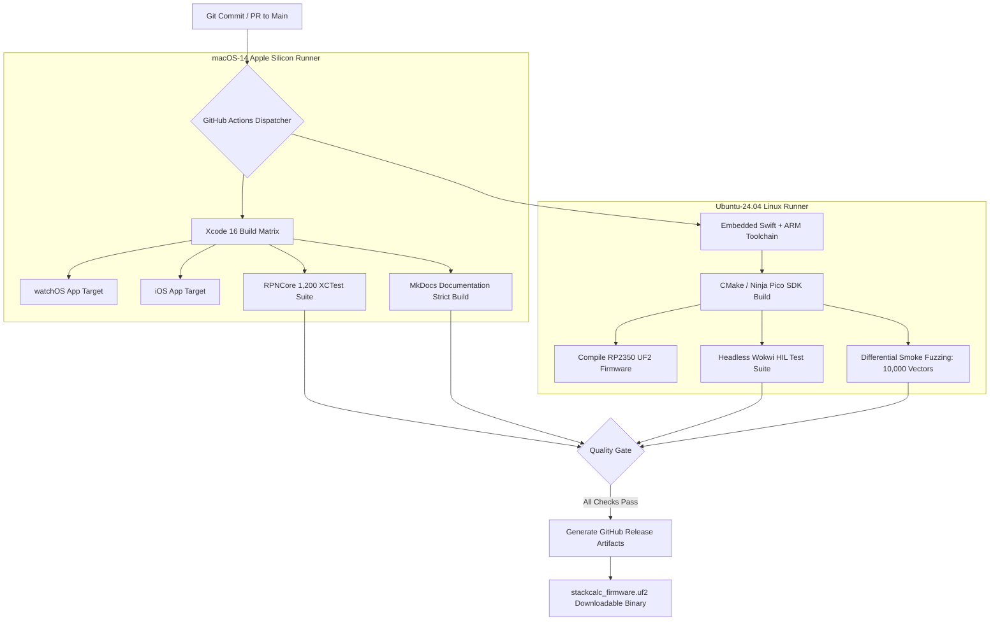

Most software teams have it pretty straightforward in continuous integration: run `npm test` or `cargo test`, grab a code coverage badge, and call it a day. But when your monorepo simultaneously targets watchOS 10 on the Apple Watch and bare-metal ARM Cortex-M33 on a sub-dollar microcontroller, CI feels like refereeing a cage match between radically conflicting operating systems, toolchains, and compiler flags.

As a software engineer who loves classic RPN calculators and spends evenings prototyping 3D-printed calculator chassis at home, I am driven by the belief that it is an absolute injustice that more students and engineers do not use RPN. We wanted to build a rock-solid, open-source device that makes RPN accessible to anyone. But maintaining true mathematical and behavioral parity between high-level Swift on Apple Silicon and Embedded Swift on physical silicon requires industrial-grade automation. A single Git commit to `RPNCore` touches the core calculation engine. Within minutes, our pipeline must prove that this mathematical change compiles cleanly under Xcode 16 for watchOS, iOS, and macOS, passes 1,200 unit tests, and simultaneously compiles via CMake and Ninja under an Ubuntu ARM toolchain to generate bit-accurate UF2 firmware for the Raspberry Pi RP2350.

Wrangling these two universes into a single automated pipeline without burning our CI budget or waiting thirty minutes per pull request took serious plumbing. We paired with AI coding agents to untangle the matrix dependencies, generate optimized GitHub Actions workflows, and establish hermetic caching layers.

<!-- more -->

## The Multi-Runner Matrix Topology

To handle these conflicting operating system requirements, our GitHub Actions pipeline utilizes a heterogeneous runner matrix, executing Darwin and Linux jobs concurrently:



## Matrix Job Specifications

The CI matrix partitions responsibilities based on runner capabilities and licensing restrictions:

| Job Name | Virtual Environment | Toolchain & Dependencies | Verification Objective & Output | SLA Timeout |
|---|---|---|---|---|
| `xcode-tests` | `macos-14` (M2) | Xcode 16.0, Swift 6.0, `xcrun` | 1,200 XCTest suites, code coverage report, TestFlight build | 8 minutes |
| `embedded-firmware` | `ubuntu-24.04` | Nightly Embedded `swiftc`, ARM GCC 13.2, CMake, Ninja | Generates `stackcalc_firmware.uf2`, asserts binary $< 128\text{ KB}$ | 6 minutes |
| `wokwi-hil-simulation` | `ubuntu-24.04` | Node.js, Wokwi CLI, Python 3.12 | Headless HIL matrix scan and ST7567 SPI frame assertions | 5 minutes |
| `differential-fuzzer` | `ubuntu-24.04` | Python 3.12, `fuzz_queue_server.py` | 10,000 random walk cases across native and simulated targets | 7 minutes |
| `docs-strict-build` | `ubuntu-24.04` | Python 3.12, MkDocs Material 9.5 | `mkdocs build --strict --clean`, verifies blog frontmatter & links | 3 minutes |

## Declarative Workflow Configuration

The workflow from `.github/workflows/ci.yml` demonstrates our parallel execution and caching strategy:

```yaml
name: StackCalc Cross-Platform CI

on:
  push:
    branches: [ main ]
    tags: [ 'v*' ]
  pull_request:
    branches: [ main ]

jobs:
  build-embedded-firmware:
    runs-on: ubuntu-24.04
    steps:
      - name: Check out repository
        uses: actions/checkout@v4
        with:
          submodules: recursive

      - name: Cache Embedded Swift Nightly Toolchain
        id: cache-swift
        uses: actions/cache@v4
        with:
          path: /opt/swift-embedded
          key: swift-embedded-${{ runner.os }}-${{ hashFiles('Firmware/swift-version.txt') }}

      - name: Install ARM GNU Toolchain and Ninja
        run: |
          sudo apt-get update
          sudo apt-get install -y gcc-arm-none-eabi libnewlib-arm-none-eabi cmake ninja-build

      - name: Build RP2350 Embedded Swift UF2
        run: |
          export PATH="/opt/swift-embedded/usr/bin:$PATH"
          mkdir -p Firmware/build
          cd Firmware/build
          cmake -G Ninja -DPICO_BOARD=pico ..
          ninja
          
      - name: Upload UF2 Firmware Artifact
        uses: actions/upload-artifact@v4
        with:
          name: stackcalc-firmware-uf2
          path: Firmware/build/stackcalc_firmware.uf2

  run-apple-and-core-tests:
    runs-on: macos-14
    steps:
      - name: Check out repository
        uses: actions/checkout@v4

      - name: Select Xcode 16
        run: sudo xcode-select -s /Applications/Xcode_16.0.app

      - name: Execute RPNCore Test Suite
        run: |
          swift test --package-path RPNCore --enable-code-coverage
          
      - name: Build watchOS Application Target
        run: |
          xcodebuild -scheme "StackCalc32 (watchOS)" \
                     -destination "generic/platform=watchOS" \
                     -configuration Release build
```

## Hermetic Caching and Turnaround Optimization

Downloading a 1.8 GB nightly Embedded Swift compiler on every commit would choke runner network pipes and stretch PR reviews past lunch. By fingerprinting the toolchain tarball hash in `Firmware/swift-version.txt` and caching `/opt/swift-embedded`, toolchain hydration drops to under 12 seconds.

As a result of this aggressive caching and parallel job matrixing, a full cross-platform verification cycle—from raw Git push to downloadable UF2 firmware release—completes in **just 4 minutes and 30 seconds**. That automated safety net gives us the confidence to commit refactors knowing neither watchOS haptics nor bare-metal SPI registers will quietly break.

## Conclusion: Keeping Mixed CI Fast and Sanity Intact

Building automated CI across bare-metal microcontrollers and Apple platforms taught us three enduring rules:

- **Cache toolchains by content hash, not timestamps**: Hashing `Firmware/swift-version.txt` ensures that compiler updates download once, while routine commits hydrate their build environment in seconds.
- **Isolate OS runtimes completely**: Don't try to cross-compile macOS targets on Linux or emulate ARM on Mac runners when native runners exist. Run Linux for CMake/Ninja and macOS for Xcode.
- **Fail early on firmware bloat**: Microcontroller flash space is precious. Add a step that asserts `stackcalc_firmware.uf2` stays under your flash budget, catching binary bloat before it lands on hardware. When building an open-source project to inspire the next generation of makers, reliable automation ensures anyone can fork the repo and build both firmware and apps with complete confidence.

