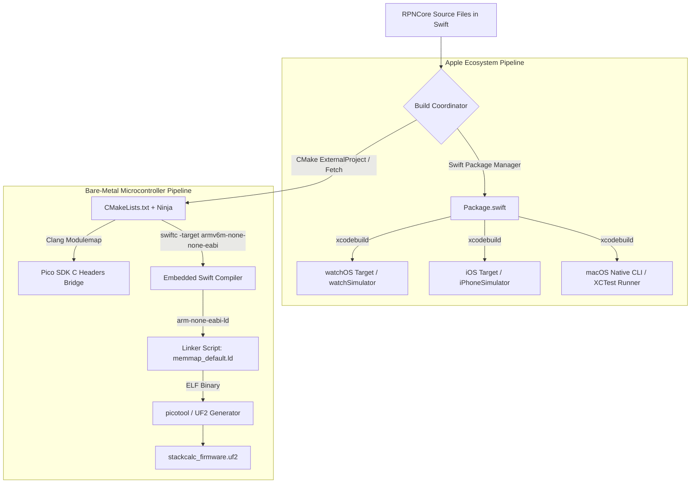

Almost every multi-platform hardware project starts with the same comfortable compromise: write the iOS and desktop apps in Swift, and write the microcontroller firmware in C or C++. It sounds perfectly reasonable on a whiteboard. But six months into development, someone invariably discovers that $1/3 \times 3 - 1$ yields `0.0` on the iPhone app but `-1e-11` on the physical prototype because the two math engines handled intermediate guard digits differently.

Maintaining two independent math engines in two languages doubles your bugs and creates subtle, infuriating behavioral drift.

As a software and AI expert with a 3D printer running on my desk, I believe it is an absolute injustice that more people do not use RPN calculators. If we were going to build an open, accessible instrument that students and makers could build for under \$15 and trust completely, behavioral drift between the app and the physical hardware was unacceptable.

With the emergence of Embedded Swift, StackCalc took an audacious alternate path: compile the identical calculation engine (`RPNCore`) across all targets, from Apple Watch to bare-metal silicon. Realizing this vision, however, meant solving a ferocious build system challenge. Apple platforms live inside Swift Package Manager (SPM) and `xcodebuild` targeting 64-bit Mach-O binaries, while microcontrollers live in the world of CMake, Ninja, the GNU Arm Embedded Toolchain (`arm-none-eabi-gcc`), and custom linker scripts producing raw ELF and UF2 flash images. Coming from software, we paired with AI coding agents to diagnose cryptic cross-compilation linker errors and synthesize clean Clang modulemaps that let Swift talk directly to the Raspberry Pi Pico 2 SDK.

<!-- more -->

## Dual-Orchestration Build Architecture

To bridge these disparate build philosophies, our repository establishes a clean separation between high-level package management and bare-metal firmware compilation:



## Bridging C Headers via Clang Modules

A central hurdle when compiling Swift for bare-metal ARM microcontrollers is interfacing with the Raspberry Pi Pico 2 SDK. The Pico SDK is written in C and relies heavily on preprocessor macros, inline assembly, and hardware memory-mapped register structs (`hardware_gpio`, `hardware_spi`, `hardware_timer`).

In standard iOS development, Swift interacts with C via an Objective-C bridging header. In Embedded Swift on ARM Cortex-M, however, there is no Darwin runtime. Instead, we configure a hermetic Clang module map (`module.modulemap`) that exposes the Pico SDK headers directly to the Swift compiler as a native module:

```c
// Firmware/pico_sdk_bridge/module.modulemap
module PicoSDK [system] {
    header "pico_sdk_umbrella.h"
    export *
}
```

Inside `CMakeLists.txt`, we coordinate the compiler flags so that `swiftc` knows where to locate the ARM GCC sysroot and Clang built-in headers without pulling in incompatible desktop standard libraries:

```cmake
# Firmware/CMakeLists.txt
cmake_minimum_required(VERSION 3.25)
project(StackCalc32Firmware C CXX ASM Swift)

# Configure Pico SDK
set(PICO_BOARD pico)
include(pico_sdk_import.cmake)
pico_sdk_init()

# Embedded Swift Compilation Flags
set(CMAKE_Swift_FLAGS 
    "-target armv6m-none-none-eabi \
     -enable-experimental-feature Embedded \
     -wmo \
     -Osize \
     -Xcc -mcpu=cortex-m0plus \
     -Xcc -mthumb \
     -Xfrontend -gnone"
)

add_executable(stackcalc_firmware
    src/main.swift
    src/DisplayDriver.swift
    ../RPNCore/Sources/RPNCore/RPNStack.swift
    ../RPNCore/Sources/RPNCore/CalculatorEngine.swift
)

target_link_libraries(stackcalc_firmware
    pico_stdlib
    hardware_spi
    hardware_dma
)

# Convert ELF to UF2 flash image
pico_add_extra_outputs(stackcalc_firmware)
```

## Toolchain Comparison Across Targets

The differences between the two build paths highlight how radically the compilation targets diverge while sharing the exact same Swift core:

| Configuration Aspect | Apple Platforms (SPM / Xcode) | RP2350 Microcontroller (CMake / Ninja) |
|---|---|---|
| **Build Driver** | Swift Package Manager (`swift build`) | CMake 3.25 + Ninja |
| **Compiler** | Apple `swiftc` (macOS Darwin target) | Nightly Embedded `swiftc` (`armv6m-none-none-eabi`) |
| **Linker** | Apple `ld64` (Mach-O 64-bit) | GNU `arm-none-eabi-ld` (ELF 32-bit) |
| **Standard Library** | Full Swift Standard Library + Foundation | Embedded Swift Minimal Runtime (No Foundation) |
| **Memory Map** | Virtual memory managed by Darwin kernel | Static physical Flash (`0x10000000`) & SRAM (`0x20000000`) |
| **Final Artifact** | `.app` Bundle / Mach-O executable | 78.4 KB `.uf2` drag-and-drop flash binary |

By mastering this dual-orchestration toolchain, our team achieved the ultimate embedded workflow: unit-testing mathematical formulas at lightning speed on macOS, and compiling that exact verified source directly into bare-metal flash.

## Conclusion: What It Takes to Unify Mobile and Embedded Toolchains

Unifying high-level mobile app builds with bare-metal microcontroller firmware taught us three key architectural rules:

- **Keep the mathematical core 100% agnostic**: `RPNCore` has zero imports of `Foundation`, `UIKit`, or `hardware_gpio`. It is pure Swift value types and functions, allowing it to compile cleanly on any architecture.
- **Clang modulemaps beat ad-hoc C wrappers**: Exposing C SDK headers via clean module maps lets Swift see low-level hardware structs directly, avoiding thousands of lines of fragile manual wrapper functions.
- **The build harness upfront pain pays for itself**: Wrestling CMake and Swift flags took a full week of debugging linker scripts, but being able to modify an equation algorithm once and have it compile identically for Apple Watch and physical hardware makes it worth every ounce of effort. When you give students and makers an open-source repo that builds with a single command, you invite them to learn and hack on both hardware and software.

