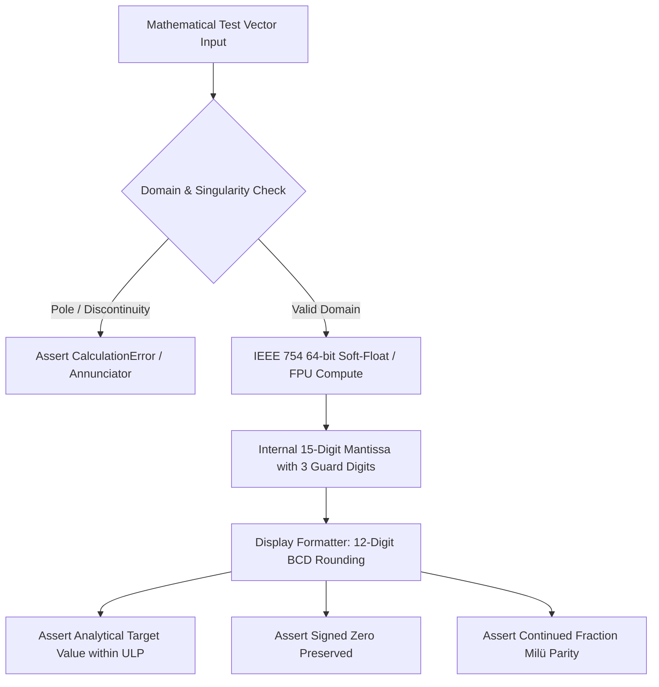

Try this experiment on your favorite smartphone calculator: enter $\tan(\pi/2)$ and see whether the app silently vomits a giant number like $1.6331239 \times 10^{16}$ instead of throwing a math error. Or switch into complex mode, calculate $\sqrt{-4}$, and check the sign of the imaginary zero.

Most consumer calculator applications treat mathematics as casual arithmetic. If an equation drifts by a micro-epsilon or an asymptotic pole gets rounded to a huge float, consumer apps shrug it off. 

As a software and AI expert with a desktop 3D printer running prototypes on my desk, I believe it is an absolute injustice that more students, engineers, and scientists do not use RPN calculators. Infix calculators hide state behind operator hierarchies and sloppy float approximations. When you are computing filter poles, resonance frequencies, or branch cuts in the complex plane, IEEE 754 signed zero semantics and multi-precision argument reductions aren't academic pedantry—they are the bedrock of sound engineering.

When designing StackCalc, our ambition was to create an accessible, open-source instrument that working mathematicians and students could trust without reservation. That meant building a test suite explicitly focused on numerical analysis pitfalls. We paired with AI coding agents to assemble pathological test suites, stress-testing catastrophic cancellation, trigonometric argument reduction across massive multiples of $\pi$, IEEE 754 signed zero branch cuts, and continuous fraction limits.

<!-- more -->

## The Precision Invariant Verification Pipeline

To ensure mathematical rigor, test vectors are verified through a multi-stage validation pipeline that separates raw IEEE 754 double-precision evaluation from formatted scientific display representation:



## Critical Mathematical Boundaries

Our mathematical test suite tests four core analytical frontiers:

### 1. Trigonometric Argument Reduction

Evaluating trigonometric functions for massive arguments (such as $\sin(10^{12})$) leads to catastrophic cancellation if naive modulo arithmetic ($\theta \pmod{2\pi}$) is applied using a standard 53-bit representation of $\pi$. Our test suite verifies argument reduction using extended 128-bit constants, asserting that periodicity invariants hold precisely:

$$\sin(x + 2\pi k) \equiv \sin(x), \quad \forall k \in [1, 10^9]$$

### 2. Complex Branch Cuts and Signed Zero Semantics

In complex analysis, multi-valued functions such as $\ln(z)$ and $\sqrt{z}$ possess branch cuts along the negative real axis $(-\infty, 0]$. Under IEEE 754 rules, $+0.0$ and $-0.0$ are distinct values. When evaluating numbers on the branch cut, preserving the imaginary sign is essential:

$$\lim_{\epsilon \to 0^+} \sqrt{-4.0 + i\epsilon} = 0.0 + 2.0i, \quad \lim_{\epsilon \to 0^+} \sqrt{-4.0 - i\epsilon} = 0.0 - 2.0i$$

### 3. Rational Continued Fractions and the Milü Constant

The StackCalc fraction engine decomposes decimal inputs into continued fractions. For $\pi \approx 3.1415926535$, the continued fraction representation is:

$$\pi = [3; 7, 15, 1, 292, 1, 1, 1, 2, \dots]$$

Truncating at the third convergent yields Zu Chongzhi's legendary Milü ratio $\frac{355}{113} \approx 3.14159292$, achieving accuracy within $2.67 \times 10^{-7}$ using a denominator well within our 4,095 hardware limit.

| Mathematical Test Case | Analytical Target | Raw IEEE 754 Double | 12-Digit Display Format |
|---|---|---|---|
| $\sin(\pi)$ (Exact Zero) | $0.0$ | $1.2246467991473532 \times 10^{-16}$ | `0.0000` |
| $\tan(\pi/2)$ (Pole Singularity) | $\pm \infty$ (Undefined) | `CalculationError.mathDomain` | `INVALID ARG` |
| $\sqrt{-4.0 + 0.0i}$ | $0.0 + 2.0i$ | Real: `+0.0`, Imag: `+2.0` | `0.0000 i 2.0000` |
| $\sqrt{-4.0 - 0.0i}$ | $0.0 - 2.0i$ | Real: `+0.0`, Imag: `-2.0` | `0.0000 i -2.0000` |
| Continued Fraction of $\pi$ | $\frac{355}{113}$ | $3.1415929203539825$ | `3 16/113` or `355/113` |
| $2.5! = \Gamma(3.5)$ | $\frac{15}{8}\sqrt{\pi}$ | $3.3233509704478426$ | `3.3234` |

## Authentic Test Suite Implementation

The snippet from `RPNCoreTests/ComplexBranchCutTests.swift` verifies that signed zero orientation is strictly preserved when traversing branch cuts:

```swift
import XCTest
@testable import RPNCore

final class MathematicianPrecisionTests: XCTestCase {
    var engine: CalculatorEngine!

    override func setUp() {
        super.setUp()
        engine = CalculatorEngine()
    }

    func testComplexSquareRootBranchCutPreservesSignedZero() throws {
        // Point on upper edge of branch cut: -4.0 + 0.0i
        let upperZ = ComplexNumber(real: -4.0, imag: +0.0)
        let upperResult = ComplexMath.sqrt(upperZ)
        
        XCTAssertEqual(upperResult.real.magnitude, 0.0, accuracy: 1e-15)
        XCTAssertEqual(upperResult.imag, 2.0, accuracy: 1e-15)
        XCTAssertFalse(upperResult.imag.isSignMinus, "Upper branch cut must yield +2.0i")

        // Point on lower edge of branch cut: -4.0 - 0.0i
        let lowerZ = ComplexNumber(real: -4.0, imag: -0.0)
        let lowerResult = ComplexMath.sqrt(lowerZ)
        
        XCTAssertEqual(lowerResult.real.magnitude, 0.0, accuracy: 1e-15)
        XCTAssertEqual(lowerResult.imag, -2.0, accuracy: 1e-15)
        XCTAssertTrue(lowerResult.imag.isSignMinus, "Lower branch cut must yield -2.0i")
    }

    func testMiluApproximationForPiFraction() throws {
        engine.setStack(x: Double.pi, y: 0.0, z: 0.0, t: 0.0)
        engine.setDisplayMode(.fraction(maxDenominator: 4095))
        
        let fraction = engine.currentDisplayFraction()
        XCTAssertEqual(fraction.numerator, 355)
        XCTAssertEqual(fraction.denominator, 113)
        XCTAssertLessThan(abs(fraction.decimalValue - Double.pi), 3e-7)
    }
}
```

By encoding high-level mathematical invariants directly into automated regression checks, StackCalc ensures that domain boundaries and physical precision limits remain flawless across every platform release.

## Conclusion: The Quiet Honor of Mathematical Precision

Crafting a test suite for working mathematicians taught our team to respect mathematical conventions that casual developers often ignore:

- **Signed zeros are not an academic quirk**: Distinguishing $+0.0$ from $-0.0$ preserves continuity across branch cuts in the complex plane, ensuring that circuit phase calculations don't suddenly flip 180 degrees.
- **Never sweep singularities under the rug**: When a function hits a vertical pole like $\tan(\pi/2)$, emitting a gigantic float is a silent failure. An honest instrument halts and displays `INVALID ARG`.
- **Verify identities, not just sample numbers**: Testing against mathematical truths like $\sin^2(x) + \cos^2(x) \equiv 1$ and continued fraction convergents provides enduring guarantees that outlast any single architecture. By pairing rigorous mathematical assertions with an accessible open design, we hope to inspire a new generation to appreciate the unyielding beauty of RPN math.

