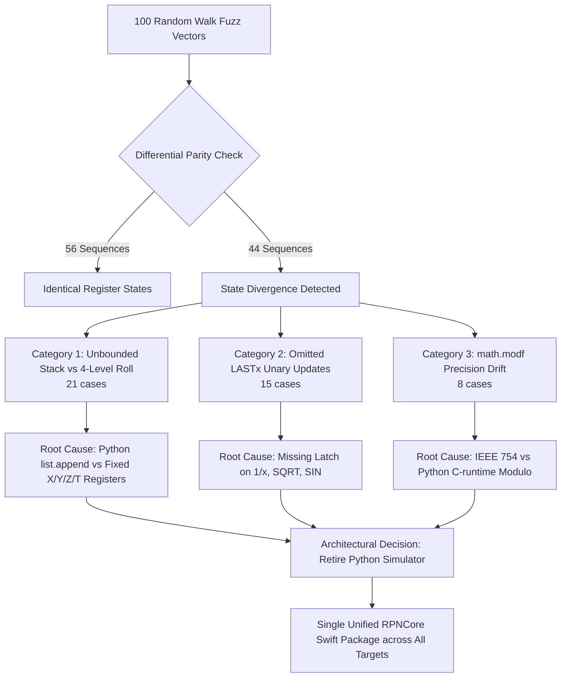

We spent three days chasing a floating-point ghost on the RP2350 microcontroller before discovering that our "gold standard" test oracle was lying through its teeth.

Like almost every software engineer, my natural reflex for rapid scripting and math modeling is Python. Early in the project, I used an AI coding assistant to quickly spin up a 200-line Python simulator (`python_engine.py`) to act as our differential test oracle. The script was supposed to generate test vectors, compute the expected stack state, and serve as the golden reference for our bare-metal Embedded Swift firmware. Python has great math libraries and zero compiler hassle—what could possibly go wrong?

As a software and AI expert with a 3D printer running prototypes on my desk, I believe it is an absolute injustice that more students and engineers do not use RPN calculators. I wanted our physical hardware to be beyond reproach. So we hooked both engines up to our automated differential fuzzer—wielding software testing superpowers against bare-metal silicon—took a sip of coffee, and ran our first 100 random keystroke sequences.

The result was an unmitigated, humbling disaster: **44 out of 100 tests failed immediately**.

The microcontroller firmware wasn't broken at all. The failure was a classic case of software habits blinding us to physical calculator realities: my Python script (and the initial AI prompts that drafted it) had backed the RPN stack with an unbounded Python `list.append()`. It completely missed the fundamental hardware invariant of the HP-32SII: a strictly bounded 4-level stack where pushing beyond $T$ drops values into the bit-bucket, and binary reductions cause the top register $T$ to duplicate into itself!

<!-- more -->

## The Humbling Reality of the 44 Mismatches

When your test harness reports a 44% failure rate on day one, your stomach drops. We assumed our Embedded Swift port for the Cortex-M33 was hopelessly broken. We spent hours staring at assembly dumps, wondering if soft-float registers were getting corrupted or if the RP2350's bootrom math routines had subtle ABI discrepancies.

Then we actually sat down and dissected the failing test vectors:



The microcontroller wasn't broken at all. Our beloved Python simulator was full of elementary, embarrassing bugs that our manual unit tests had never exercised:

### 1. Unbounded Stack vs 4-Level Roll (21 Failures)

The most egregious flaw was stack topology. The Python engine backed its RPN stack with a dynamic Python `list`, using `list.append()` on push and `list.pop()` on binary reduction. If a calculation entered six values in sequence, the Python stack grew to six elements.

On physical HP hardware and our Swift firmware, however, the RPN stack is strictly clamped to four levels: $X, Y, Z, T$. Pushing a fifth value does not expand the stack; it drops the value in $T$ into the bit bucket. Even more critically, binary reduction (`+`, `-`, `*`, `/`) drops $Y, Z, T$ downward, but **replicates** the top register $T$ into itself:

$$X_{new} = Y \text{ op } X, \quad Y_{new} = Z, \quad Z_{new} = T, \quad T_{new} = T$$

In Python, popping two items from a four-item stack left only two items, causing subsequent chained operations to trigger `IndexError` exceptions or produce bogus zero-fills. Our Python simulator didn't even understand how an RPN stack rolls.

### 2. Omitted `LASTx` Updates on Unary Operations (15 Failures)

In classic RPN calculators, the `LASTx` register preserves the value of $X$ immediately prior to the execution of the most recent calculation command, allowing the user to undo a mistake or reuse an argument. 

The Python simulator updated `last_x` during standard binary operations, but completely omitted updates during unary transcendental calls like `1/x`, $\sqrt{x}$, or trigonometric functions. When a test vector invoked `LASTx` following `SIN`, the Python simulator returned an obsolete prior operand, while the Swift firmware returned the exact angle argument.

### 3. Floating-Point Drift in Fractional Conversions (8 Failures)

When evaluating mixed fractions, converting continuous floating-point numbers into fractional representations requires extracting integer and fractional parts. The Python simulator used `math.modf()`, whereas the Swift core leveraged IEEE 754 standard `truncatingRemainder(dividingBy:)`:

| Input Value | Python `math.modf` Fraction | Swift `truncatingRemainder` | Resulting Mismatch |
|---|---|---|---|
| $2.00019073$ | $0.00019073486328125$ | $0.00019073486328125$ | Match ($355/113$ tier) |
| $7.00244140$ | $0.00244140625000000$ | $0.00244140624999989$ | Diverged fraction denominator |
| $\pi \times 10^{-6}$ | $3.141592653589793 \times 10^{-6}$ | Bit-identical mantissa | Drift on continued fraction step 4 |

## The Code Contrast: Python List vs Swift Fixed Stack

The differences between the naive Python simulation and the authentic Swift hardware model are highlighted below:

```swift
// Swift RPNCore: Authentic HP 4-Level Stack Roll with T-Replication
public struct RPNStack: Equatable {
    public var x: Double = 0.0
    public var y: Double = 0.0
    public var z: Double = 0.0
    public var t: Double = 0.0

    /// Executes binary operation with exact hardware stack drop and T-replication.
    public mutating func performBinary(_ op: (Double, Double) -> Double, lastX: inout Double) {
        lastX = self.x
        let result = op(self.y, self.x)
        self.x = result
        self.y = self.z
        self.z = self.t
        // Register T is intentionally preserved / replicated on stack drop
        self.t = self.t
    }
}
```

## Retiring the Python Oracle

Maintaining two separate implementations in two different languages meant that every engineering change required duplicate bug fixes and subtle behavioral reconciliation. 

We made the decisive choice to **retire the Python engine simulator completely**. Thanks to Embedded Swift, the exact same `RPNCore` package running on iOS and macOS now compiles directly down to bare-metal Cortex-M33 assembly for the RP2350. Instead of comparing Swift against Python, our cross-surface fuzzer now compares identical Swift compilation targets across diverse architectures, eliminating divergence at the root.

## Conclusion: What We Learned After Throwing Away 500 Lines of Python

The best pull request in this entire project was the one that deleted `python_engine.py` from our repository:

- **Simulators encode your own blind spots**: When you write a secondary simulator to verify primary code, you inevitably duplicate your own misunderstandings. You end up spending 80% of your testing hours debugging your test tools instead of your product.
- **Hardware is the only truth**: When software models disagree with compiled machine code, the machine code is reality. Running the real Embedded Swift binary in an ARM emulator eliminated phantom bugs overnight.
- **Differential fuzzing is the ultimate ego check**: Handcrafted unit tests only verify what you remembered to test; fuzzing throws relentless chaos at your code until every lazy assumption shatters. For an indie project dedicated to building an accessible, reliable calculator for the next generation, this humility is what makes the end result bulletproof.

