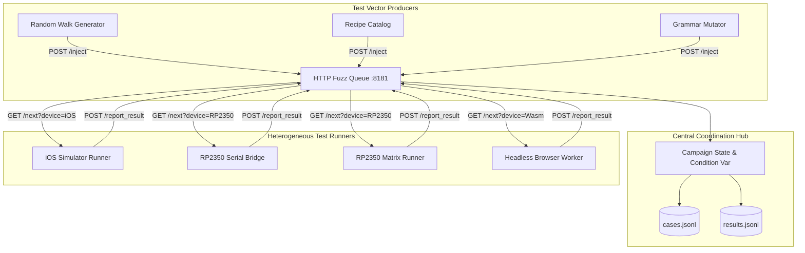

As software engineers, our immediate instinct when told to coordinate differential fuzzing across seven disparate platforms—from an Apple Watch simulator to a physical microcontroller hooked up via USB—is often to reach for Kubernetes, RabbitMQ, and gRPC. I almost fell into that trap myself.

But in a maker environment where my desktop 3D printer is humming in the corner, prototype boards are wired up on the desk, and an Apple Silicon laptop generates test vectors a thousand times faster than a Cortex-M33 can execute them, heavyweight distributed frameworks are a recipe for endless yak shaving. I don't need a cloud cluster; I need lightweight software superpowers applied to physical hardware. As an RPN calculator enthusiast, I believe it is an absolute injustice that more students and engineers do not use RPN calculators. To make StackCalc an open, accessible, low-cost instrument that everyone can trust, the testing infrastructure had to be rock-solid and friction-free.

Instead of orchestrating complex brokers, we built a dead-simple HTTP test oracle and dispatch queue server (`Tools/Fuzzing/fuzz_queue_server.py`) in under 200 lines of standard library Python. Operating on port 8181, this service acts as the resilient synchronization hub for our entire cross-surface testing fleet, dispatching identical input vectors and collecting telemetry for offline regression analysis.

<!-- more -->

## Queue Server Topology

The architecture decouples test case generation from execution. Generator scripts—ranging from pure random walk generators to AI-guided grammar synthesizers—inject test vectors into the server. By prompting AI coding agents with HP-32SII operator precedence and state rules, we synthesized formal keystroke grammars that generate intricate sequences: chained transcendental chords, rapid shift layer transitions, and extreme mantissa overflows. Independent device runners long-poll the queue, process operation chords against their local calculation engines, and report execution telemetry back to the server.



## REST API Specification

The HTTP server exposes a compact REST interface tuned for low latency and zero dependencies, relying exclusively on Python's built-in `http.server` and `threading` primitives:

| Endpoint | HTTP Method | Parameters / Payload | Description & Semantics |
|---|---|---|---|
| `/inject` | `POST` | `{"caseId": str, "sequence": list}` | Ingests a new test vector; broadcasts wake-up to all waiting long-poll workers. |
| `/next` | `GET` | `device=str, wait=0\|1` | Fetches next unvisited test case for the requesting device cursor. Supports 5s long-polling. |
| `/report_result` | `POST` | `{"device": str, "caseId": str, "registers": dict}` | Records target runtime outputs into `results.jsonl` for offline regression analysis. |
| `/status` | `GET` | None | Returns JSON snapshot of campaign progress, cursor lags, and device heartbeat timestamps. |
| `/reset` | `POST` | `{"campaignId": str}` | Flushes active in-memory queues and initializes a new isolated log directory. |

## Cursor Tracking and Condition Variable Implementation

Each connected device maintains its own cursor offset into the campaign's case array. If the hardware microcontroller runner takes 120 ms to physically scan its matrix switches while the native macOS binary finishes in 4 ms, the queue never blocks. The faster runner simply advances its cursor, while the microcontroller processes at its own natural pace.

The core thread synchronization and vector delivery logic from `fuzz_queue_server.py` handles this with standard Python condition variables:

```python
class Campaign:
    def __init__(self) -> None:
        self.cases: list[dict] = []
        self.results: list[dict] = []
        self.cursors: dict[str, int] = {}
        self.complete = False
        self.condition = threading.Condition()
        LOG_DIR.mkdir(parents=True, exist_ok=True)

    def inject(self, payload: dict) -> None:
        """Add test vector to campaign and wake up any long-polling devices."""
        with self.condition:
            self.cases.append(payload)
            self.append_json_line(CASES_LOG, payload)
            self.condition.notify_all()

    def next_case(self, device: str, wait: bool) -> dict | None:
        """Fetch next vector for a specific device, optionally blocking until available."""
        deadline = time.monotonic() + WAIT_SECONDS
        with self.condition:
            index = self.cursors.setdefault(device, 0)
            while index >= len(self.cases):
                if self.complete or not wait:
                    return None
                remaining = deadline - time.monotonic()
                if remaining <= 0:
                    return None
                self.condition.wait(timeout=remaining)
            
            case = self.cases[index]
            self.cursors[device] = index + 1
            return case
```

## Immutable JSON Lines Auditing

A critical design requirement was non-destructive auditing. If a floating-point mismatch or hardware hang occurs on case 47,812, the engineer needs to reproduce the failure immediately without replaying all preceding 47,811 cases.

Every injected case and reported result is flushed synchronously to append-only `.jsonl` files on disk:
- `cases.jsonl`: Contains the verbatim sequence of keystroke IDs, operand values, and expected mathematical invariants.
- `results.jsonl`: Contains the timestamped register states ($X, Y, Z, T, L$) and annunciator flags returned by each specific target.

An automated offline script (`Tools/Fuzzing/multi_device_fuzzer.py`) joins these two files by `caseId`. Any disparity exceeding our $1.0 \times 10^{-10}$ relative tolerance is instantly flagged, outputting a standalone minimal reproduction script. This resilient HTTP-and-JSON Lines pipeline gave us complete confidence across thousands of automated CI test runs.

## Conclusion: Pragmatic Rules for Hardware Test Harnesses

Operating a multi-device test harness for weeks without maintenance taught us three core principles:

- **Banish third-party broker dependencies**: When a USB serial connection drops, you want a test script that reconnects with a simple HTTP retry loop, not a distributed message broker throwing cryptic cluster errors.
- **Independent cursors save hardware testing**: Never force physical microcontrollers to execute in lockstep with native desktop binaries. Decoupled cursors allow fast simulators to blaze ahead while hardware chugs along at its own physical clock speed.
- **Append-only logs are your forensic lifeline**: When case 64,210 fails at 3 AM, being able to `grep` a single line from `cases.jsonl` and rerun it in isolation turns a potential multi-day debugging nightmare into a 30-second fix. Applying software testing rigor to hardware is how we build an open calculator students can rely on for a lifetime.

