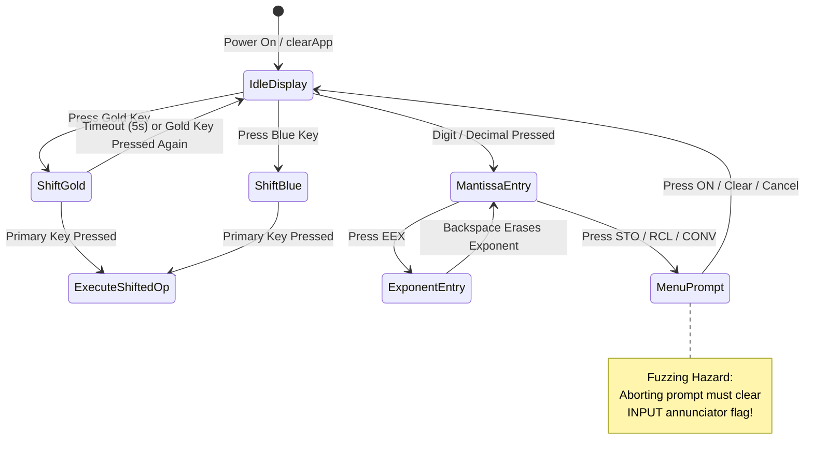

A calculation engine can pass 1,200 unit tests with flying colors and still completely fall apart the second a real human touches the keyboard.

Humans do not key in clean mathematical textbook formulas. They mash buttons impatiently, double-tap keys while walking down the stairs, change their minds mid-keystroke, toggle shift layers frantically, and mash `CLEAR` while an input prompt is halfway through animating onto the screen.

As a software and AI expert with a 3D printer running button plunger prototypes on my desk, I believe it is an absolute injustice that more students and engineers do not use RPN calculators. But when someone tries an RPN calculator for the first time, a single stuck shift layer or corrupted input buffer will convince them the whole paradigm is broken. In an RPN scientific calculator, the user interface is an intricate, hair-trigger state machine. A single button press does not simply render a character—it mutates the active mantissa, switches modifier layers (Gold, Blue), toggles degree/radian annunciators, or navigates prompt stacks. 

To ensure our UI never deadlocks, drops strokes, or displays ghost annunciators on glass or physical silicon, we brought software testing superpowers to the interface. We paired with AI coding agents to map state transitions and built a dedicated "toddler simulator"—an adversarial UI fuzzing harness (`Tools/Fuzzing/live_simulator_fuzzer.py`) designed to bombard running simulator instances and physical keypad bridges with 40 chaotic keystrokes per second.

<!-- more -->

## The UI State Machine and Transition Traps

The user interface layer must reconcile raw tactile switch closures with visual display states. The diagram below models the primary state transitions and the hazard conditions exposed by our fuzzer:



## Chaotic Key-Mash Scenarios and Annunciator Parity

Our fuzzer injects pseudo-random keystroke sequences at rates exceeding 40 events per second. The goal is to stress four notoriously fragile UI edge cases:

1. **Orphan Exponent Entry**: Pressing `EEX` immediately after `ENTER` without entering a mantissa, followed by alternating `+/-` signs and backspaces.
2. **Shift Latch Cancellation**: Rapidly tapping `GOLD` $\to$ `BLUE` $\to$ `GOLD` $\to$ `BACKSPACE` to verify that modifier state machine never drops into an illegal dual-shifted mode.
3. **Annunciator Flag Drift**: Validating that visual LCD annunciators (`RAD`, `GRAD`, `360`, `PRGM`, `INPUT`, `SHIFT_GOLD`, `SHIFT_BLUE`) match the exact underlying state. Early fuzz campaigns revealed that aborting a statistical `\Sigma-` prompt with the `CLEAR` key restored the stack but left the `INPUT` annunciator permanently stuck on screen like a dead pixel.
4. **Concurrent Crown and Touch Conflicts**: On watchOS, rotating the Digital Crown while rapidly pressing keys caused event loop starvation in SwiftUI, stalling UI updates.

| Chaotic Keystroke Chord | Injected Rate | Potential Failure Mode | Hardened Engine Defense |
|---|---|---|---|
| `[EEX, +/-, +/-, ., 5]` | 35 events/sec | Exponent buffer overflow or NaN crash | Auto-fill mantissa `1.0` before exponent entry |
| `[GOLD, BLUE, GOLD, 8]` | 50 events/sec | Double-shifted opcode collision | Strict last-shift-wins mutual exclusion |
| `[STO, A, BACKSPACE, ON]` | 25 events/sec | Stuck `INPUT` annunciator flag | Atomic prompt dismiss handler with full flag purge |
| `[3, ENTER, Crown-Scroll, +]` | 40 events/sec | Deadlock in watchOS RunLoop | Crown accumulator debounced via 0.5 threshold |

## Live Simulator Harness Implementation

The snippet from `Tools/Fuzzing/live_simulator_fuzzer.py` shows how the automated harness launches the simulator, drives high-speed key mashes, and asserts visual annunciator state:

```python
import subprocess
import time
import json
from pathlib import Path

def inject_key_mash_sequence(device_id: str, bundle_id: str, chords: list[str]) -> dict:
    """Injects high-speed simulated button presses into iOS / watchOS simulator and captures UI state."""
    # Ensure simulator application is foregrounded
    subprocess.run(["xcrun", "simctl", "launch", device_id, bundle_id], check=True, stdout=subprocess.DEVNULL)
    
    # Inject keystroke chord sequence via simulator bridge
    for key_code in chords:
        cmd = ["xcrun", "simctl", "spawn", device_id, "notifyutil", "-p", f"rpn.calc.key.{key_code}"]
        subprocess.run(cmd, check=True)
        time.sleep(0.025)  # 40 Hz injection frequency

    # Query application UI state via diagnostic socket
    state_dump = subprocess.check_output(
        ["xcrun", "simctl", "spawn", device_id, "defaults", "read", bundle_id, "ActiveUIStateSnapshot"]
    )
    return json.loads(state_dump)

def assert_annunciator_consistency(ui_state: dict):
    """Verifies that no annunciators are left orphan-illuminated."""
    is_shifted = ui_state.get("shift_state") != "NONE"
    gold_annunciator = ui_state.get("annunciators", {}).get("GOLD", False)
    blue_annunciator = ui_state.get("annunciators", {}).get("BLUE", False)
    
    if not is_shifted and (gold_annunciator or blue_annunciator):
        raise AssertionError(f"Orphan shift annunciator detected! State: {ui_state}")
```

By subjecting our UI runtimes to tens of thousands of frantic key-mash permutations, we eradicated UI deadlocks and annunciator desynchronization, delivering a rock-solid user experience across watchOS, iOS, and physical hardware.

## Conclusion: The Hard Truth About UI State Machines

Bombarding our user interface with 40 Hz keystroke storms taught us three tough engineering truths:

- **Cancel paths must be atomic**: If a prompt can be dismissed or aborted, its cleanup code cannot be a series of loose variable toggles. It must be an atomic reset that guarantees every associated annunciator is extinguished.
- **Annunciators are active contracts**: An illuminated `INPUT` or `RAD` icon isn't cosmetic art—it tells the user how their next keystroke will be interpreted. If an annunciator stays on after a cancelled operation, the user's trust is shattered.
- **Simulate human chaos early**: Clean unit tests will never catch what happens when someone accidentally presses three buttons while pulling the calculator out of a backpack. High-speed adversarial fuzzing is the only way to expose race conditions before users do, ensuring our low-cost physical calculator remains utterly indestructible in the hands of eager students.

