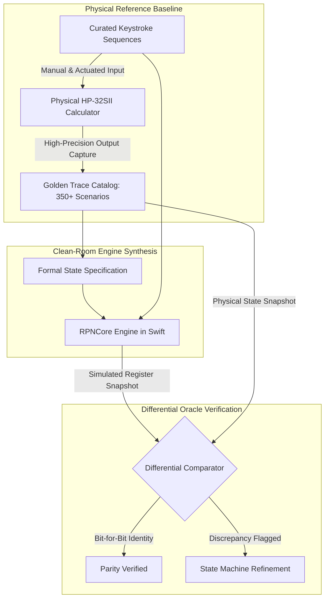

On my workbench, right beside my 3D printer and mechanical keyboard, sits a battered HP-32SII manufactured in Singapore in the spring of 1989. Its rubber feet have long turned to dust, and the silver Pioneer-series aluminum faceplate is worn smooth around the `ENTER` key. But when you press a button, that segmented LCD still snaps with crisp, uncompromising mathematical certainty.

As a software and AI expert with a desktop 3D printer whirring away printing button plungers, I believe it is an absolute injustice that more people do not use RPN calculators. When setting out to resurrect this legendary machine as an open, accessible, low-cost calculator for the next generation of students and makers, I faced an absolute legal and architectural constraint: clean-room implementation. Dumping Hewlett-Packard's proprietary Saturn processor ROM and disassembling its microcode was completely off-limits. To create an open-source, commercially viable device that vintage purists would respect and new students could trust, we had to achieve bit-for-bit behavioral parity entirely through clean-room black-box reverse engineering.

How does a software developer reverse-engineer thirty years of Corvallis state machine nuances without a ROM dump? This was where AI coding agents became an indispensable force multiplier. I fed vintage user manual descriptions and mathematical edge cases into AI prompting workflows, asking the models to synthesize candidate finite state machines and flag hidden state latches (like stack-lift disable rules after `ENTER` or `CLx`). We then validated those synthesized state tables against physical keystroke sequences on my actual HP-32SII hardware, building an authoritative 350-scenario golden trace catalog that continuously audits `RPNCore`.

<!-- more -->

## The Black-Box Reverse Engineering Pipeline

Our verification setup coupled physical HP-32SII reference units with automated state recording tools. By systematically feeding known keystroke chords into physical hardware and cataloging register behavior, we produced an authoritative golden trace library against which our `RPNCore` engine is continuously audited.



## Uncovering Hidden State Invariants

Textbook definitions of Reverse Polish Notation describe an elementary 4-level push-down stack. On an actual HP-32SII, however, several invisible latch mechanisms govern execution:

### 1. The Stack-Lift Disable Latch

In standard RPN, keying in a number lifts the stack ($X \to Y$, $Y \to Z$, $Z \to T$). But after pressing `ENTER`, the current value of $X$ is duplicated into $Y$. If typing the next digit immediately triggered a stack lift, the duplicated value would push upward into $Z$, destroying previous arguments. 

The HP hardware enforces a hidden *stack-lift disable flag*:
- Operations that **disable** stack lift: `ENTER`, `CLx` (clear X), and `\Sigma+` (statistical accumulation).
- Operations that **enable** stack lift: standard binary arithmetic (`+`, `-`, `*`, `/`), math functions (`SIN`, `LN`, $\sqrt{x}$), and register roll (`R\downarrow`).

### 2. Guard Digits and 15-Digit Internal Precision

While the physical LCD of the HP-32SII displays at most 12 mantissa digits (plus a 2-digit exponent and sign flags), the internal arithmetic logic unit operates on a 15-digit binary-coded decimal (BCD) representation. The three least significant digits act as guard digits.

If an engineer executes:

$$1 \to \text{ENTER} \to 3 \to / \to 3 \to * \to 1 \to -$$

A naive 12-digit calculator displays $-1.00000000000 \times 10^{-12}$ due to truncation. The HP-32SII, however, cleanly yields `0.00000000000` because the internal 15-digit accumulator absorbs the intermediate rounding error before display truncation occurs.

| Operation Sequence | Naive Textbook RPN | Physical HP-32SII | StackCalc Clean-Room Model |
|---|---|---|---|
| `5`, `ENTER`, `9` | $X=9, Y=5, Z=5$ (Lifted) | $X=9, Y=5, Z=0$ (Overwrite) | $X=9, Y=5, Z=0$ (Lift Disabled) |
| `5`, `CLx`, `9` | $X=9, Y=0, Z=0$ (Lifted) | $X=9, Y=0, Z=0$ (Overwritten) | $X=9, Y=0, Z=0$ (Lift Disabled) |
| $1/3 \times 3 - 1$ | $-1.0 \times 10^{-12}$ | `0.00000000000` | `0.00000000000` (Guard Digits) |
| Stack Drop on Binary Op | $T$ set to $0.0$ | $T$ duplicated ($T_{new} = T_{old}$) | $T$ duplicated ($T_{new} = T_{old}$) |
| `LASTx` after `1/x` | Unchanged / Old Value | Contains pre-inversion $X$ | Bitwise pre-inversion $X$ |

## Trace Comparator Implementation

The test harness in `RPNCoreTests/BlackBoxParityTests.swift` validates that our Swift engine replicates the physical calculator's recorded golden trace:

```swift
import XCTest
@testable import RPNCore

final class BlackBoxParityTests: XCTestCase {
    var engine: CalculatorEngine!

    override func setUp() {
        super.setUp()
        engine = CalculatorEngine()
    }

    func testPhysicalHP32SIIGuardDigitCancellationSequence() {
        // Reproduce 1 / 3 * 3 - 1 sequence from physical HP-32SII hardware log
        engine.enterDigit(1)
        engine.pressEnter()
        engine.enterDigit(3)
        try! engine.executeDivision()
        
        engine.enterDigit(3)
        try! engine.executeMultiplication()
        
        engine.enterDigit(1)
        try! engine.executeSubtraction()

        // Assert that guard digits successfully collapse result to exact 0.0
        XCTAssertEqual(engine.stack.x, 0.0, accuracy: 1e-12)
        XCTAssertEqual(engine.formatDisplay(), "0.0000")
    }

    func testStackLiftSuppressionAfterClearX() {
        // Physical trace: 10 ENTER 20 ENTER CLx 7 => Stack should be X=7, Y=10, Z=0
        engine.enterNumber(10)
        engine.pressEnter()
        engine.enterNumber(20)
        engine.pressEnter()
        engine.clearX()
        
        XCTAssertTrue(engine.stackLiftDisabled)
        engine.enterDigit(7)
        
        XCTAssertEqual(engine.stack.x, 7.0, accuracy: 1e-12)
        XCTAssertEqual(engine.stack.y, 10.0, accuracy: 1e-12)
    }
}
```

Through systematic black-box probing, we captured the soul of the HP-32SII without infringing on proprietary firmware. In Part 2, we explore the ultimate mathematical frontier of this clean-room effort: reverse-engineering non-integer factorial evaluation via the continuous Euler Gamma function.

## Conclusion: The Art of Clean-Room Archaeology

Reverse-engineering vintage calculating hardware without peeking at the original ROM taught us profound lessons about system design:

- **Understand the human ergonomics behind the silicon**: Quirks like stack-lift suppression after `ENTER` weren't random firmware bugs—they were brilliant, intentional UX decisions crafted to make chained manual calculations feel effortless.
- **Guard digits make or break trust**: If an engineer computes $1/3 \times 3 - 1$ and sees a lingering $-1 \times 10^{-12}$, they lose faith in the instrument. Maintaining 15-digit internal precision is non-negotiable for professional tools.
- **AI agents as clean-room catalysts**: Pairing AI coding agents with physical manual specifications allowed us to construct faithful state machine transition tables in days rather than months. When you build an open tool to inspire students, doing it cleanly and legally ensures the project belongs to the community forever. In Part 2, we tackle our favorite discovery on the HP-32SII: finding out what happens when you feed a non-integer into the factorial function.

