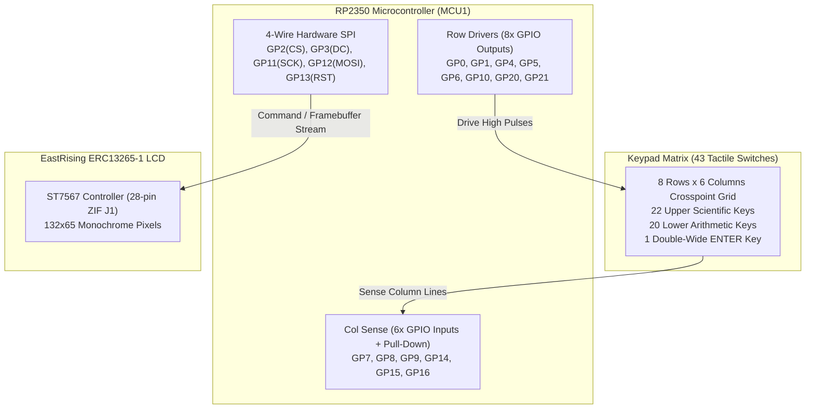

Coming from high-level software development, variables feel virtual and resources feel practically infinite. In a software state machine or an iOS app, if you need another property, you allocate it; if you need another event stream, you bind a publisher. But when our love for classic RPN calculators like the HP-32SII led us to design our very first physical circuit board—with our desktop 3D printer whirring in the background ready to print a pocket enclosure—our software instincts collided directly with physical silicon. An RP2350 microcontroller has exactly 30 physical GPIO pins, and not a single pin more.

We were moving StackCalc32 off the rat's nest of breadboard jumper wires and onto our first custom circuit board. Our goal was clear and ambitious: build an accessible, ultra-low-cost physical RPN calculator for students, engineers, and makers, packing a 43-key scientific keypad, an EastRising graphic LCD, an RP2350 module, and power rails into a pocketable 72.0 mm × 142.4 mm PCB.

Then we checked our initial pinout truth table, and our software-centric assumptions blew up. GPIO 17 on our compact RP2350-Zero module was permanently trapped on an onboard RGB Neopixel LED, completely inaccessible on the external castellated headers. Worse, in our novice haste, `GP20` and `GP21` had been double-assigned to both the LCD's SPI control bus and the keypad row scanning lines. Every time our early firmware wrote a single pixel command to the display, it inadvertently pumped high pulses into Row 3 of the matrix, spamming ghost keystrokes into the RPN calculation stack.

<!-- more -->

## The 43-Switch Keypad Matrix Architecture

If you want a tactile typing experience reminiscent of classic scientific calculators like the HP-32SII, individual GPIOs for every key are out of the question. With 43 tactile snap switches—22 scientific functions clustered on a tight 11.50 mm × 11.30 mm pitch, 20 lower numeric and arithmetic keys in four rows of five columns, plus a double-wide `ENTER` key—direct sensing would require 43 separate input lines. 

We settled on an 8-row by 6-column matrix topology providing 48 theoretical crosspoints. That gave us enough pads for all 43 physical switches with five spare nodes reserved for future expansion. To kill off contact bounce and keep power draw down, each column line uses an internal RP2350 pull-down resistor ($R_{PD} \approx 50\text{ k}\Omega$). The firmware pulses the rows active-high in sequence:

```
Row Drive: GP5, GP0, GP10, GP21, GP1, GP4, GP20, GP6 (Active-High Outputs)
Column Read: GP15, GP9, GP14, GP8, GP7, GP16 (Inputs with Internal Pull-Down)
```

In software, assigning a boolean flag takes clock cycles, but wires don't have 'settling time.' Discovering that 142.4 mm of physical copper trace acts like an analog circuit with stray parasitic capacitance was an eye-opener:

$$\tau = R_{PD} \cdot C_{trace} \approx 50\text{ k}\Omega \times 25\text{ pF} = 1.25\,\mu\text{s}$$

We had to teach our firmware loop to wait for physics to catch up with logic. We baked in a conservative settling delay of $t_{settle} = 10\,\mu\text{s}$ before reading the column pins, ensuring the input mask settles firmly into a stable logic level before the matrix scanner samples.



## Untangling the Pin Collision Crisis with AI

The real headache erupted when wiring up the EastRising ERC13265-1 display module. The glass uses an integrated Sitronix ST7567 controller talking over 4-wire serial SPI. In early desktop breadboard experiments, we had naively copied generic Raspberry Pi Pico 2 breakout headers:

```c
// Broken legacy firmware pin mapping
#define PIN_CS   17
#define PIN_SCK  18
#define PIN_MOSI 19
#define PIN_RST  20
#define PIN_DC   21  // Data/Command select
```

That mapping blew up the minute we moved to the RP2350-Zero footprint (`MCU1`). As noted, GPIO 17 went nowhere except the onboard Neopixel LED. Even worse, `GP20` and `GP21` were already laid out in `calculator.kicad_sch` as Row 6 and Row 3 outputs (`P20`, `P21`) for the numeric keypad. Toggling `PIN_DC` high to stream a byte of graphic data instantly drove Row 3 high, tricking the calculator into thinking the user had mashed the `4` key.

### Unified Pinout Truth Table

Staring at the 600-page RP2350 datasheet trying to balance hardware SPI0 peripherals, 8 matrix rows, and 6 matrix columns was utterly overwhelming for a software engineer designing their first PCB. We fed our matrix constraints, peripheral multiplexing rules, and board dimensions into an AI coding assistant. The AI acted as our interactive hardware mentor: it analyzed the RP2350's pin functions, warned us about the internal flash and LED pins, and helped us reshuffle our peripheral bus into a clean, conflict-free layout.

We shifted the display's SPI lines onto five contiguous, fully exposed GPIOs on the RP2350-Zero outer perimeter, keeping hardware SPI0 clock generation intact and leaving our matrix scanning loops completely isolated.

| RP2350 GPIO | Schematic Net | Peripheral | Direction | Function / Resolution |
|---|---|---|---|---|
| `GP0` | `ROW_1` | Keypad Matrix | Output | Matrix Row 1 drive |
| `GP1` | `ROW_4` | Keypad Matrix | Output | Matrix Row 4 drive |
| `GP2` | `LCD_CS` | Display SPI | Output | Chip Select (Active Low) |
| `GP3` | `LCD_DC` | Display SPI | Output | Data / Command Select (reassigned from GP21) |
| `GP4` | `ROW_5` | Keypad Matrix | Output | Matrix Row 5 drive |
| `GP5` | `ROW_0` | Keypad Matrix | Output | Matrix Row 0 drive |
| `GP6` | `ROW_7` | Keypad Matrix | Output | Matrix Row 7 drive (Sleep wake row) |
| `GP7` | `COL_4` | Keypad Matrix | Input | Matrix Column 4 sense |
| `GP8` | `COL_3` | Keypad Matrix | Input | Matrix Column 3 sense |
| `GP9` | `COL_1` | Keypad Matrix | Input | Matrix Column 1 sense |
| `GP10` | `ROW_2` | Keypad Matrix | Output | Matrix Row 2 drive |
| `GP11` | `LCD_SCK` | Display SPI | Output | SPI0 Serial Clock (reassigned from GP18) |
| `GP12` | `LCD_MOSI` | Display SPI | Output | SPI0 Master Out Slave In |
| `GP13` | `LCD_RST` | Display SPI | Output | Hardware Reset (reassigned from GP20) |
| `GP14` | `COL_2` | Keypad Matrix | Input | Matrix Column 2 sense |
| `GP15` | `COL_0` | Keypad Matrix | Input | Matrix Column 0 sense (ON/C column) |
| `GP16` | `COL_5` | Keypad Matrix | Input | Matrix Column 5 sense |
| `GP20` | `ROW_6` | Keypad Matrix | Output | Matrix Row 6 drive (Freed from LCD_RST) |
| `GP21` | `ROW_3` | Keypad Matrix | Output | Matrix Row 3 drive (Freed from LCD_DC) |

Once the schematic nets were untangled and passed KiCad's Electrical Rules Check (ERC) with zero warnings, we were finally ready to tackle the four-layer PCB stackup.

## Conclusion: What Software Engineers Learn on Silicon

Stepping away from compilers and venturing into physical circuit design taught us that hardware doesn't come with garbage collection or dynamic memory allocation. Every pin is a scarce physical asset, every copper trace is an analog circuit subject to resistance and capacitance, and pin collisions cannot be patched with a quick software hotfix.

- **Audit module breakouts on physical silicon:** Never assume dev-board pin names correspond to usable hardware pins. As we discovered with the RP2350-Zero, onboard LEDs or QSPI lines can trap GPIOs unexpectedly.
- **Group bus pins contiguously:** Placing `LCD_CS`, `LCD_DC`, `LCD_SCK`, `LCD_MOSI`, and `LCD_RST` in a contiguous block (`GP2`–`GP3`, `GP11`–`GP13`) kept routing channels clean and eliminated parasitic cross-talk into our matrix sense lines.
- **Calculate trace RC delays early:** Giving long $140\text{ mm}$ traces a $10\,\mu\text{s}$ settling window prevented race conditions during matrix scanning, keeping keypresses deterministic.

With an AI coding assistant helping us navigate microcontroller silicon registers and multiplexing tables, we turned a daunting hardware puzzle into working schematics—bringing us one step closer to putting an affordable, tactile RPN calculator into students' and engineers' hands.
