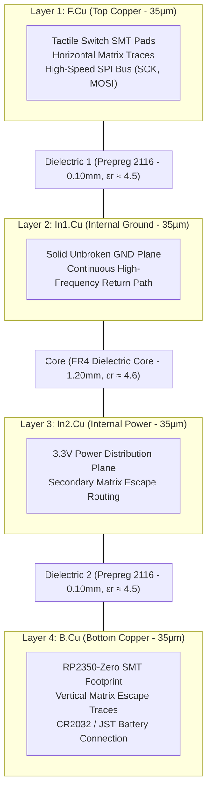

Getting a clean schematic in KiCad feels like a victory, right up until you open the PCB layout editor and stare down a dense rat's nest of 43 tactile switches, an RP2350 running at 133 MHz, and high-speed SPI lines snaking past delicate keypad sense traces. In software, an array lookup or pointer dereference doesn't care what is physically beneath it on a silicon die. But when we laid out our very first 2-layer circuit board for StackCalc32, our 10 MHz SPI display bus started ringing erratically, spewing static and corrupted characters across the LCD.

Every vertical matrix track on our 2-layer prototype had shredded the bottom ground plane, turning signal traces into accidental loop antennas. We had no idea why until we asked an AI coding agent to analyze our layout, and it gave our software team a crash course in electromagnetic physics.

<!-- more -->

## The 4-Layer Stackup Architecture

In introductory physics, you are taught that electricity takes the path of least resistance. In high-speed digital electronics, that rule breaks down: high-frequency signals follow the path of *least loop inductance*, clinging directly to the copper reference plane immediately underneath the active signal trace. In our early 2-layer test layout, slicing the ground plane with dozens of vertical matrix tracks had created sprawling inductive ground loops that rang like a church bell whenever the SPI bus toggled.

The AI assistant recommended moving to a balanced 1.60 mm thick, 4-layer PCB with dedicated internal ground and power planes:



With just 0.10 mm of prepreg dielectric between `F.Cu` and the solid ground plane on `In1.Cu`, top traces form tightly coupled microstrip transmission lines. This slashes characteristic loop inductance:

$$L_{loop} \approx \frac{\mu_0 \cdot h}{w}$$

where $h = 0.10\text{ mm}$ is the dielectric height above the ground plane and $w = 0.25\text{ mm}$ is the standard signal track width.

### Physical Stackup Specifications

| Layer Index | Name | Layer Type | Copper Thickness | Dielectric Spacing | Primary Function |
|---|---|---|---|---|---|
| 1 | `F.Cu` | Signal / Component | $35\,\mu\text{m}$ (1 oz) | — | SMT Keypads, Horizontal Matrix, SPI Lines |
| — | Prepreg | Dielectric FR-4 | — | $0.10\text{ mm}$ | Insulation & RF Return Coupling ($\epsilon_r \approx 4.5$) |
| 2 | `In1.Cu` | Ground Plane | $35\,\mu\text{m}$ (1 oz) | — | Continuous Low-Impedance Reference Plane |
| — | Core | FR-4 Core | — | $1.20\text{ mm}$ | Structural Rigid Base ($\epsilon_r \approx 4.6$) |
| 3 | `In2.Cu` | Power Plane | $35\,\mu\text{m}$ (1 oz) | — | 3.3V Power Bus & Non-Critical Routing |
| — | Prepreg | Dielectric FR-4 | — | $0.10\text{ mm}$ | Insulation & Planar Isolation ($\epsilon_r \approx 4.5$) |
| 4 | `B.Cu` | Signal / Component | $35\,\mu\text{m}$ (1 oz) | — | RP2350 MCU, Vertical Column Routing, JST1 |

## The SWIG Proxy Bug in Routing Automation

Being software developers, our natural response to repetitive GUI operations in KiCad was: *write a script!* We didn't want to manually click around redrawing ground copper zones every time a switch footprint shifted by half a millimeter. We wrote `Hardware/auto_router.py` using KiCad's `pcbnew` Python interface. The script was supposed to iterate through board nets, identify `"GND"`, assign it to polygon copper zones across all four layers, and fire the polygon zone filling engine.

That’s when the gremlins hit. Under KiCad 8 (commit `f7416d1`), repeatedly calling `board.GetNetInfo().Nets()` triggered memory corruption inside the underlying C++ / SWIG proxy wrapper. The net iterator returned stale pointers or dropped net attributes entirely, silently defaulting `netcode = 0` (unconnected net) across every polygon zone.

We zipped up the gerbers and uploaded them to automated fab tools at PCBWay and MacroFab. Ten minutes later, automated manufacturing DRC hit our inbox with critical errors:
```
DRC Error: Isolated copper zone detected on In1.Cu (Net None).
DRC Error: 43 tactile switch ground shields floating.
```
Because the ground pour had defaulted to netcode 0, our internal ground plane was completely severed from the RP2350's ground pins!

### The Hardcoded Netcode Solution

Digging into the SWIG proxy wreckage, our software debugging instincts kicked in. We realized that while the dynamic iterator object corrupted itself, the netcode IDs within a frozen KiCad database remain strictly static between board saves. In `calculator.kicad_pcb`, net `GND` was deterministically assigned integer identifier `18`.

We stripped out the flaky dynamic iterator and hardcoded the verified netcode directly in `auto_router.py`:

```python
# Bypass KiCad SWIG proxy memory corruption by hardcoding GND netcode (18)
# Commit: f7416d1 (Hardware/auto_router.py:21-36)
import pcbnew

def regenerate_ground_planes(board):
    netcode = 18  # Hardcoded static netcode for Net GND
    target_layers = [pcbnew.F_Cu, pcbnew.In1_Cu, pcbnew.In2_Cu, pcbnew.B_Cu]
    
    zones = board.Zones()
    for zone in zones:
        if zone.GetLayer() in target_layers:
            if netcode > 0:
                zone.SetNetCode(netcode)
    
    # Trigger full polygon filling engine across all 4 layers
    filler = pcbnew.ZONE_FILLER(board)
    filler.Fill(board.Zones())
    board.Save("calculator.kicad_pcb")
```

Running this patched script populated unbroken polygon copper pours with thermal relief spokes on all 43 switch ground points and MCU ground castellations. The regenerated gerbers sailed through automated fab DRC checks with zero warnings, giving us a rock-solid electrical foundation.

## Conclusion: A Software Developer's First 4-Layer Board

Automating EDA workflows with Python felt familiar, but it taught our software team a sobering lesson about bridging the gap into physical manufacturing:

- **What broke:** Trusting dynamic SWIG iterators to query board metadata across major KiCad releases without validating the underlying C++ pointer stability.
- **What saved us:** Realizing that board netcodes remain deterministic across saves, allowing a hardcoded static assignment (`netcode = 18`) to bypass the memory corruption entirely.
- **The physical reality:** Coming from web and mobile development where passing tests mean code is safe to ship, hardware is unforgiving. A successful script exit code doesn't guarantee physical copper exists on the board.

Always inspect generated gerber files in Gerbv or KiCad's 3D viewer to confirm that ground pours actually form physical copper bridges to your component pads before sending boards to the fab.
