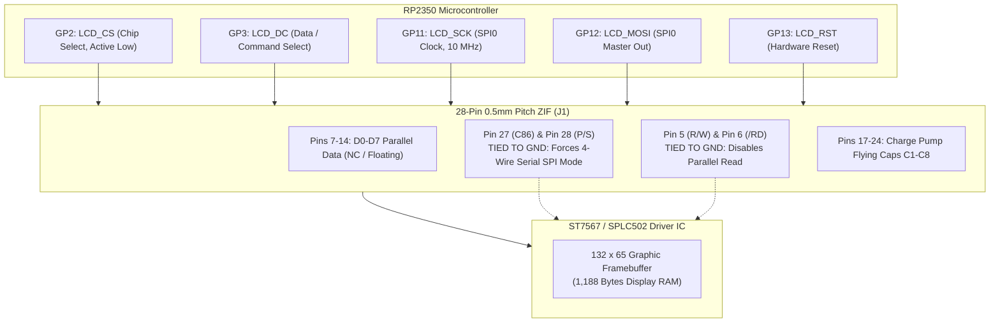

As software developers who love designing sleek iOS apps, our immediate instinct was to reach for vibrant full-color TFTs or high-contrast 0.96-inch OLED displays. But StackCalc32 is born from a different passion: we believe it is an absolute injustice that more people do not use RPN calculators today. Most students and young engineers have never experienced the sheer speed and elegance of postfix notation with a 4-level stack, simply because vintage HP calculators are locked behind \$200 collector markups on eBay, and modern classroom calculators are clunky algebraic dinosaurs.

Our mission is to build an open, accessible, ultra-low-cost physical RPN calculator that inspires the next generation of mathematicians and engineers. Putting a power-hungry color screen on a pocket device would completely defeat that goal: an emissive OLED washes out under bright daylight and sucks a coin cell flat before lunch.

<!-- more -->

## The Display Technology Trade-Off Matrix

We evaluated display options not from the perspective of high-end lab gear, but through the practical lens of battery runtime, refresh latency, and outdoor readability:

1. **Electrophoretic E-Paper Displays (EPD)**: E-paper has unmatched paper-like contrast and consumes zero static power. But its partial-refresh latency is painfully sluggish ($150\text{ to }800\text{ ms}$). When you're flying through rapid RPN calculations—mashing three digits and an operator in under a second—that display lag produces ghosting and makes interactive entry feel broken.
2. **Organic LED Displays (OLED)**: Common 0.96-inch and 1.3-inch monochrome OLEDs give you crisp microsecond response times and look gorgeous in a dark bedroom. But every lit pixel is an active emitter:

$$P_{OLED} = V_{bus} \cdot I_{active} = 3.3\text{ V} \times 35\text{ mA} = 115.5\text{ mW}$$

Pumping 35 mA out of a standard 220 mAh CR2032 coin cell drains the battery in under six hours of active computation. For an affordable pocket tool meant to live in a student's backpack for an entire semester, that’s a non-starter.
3. **Chip-on-Glass (COG) Reflective FSTN Graphic LCD**: We chose the EastRising ERC13265-1 (driven by a Sitronix ST7567 / Sunplus SPLC502 IC). Using ambient light reflected through polarized liquid crystals, static power consumption drops through the floor:

$$P_{LCD} = 3.3\text{ V} \times 15\,\mu\text{A} = 0.0495\text{ mW}$$

That is over **2,300 times more energy efficient than an OLED**, delivering over 300 hours of continuous active use on a single battery while maintaining a full 60 Hz refresh rate with zero ghosting.



## Configuring the ST7567 for 4-Wire SPI with AI

The EastRising module bonds its ST7567 controller silicon die directly onto the glass substrate via Chip-on-Glass (COG) packaging. Coming from software, reading the ST7567 datasheet felt like trying to parse an arcane protocol specification: it detailed 8080 parallel, 6800 parallel, 3-wire SPI, and 4-wire SPI across dense timing diagrams.

Because our RP2350-Zero module had only 20 exposed GPIOs to split between 43 keys and the screen, running a parallel bus would burn 12 to 14 pins, completely blowing our pin budget. We asked an AI coding agent to analyze the datasheet's multi-mode pin strap truth table. The AI showed us how hardwiring specific mode pins directly to `GND` at the PCB copper layer would lock the controller into 4-wire serial SPI, eliminating all need for extra GPIOs:

- **Pin 28 (`P/S` - Parallel/Serial Select)**: Tied permanently to `GND`, shutting down the parallel interface and engaging the serial engine.
- **Pin 27 (`C86` - Microprocessor Select)**: Tied permanently to `GND`.
- **Pin 5 (`R/W_WR`) & Pin 6 (`/RD_E`)**: Tied permanently to `GND` to suppress parallel bus read/write cycles.
- **Pins 7–14 (`D0` through `D7`)**: Left floating (No Connect). In 4-wire SPI mode, Pin 13 acts as `SCLK` and Pin 12 acts as `SI` (MOSI).

```c
// KiCad Netlist extract for 4-Wire Serial ST7567 Display Interfacing
// Net: LCD_CS   -> RP2350 GP2  -> J1 Pin 25 (/CS)
// Net: LCD_DC   -> RP2350 GP3  -> J1 Pin 26 (A0 / Command-Data Select)
// Net: LCD_SCK  -> RP2350 GP11 -> J1 Pin 13 (SCLK)
// Net: LCD_MOSI -> RP2350 GP12 -> J1 Pin 12 (SDA / SI)
// Net: LCD_RST  -> RP2350 GP13 -> J1 Pin 14 (/RESET)
// Net: GND      -> J1 Pins 4, 5, 6, 16, 27, 28
// Net: +3V3     -> J1 Pins 15 (VDD), 1, 2
```

### Display Technology Comparison

| Evaluation Metric | E-Paper (EPD) | Monochrome OLED | EastRising ERC13265-1 (ST7567) |
|---|---|---|---|
| Pixel Resolution | $152 \times 152$ | $128 \times 64$ | $132 \times 65$ (Ideal 12-char RPN stack) |
| Refresh Latency | $150\text{ to }800\text{ ms}$ | $< 10\,\mu\text{s}$ | $< 16.7\text{ ms}$ ($60\text{ Hz}$ full frame) |
| Active Current Draw | $8.0\text{ mA}$ during refresh | $25\text{ to }40\text{ mA}$ | $15\,\mu\text{A}$ ($0.015\text{ mA}$) |
| CR2032 Battery Lifetime | $\sim 2\text{ weeks}$ frequent use | $\sim 6\text{ hours}$ | $> 300\text{ hours}$ active computation |
| Outdoor Sunlight Readability | Exceptional | Poor (Washes out completely) | Exceptional (Reflective polarizer) |
| Microcontroller Pin Count | 6 GPIOs | 4 GPIOs (I2C) / 5 GPIOs | 5 GPIOs (4-Wire SPI) |
| Cost in 100-unit Volume | \$9.50 | \$3.80 | \$6.80 |

Hardwiring the ERC13265-1 into 4-wire serial SPI gave us the best of both worlds: instant 60 Hz frame flushes and sunlight readability while drawing mere microamps from our supply rail.

## Conclusion: The Transflective Retrospective

Modern consumer gadgets have conditioned us to expect glowing backlights and power-hungry color screens on everything, but building an accessible handheld calculator for the next generation demands thoughtful engineering discipline:

- **Empowering the next generation:** Building a physical calculator that lasts for months on a cheap battery ensures students and enthusiasts can carry RPN with them everywhere, without worrying about chargers or dead screens.
- **Reflective optics beat raw emissive power:** In real-world environments—under bright classroom lights, outdoors, or on a work desk—transflective monochrome glass isn't a retro compromise; it is an optically superior and electrically elegant solution.
- **Simplicity on silicon:** Squeezing over 300 hours of computation out of a 220 mAh coin cell while maintaining a crisp 60 Hz refresh rate showed our software team that embracing physical constraints leads to better, more accessible hardware.
