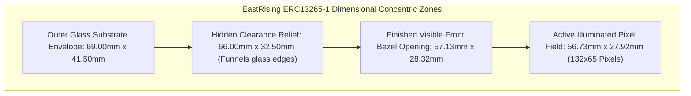

In web or iOS development, if text looks washed out or contrast is low, you adjust an opacity slider or tweak a CSS hex color. When we first powered on the EastRising ERC13265-1 LCD on our desk, our software intuitions were utterly useless. We had wired our 4-wire SPI bus and pushed our very first pixel test pattern to the display.

The result was disheartening. Half the active digits were washed out into faint gray ghosts, while the inactive background bloomed into dark, oily shadow puddles. To add insult to injury, when we slipped the glass into our first 3D-printed faceplate prototype fresh off our desktop 3D printer, the raw conductive indium tin oxide (ITO) routing traces and glue beads were glaringly exposed along the perimeter like an unfinished science fair project.

<!-- more -->

## Mechanical Bezel Framing in OpenSCAD

As an amateur 3D-printing enthusiast, OpenSCAD is my CAD tool of choice because it lets programmers model physical shapes using declarative code and parametric variables rather than imprecise mouse dragging. 

The physical glass substrate of the EastRising ERC13265-1 measures 69.00 mm wide by 41.50 mm tall. However, the illuminated active pixel matrix (132 columns × 65 rows) occupies only **56.73 mm wide by 27.92 mm tall**. Surrounding the pixels is a 66.00 mm × 32.50 mm viewing region, followed by inactive borders carrying conductive ITO routing fanouts and epoxy seals.

If your faceplate cutout is even 0.50 mm too wide, those unsightly ITO traces glare back at the user. If you cut it 0.30 mm too tight, the top status annunciators (`RAD`, `GRAD`, `PRGM`) or the bottom decimal points get cut off by the plastic rim.



In `Hardware/designs/screen_faceplate.scad`, we engineered a stepped two-tier aperture using parametric geometry:
1. **Hidden Rear Relief**: A chamfered pocket measuring $66.00\text{ mm} \times 32.50\text{ mm}$ that floats over the glass perimeter to absorb desktop FDM 3D printer tolerances and epoxy bead height variations.
2. **Finished Front Bezel**: A crisp window measuring **57.13 mm × 28.32 mm**. This wraps the active pixel matrix with an exact $0.20\text{ mm}$ per-edge registration buffer:

$$W_{bezel} = W_{active} + 2(0.20\text{ mm}) = 56.73\text{ mm} + 0.40\text{ mm} = 57.13\text{ mm}$$

$$H_{bezel} = H_{active} + 2(0.20\text{ mm}) = 27.92\text{ mm} + 0.40\text{ mm} = 28.32\text{ mm}$$

To keep the thin plastic border from flexing when pressed, the screen bezel integrates 0.80 mm side walls and 2.40 mm deep lateral guides that slide directly into the Tier 1 chassis slots.

### Concentric Display Aperture Specifications

| Concentric Zone | Width (mm) | Height (mm) | Area (mm²) | Mechanical Role |
|---|---|---|---|---|
| Outer Glass Substrate | $69.00\text{ mm}$ | $41.50\text{ mm}$ | $2,863.5$ | Maximum physical component boundary |
| Viewing Area Glass | $66.00\text{ mm}$ | $32.50\text{ mm}$ | $2,145.0$ | Cleared by hidden rear chamfer pocket |
| Finished Bezel Opening | $57.13\text{ mm}$ | $28.32\text{ mm}$ | $1,617.9$ | Visible exterior window ($+0.20\text{mm}$ allowance) |
| Active Pixel Field | $56.73\text{ mm}$ | $27.92\text{ mm}$ | $1,583.9$ | 132 x 65 illuminated dots ($0.41 \times 0.41\text{mm}$ pitch) |

## Calibrating the ST7567 Contrast Register with AI

With the glass framed cleanly by code, we turned to the washed-out liquid crystals. On the ST7567 controller, operating bias voltage $V_0$ is produced by an internal DC-DC charge pump governed by an internal resistor ladder ($Rb/Ra$) and an Electronic Volume (EV) register:

$$V_0 = \left(1 + \frac{Rb}{Ra}\right) \cdot V_{reg} \cdot \left(1 - \frac{63 - \alpha}{162}\right)$$

where $\alpha$ is the 6-bit value ($0..63$) loaded into the Electronic Volume command (`0x81`).

Coming from software, this analog formula was completely foreign. Generic vendor example code initialized the electronic volume to `0x1F` (31 decimal). On an uncalibrated evaluation board driven by a sagging USB port, that might have worked. But on our board's stiff 3.3V LDO rail, that setting pushed $V_0$ past $10.8\text{ V}$, over-saturating the liquid crystals and causing dark shadow clouds across every character.

We consulted an AI coding assistant to understand the relationship between the resistor ladder and the charge pump. Then we wrote a lightweight firmware calibration loop to sweep the contrast values interactively. The optimal combination was setting the internal regulator ratio to `0x24` ($Rb/Ra = 4.5$) and dialing the electronic volume down to `0x18` (24 decimal). This pegged $V_0 \approx 9.2\text{ V}$, giving us an ink-black 64:1 contrast ratio against a pale reflective background with zero blooming:

```c
// ST7567 / SPLC502 Hardware Initialization Sequence (Firmware/hardware_wrapper.c)
void st7567_init(void) {
    gpio_put(PIN_RST, 0);
    sleep_ms(10);
    gpio_put(PIN_RST, 1);
    sleep_ms(20);

    lcd_send_cmd(0xE2); // System software reset
    lcd_send_cmd(0xA2); // Set LCD bias ratio to 1/9 bias
    lcd_send_cmd(0xA0); // ADC select: Normal display orientation (SEG0 -> SEG131)
    lcd_send_cmd(0xC8); // Common output mode: Reverse scan (COM63 -> COM0)
    
    // Voltage Regulator & Resistor Ratio Calibration
    lcd_send_cmd(0x24); // Set internal regulator resistor ratio (Rb/Ra = 4.5)
    lcd_send_cmd(0x81); // Enter Electronic Volume mode
    lcd_send_cmd(0x18); // Set Contrast value to 24 decimal (eliminates wash-out)
    
    // Power Controller Sequence: Booster -> Regulator -> Follower ON
    lcd_send_cmd(0x2F); 
    lcd_send_cmd(0x40); // Set display start line to 0
    lcd_send_cmd(0xAF); // Display ON
}
```

The display memory maps 1,188 bytes across nine 8-pixel-tall horizontal pages. Mated with our $57.13 \times 28.32\text{ mm}$ aperture, the numbers pop off the glass with the crisp, unmistakable authority of an HP classic.

## Conclusion: What We Learned from Register Tuning

Getting a monochrome LCD to look professional requires bridging CAD tolerances and silicon register tuning without relying on specialized laboratory instrumentation:

- **Never trust vendor sample code blindly:** Sample initialization routines are almost universally configured for generic demo modules. Build a quick firmware loop to test command `0x81` across realistic ambient lighting conditions.
- **Thermal margin matters:** Tuning for $V_0 \approx 9.2\text{ V}$ gave us enough margin so that cold ambient temperatures don't fade the pixels and warm environments don't turn the screen into an opaque black puddle.
- **Step your bezel openings in code:** A single straight-through 3D-printed cutout will always either clip your active pixels or reveal ugly raw glass seals. A stepped rear relief pocket in OpenSCAD hides printer variance while framing the active area with 0.20 mm precision.
